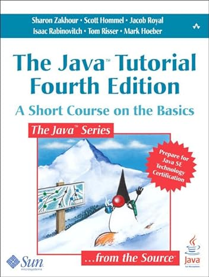

# Introdução ao Curso

------

## Boas vindas

Bem-vind@s ao curso de *Segurança da Informação*

Curso:

- Programação Orientada a Objetos - `TCC00341` (turma A1) - C.H. 64
- Site: https://igormcoelho.github.io/curso-seguranca-informacao

Links úteis:

- http://www.ic.uff.br/index.php/pt/curriculo-e-disciplinas/disciplinas-obrigatorias
- https://app.uff.br/graduacao/quadrodehorarios
- https://app.uff.br/iduff
- Instituto de Computação (IC/UFF) - www.ic.uff.br
- Universidade Federal Fluminense (UFF) - www.uff.br

--------

## Sobre mim

::::::::::::: {.columns}

::::: {.column width=40%}

{width=50%}

e-mail (com prefixo no assunto '[POO-2024.1]'):

imcoelho at ic.uff.br (emergência)

:::::

::::: {.column width=60%}

Me chamo Igor, e é um prazer apresentar esse curso para vocês! Sou professor e pesquisador da UFF, desenvolvedor de algoritmos e sistemas (a maioria de código-aberto), sendo atuante e apaixonado pela área de blockchain. Podem me contactar pelos emails ao lado (*substituam o 'at' por '@'*), mas peço que priorizem o uso da ferramenta de Classroom do curso, que consigo responder mais rápido (com alcance aos demais alunos).
Esse curso está disponível no meu site pessoal no github: https://igormcoelho.github.io/curso-seguranca-informacao

:::::

:::::::::::::

--------

## Sobre vocês

Gostaria que se apresentassem também para nos conhecermos melhor! 

Ninguém aprende 100% do que o professor ensina, e nem o professor consegue ensinar 100% de um conteúdo, então cabe aos alunos: *ler*, *estudar* e *questionar* (muito!). **Juntos** podemos trabalhar para transmitir esse conhecimento valioso para cada um de vocês.

Sempre que tiverem uma dúvida ou curiosidade, perguntem! Toda pergunta é valiosa, e o conhecimento é construído em pequenas porções.

-------

## Acordo Aluno-Professor

*Para esse curso funcionar: tenham dedicação!*

É fundamental: 

- Não atrasar entrega de trabalho, mas caso precisem de uma extensão, solicitem antes do prazo! (*atrasos podem reduzir ou até zerar notas*)
- Buscar ao máximo não perder nenhuma aula (síncrona), e caso percam, busquem o quanto antes suprir esse conteúdo
- Nunca, em hipótese alguma, copiem um trabalho pronto! Além dos efeitos práticos (como perda de nota ou demais sanções previstas nas normas), não se enganem: quem mais perde é o aluno. Conhecimento é o bem mais valioso!
- **Sempre** citem as fontes, especialmente para trechos de textos. Sempre que possivel, indique a licença de uso de imagens e códigos (os buscadores permitem buscas com licença livre, como CC-BY 4.0).

--------

## Período 2024.1 - aulas presenciais

Atividades em 2024.1

- Período: 18/03/2024 (segunda-feira) - 17/07/2024 (quarta-feira)

- Lançamento de notas: 10/07/2024 (último encontro)

Teremos aulas presenciais em horários regulares e outras diversas atividades assíncronas complementares (vídeos, textos, trabalhos, ...) para suprir toda a carga horária.

---------

## Horários Síncronos

Horários do curso: segunda e quarta 18h-20h.

(*) Algumas exceções estão previstas e algumas aulas poderão ser alteradas (caso seja necessário), mas esta é a regra geral.

--------

## Avaliação

Haverá atividades avaliativas assícronas (R), como listas de exercícios e resumos de textos/vídeos. Além disso, haverá atividades com prova (V) e trabalho com apresentação (P).

A nota N1 do curso será:

N1 = 20%R + 50%V + 30%P

De acordo com as normas regulares da UFF, a nota mínima N1 para aprovação é 6.

Haverá VS para aqueles com nota superior a 4,0.

--------

## Cronograma (I)

- Período: 18/03/2024 - 17/07/2024

Tipo = Sinc./Asinc.

| Data       | Atividade                       | Tipo    |
| :---       |   :----                         | :---    |
| 18/03/2024 |  Inscrição no classroom         |  Asinc. | 
| 20/03/2024 |  Introdução ao Curso            |  Sinc.  | 

A fazer...

-------

## Cronograma (IV)

| Data       | Atividade                       | Tipo   |
| :---       |   :----                         | :---   |
| 10/07/2024 |  Lançamento Notas               |  *Asinc. |
| 17/07/2024 |  Fim Semestre                   |  *Asinc. |

-------

## Conteúdo do Curso

O conteúdo do curso será introdutório para a área de Segurança da Informação, focado naqueles que nunca viram os conceitos antes. O curso tem duas partes principais, mais uma parte de estudo de caso.

Segurança de Sistemas de Informação: (i) Visão mais Prática da segurança; (ii) Conceitos, métodos de ataque e ferramentas de defesa

Criptografia: (i) Presente em praticamente toda solução de segurança; (ii) Módulo da outra parte; (iii) Arcabouço para análise rigorosa de segurança

Estudo de Caso/Aplicação Prática com Blockchain: (i) Trarei para vocês um pouco de como a área de Segurança da Informação tem impactado em tecnologias disruptivas recentes, como a Blockchain

(*) Os materais desse curso são baseados nos dos professores Raphael Machado, Kowada e Viterbo, que agradeço muito!

-------

## Bibliografia Recomendada

::::::::::::: {.columns}

::::: {.column width=40%}

{width=50%}*

:::::

::::: {.column width=60%}

(*) Segurança de Computadores, Stallings/Brown; Understanding Cryptography, Christof Paar

:::::

::::::::::::: 

# Agradecimentos

-----

## Pessoas

Em especial, agradeço aos colegas que elaboraram bons materiais, como os profs. Raphael Machado, Kowada e Viterbo cujos conceitos formam o cerne desses slides.

Estendo os agradecimentos aos demais colegas que colaboraram com a elaboração do material do curso de [Pesquisa Operacional](https://github.com/igormcoelho/curso-pesquisa-operacional-i), que abriu caminho para verificação prática dessa tecnologia de slides.

-----

## Software

Esse material de curso só é possível graças aos inúmeros projetos de código-aberto que são necessários a ele, incluindo:

- pandoc
- LaTeX
- GNU/Linux
- git
- markdown-preview-enhanced (github)
- visual studio code
- atom
- revealjs
- ...

-----

## Empresas

Agradecimento especial a empresas que suportam projetos livres envolvidos nesse curso:

- github
- gitlab
- microsoft
- google
- ...

-----

## Reprodução do material

Esses slides foram escritos utilizando pandoc, segundo o tutorial ilectures:

- https://igormcoelho.github.io/ilectures-pandoc/

Exceto expressamente mencionado (como materiais cedidos por outros professores), a licença será Creative Commons.

**Licença:** CC-BY 4.0 2020

Igor Machado Coelho