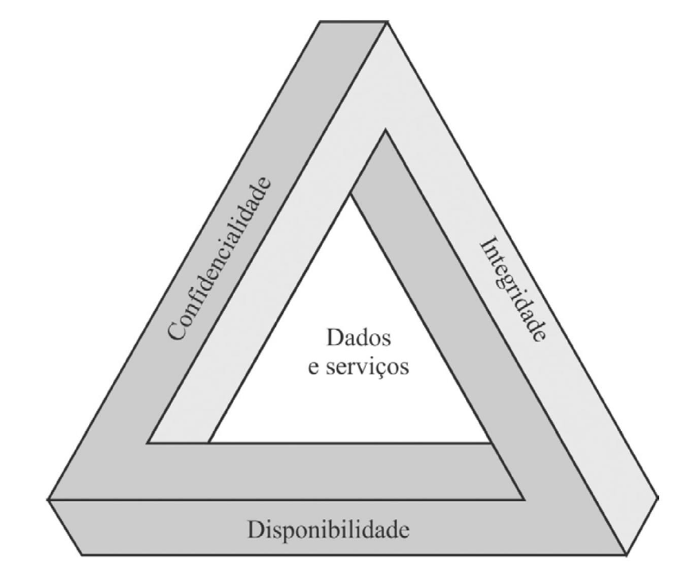

# Aula: Princípios Básicos

------

## Pré-Requisitos

São requisitos para essa aula o conhecimento de:

- Redes de Computadores (conceitos gerais)

------

## Tópicos

- Histórico
- Conceitos
- Desafios
- Princípios Básicos
- Ciclo de Vida da Informação

# Princípios Básicos

------

## Histórico

- Nasceu como elemento de estratégia militar
   * Assim como a ARPANET, ...
- Amadureceu em entidades militares,
governamentais e Acadêmicas
- Desde a década passada faz parte da
estratégia corporativa

-------

## Conceitos

::: {.block}

### O que é a Informação? {#informacao}

| “Conjunto de dados utilizados para a transferência de
| uma mensagem entre indivíduos e/ou máquinas em
| processos comunicativos ou transacionais“
| (Marcos Sêmola)

:::

::: {.block}

### O que é a Segurança? {#seguraca}

| “[...] um estado e qualidade ou condição de seguro,
| assim também como convicção e certeza”
| (Dicionário Aurélio)

:::

-------

## DEFINIÇÕES DE SEGURANÇA DA INFORMAÇÃO

- Segurança da Informação é a proteção da **informação**
de vários tipos de **ameaças** para a **continuidade do
negócio** e também para **minimizar o risco** ao
negócio.

- Segurança da Informação: área do conhecimento
dedicada à **proteção de ativos da informação** *contra*
**acessos não autorizados, alterações indevidas** ou a
sua **indisponibilidade**.

::: {.block}

### Dados vs Informação

O termo Segurança da Informação aborda, de forma equivalente,
o que é compreendido como dado ou como informação.

:::

-------

## SEGURANÇA COMPUTACIONAL

- Proteção oferecida a um sistema de informação
automatizado para atingir os objetivos aplicáveis
de preservar a integridade, disponibilidade e
confidencialidade dos recursos do sistema de
informação
- Inclui hardware, software, firmware, informações
/ dados e telecomunicações

::: {.block}

### Indo além das redes

O termo Segurança da Informação pode ser expandido para diversas
outras áreas da computação, incluindo não apenas software.

:::

-------

## DESAFIOS GERAIS

- Definição das Funções e Responsabilidades;
- Participação ativa nas estratégias
organizacionais;
- Integração com a missão da Organização.

-------

## DESAFIOS ESPECÍFICOS
1. Não é simples
2. Deve considerar possíveis ataques
3. Usa procedimentos não intuitivos
4. Envolve algoritmos e informações secretas
5. Deve decidir onde implantar mecanismos
6. Batalha de inteligência entre
atacante/administrador
7. Benefício não percebido até falhar
8. Requer monitoramento regular
9. Muitas vezes um pensamento posterior
10. Considerado impedimento ao uso do sistema

-------

## CONCEITOS CHAVE

{width=70%}

-------

## PRINCÍPIOS BÁSICOS

### CONFIDENCIALIDADE

Toda informação deve ser protegida de acordo com o grau de sigilo de seu conteúdo, visando a limitação de seu acesso e uso apenas às pessoas para quem elas são destinadas

### INTEGRIDADE

Toda informação deve ser mantida na mesma condição em que foi disponibilizada pelo seu proprietário, visando protegê-las contra alterações indevidas, intencionais ou acidentais. Garantir que as informações sejam alteradas somente pelas pessoas que possuem acesso para tal!

### DISPONIBILIDADE
Toda informação gerada ou adquirida por um indivíduo ou instituição deve estar disponível aos seus usuários no momento em que os mesmos delas necessitem para qualquer finalidade

------

## ASPECTOS DE SI / CONCEITOS ADICIONAIS

Alguns aspectos são complementares à tríade CID, sendo Autenticação considerado por alguns[^1] como parte da Integridade.

### AUTENTICIDADE

Garantia de que as entidades (informação, máquinas, usuários) identificadas em um processo de comunicação como remetentes ou autores sejam exatamente o que dizem ser e que a mensagem ou informação não foi alterada após seu envio ou validação

### LEGALIDADE / Determinação de Responsabilidade

Caraterística das informações que possuem valor legal dentro de um processo de comunicação, onde todos os ativos estão de acordo com as cláusulas contratuais pactuadas ou a legislação política institucional, nacional ou internacional vigentes

[^1]: FIPS PUB 199

# Discussão

## Breve discussão

### Cenário atual: instituições públicas e privadas da região

- Será que as instituições da região tem cumprido com a responsabilidade de segurança
debatida até o momento?
- Como as equipes podem ser melhor treinadas e aprimoradas para esse cumprimento?
- Recomendada leitura de material complementar (material acessível a executivos e público-geral): "SÊMOLA, Marcos. Gestão da Segurança da Informação, 2a Ed. Elsevier Brasil, 2014."

# Agradecimentos

-----

## Pessoas

Em especial, agradeço aos colegas que elaboraram bons materiais, como o prof. Raphael Machado, Kowada e Viterbo cujos conceitos formam o cerne desses slides.

Estendo os agradecimentos aos demais colegas que colaboraram com a elaboração do material do curso de [Pesquisa Operacional](https://github.com/igormcoelho/curso-pesquisa-operacional-i), que abriu caminho para verificação prática dessa tecnologia de slides.

-----

## Software

Esse material de curso só é possível graças aos inúmeros projetos de código-aberto que são necessários a ele, incluindo:

- pandoc
- LaTeX
- GNU/Linux
- git
- markdown-preview-enhanced (github)
- visual studio code
- atom
- revealjs
- groomit-mpx (screen drawing tool)
- xournal (screen drawing tool)
- ...

-----

## Empresas

Agradecimento especial a empresas que suportam projetos livres envolvidos nesse curso:

- github
- gitlab
- microsoft
- google
- ...

-----

## Reprodução do material

Esses slides foram escritos utilizando pandoc, segundo o tutorial ilectures:

- https://igormcoelho.github.io/ilectures-pandoc/

Exceto expressamente mencionado (com as devidas ressalvas ao material cedido por colegas), a licença será Creative Commons.

**Licença:** CC-BY 4.0 2020

Igor Machado Coelho

-------

## This Slide Is Intentionally Blank (for goomit-mpx)
