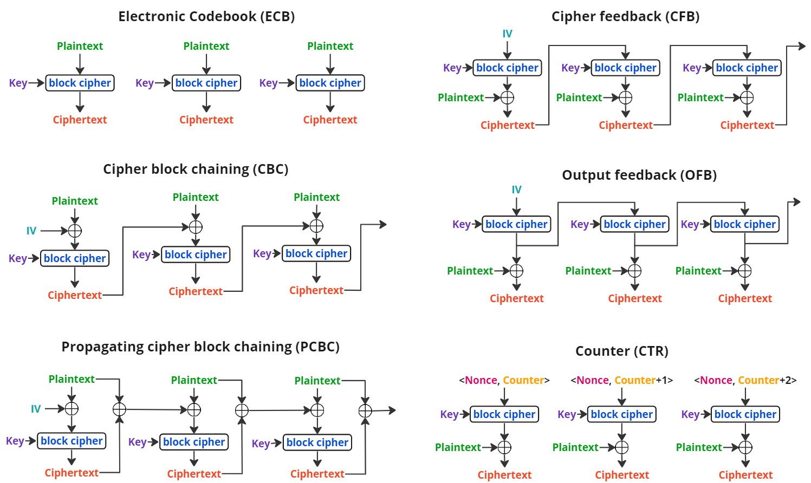
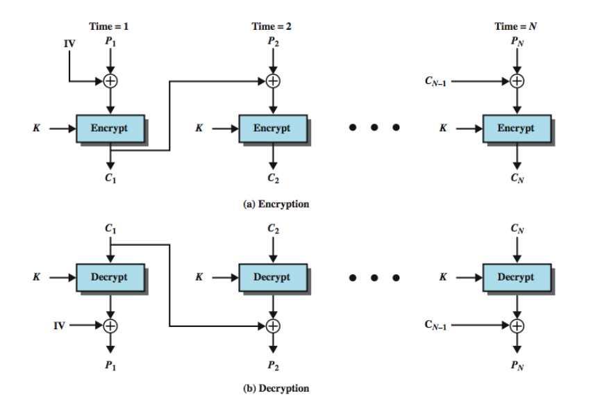

# Módulo: Modos de Operação para Cifras Criptográficas

------

## Pré-Requisitos

São requisitos para essa aula o conhecimento de:

- Redes de Computadores (conceitos gerais)
- Módulo 1: princípios básicos
- Módulo 2: ameaças
- Módulo 3: requisitos
- Módulo 4: malware e vírus
- Módulo 5: worms
- Módulo 6: engenharia social e carga útil
- Módulo 7: contramedidas
- Módulo 8: negação de serviço
- Módulo 9: criptografia simétrica

------

## Tópicos

- Modos de Operação

# Modos de Operação e Cifras de Bloco vs Fluxo

## Questões práticas de segurança

- Normalmente, a cifração simétrica é aplicada a uma unidade de dados maior do
que um bloco único de 64 bits ou 128 bits
- Mensagens de e-mail, pacotes de
rede, registros de bancos de dados e outras fontes de texto às claras devem ser
partidos em uma série de blocos de comprimento fixo para a cifração por uma
cifra de bloco simétrica
-  A abordagem mais simples para a cifração de múltiplos
blocos é conhecida como modo de livro código eletrônico (**electronic codebook
-- ECB**)
   * texto às claras é processado b bits por vez e cada bloco de
texto às claras é cifrado usando a mesma chave (normalmente b=64 ou b=128)
- Para mensagens longas, o modo ECB pode não ser seguro
   * Um criptoanalista pode conseguir explorar regularidades no texto às claras para facilitar a tarefa de decifração.
   * Por exemplo, se é sabido que a mensagem sempre começa com
certos campos predefinidos, então o criptoanalista pode ter vários pares de texto
às claras-texto cifrado conhecidos com os quais trabalhar.
- Utilização de **modos de operação** e também de **cifras de fluxo**

## Ilustração da Cifração de Bloco

## Ilustração da Cifração de Fluxo

## CIFRAS DE FLUXO

- Processa os elementos de entrada continuamente
- Chave é entrada para um gerador de bits pseudoaleatório
   * Produz fluxo de números pseudoaleatórios (sequência de
cifração)
   * Imprevisível sem conhecer a chave de entrada
   * XOR com bytes de texto às claras
- São mais rápidos e usam muito menos código
- Considerações de projeto:
   * Sequência de cifração deve ter um grande período
   * Deve ter propriedades próximas a de números aleatórios
   * Usar uma chave suficientemente longa
- Uma cifra de fluxo muito utilizada é o RC4 (Rivest Cipher 4) de 1987, *vazado* em 1994: https://en.wikipedia.org/wiki/RC4 
- Bastante simples, mas considerada insegura (usada em protocolos inseguros como WEP)

## RC4 vs cifras de bloco

## MODOS DE OPERAÇÃO
- Em inglês, Block Cipher Mode Operation:
   * https://en.wikipedia.org/wiki/Block_cipher_mode_of_operation
- Cifras de bloco processam dados em blocos
   * Por exemplo, 64 bits (DES, 3DES) ou 128 bits (AES)
- Para mensagens mais longas deve quebrar em blocos
   * E, possivelmente, o completar final do bloco para
múltiplo (*padding*)
- Modos mais antigos: ECB, CBC, OFB, and CFB (FIPS 81 de 1981)
- 5 cinco modos de operação: NIST SP 800-38A de 2001
   * Livro-código eletrônico (ECB)
   * Encadeamento de blocos de cifra (CBC)
   * Realimentação de cifra (CFB)
   * Realimentação de saída (OFB)
   * *Contador (CTR)* - de 2001
- Modo XTS-AES adicionado na SP800-38E de 2010
- Modo PCBC também frequentemente usado (sem norma)
- Os modos pretendem cobrir praticamente todas as possíveis aplicações de
cifração para as quais uma cifra de bloco poderia ser usada

## Vetor de Inicialização

- Alguns modos exigem uma sequência binária única chamada de Vetor de Inicialização, ou *Initialization Vector* (IV)
   * Não deve se repetir, e para alguns modos, deve ser aleatório
- Utilizado para garantir que *plaintexts* repetidos gerem *ciphertexts* distintos, mesmo que a mesma chave seja utilizada
- Também chamado de *Starting Variable* (SV)
- O IV não precisa ser secreto, como uma chave privada
- Observar regras nas normas como SP800-38A
    * Modo CBC e CFB: reutilizar IV vaza informações no primeiro bloco de plaintext
    * Modo OFB e CTR: reutilizar IV quebra a segurança
    * Em CBC, o IV deve ser imprevisível

## Modos: visão geral (seis modos incluindo PCBC)

## Modo: ELECTRONIC CODEBOOK (ECB)
- Modo mais simples
- Dividir texto às claras em blocos de $b$ bits cada
- Cifrar cada bloco usando a **mesma chave**
- "Codebook" (livro-código) porque tem valor de
texto cifrado exclusivo para cada bloco de texto
sem formatação
- Não é seguro para mensagens longas: 
   * texto às claras **repetido** é visto no texto cifrado **também repetido**
   * um criptoanalista possivelmente conseguirá explorar essas regularidades
   * Por exemplo, sabendo que a mensagem sempre começa com certos campos predefinidos, o criptoanalista pode ter vários pares de textos às claras/textos cifrados conhecidos com os quais trabalhar
- Para superar as deficiências de
segurança do ECB, seria bom se tivéssemos uma técnica na qual um mesmo
bloco de texto às claras, caso repetido, produzisse blocos de texto cifrado
diferentes
- Fraquezas conhecidas: veja no próximo slide a encriptação de bits de uma imagem

## Ilustração Fraqueza ECB

## Modo: CIPHER BLOCK CHAINING (CBC)

- a entrada para o algoritmo de cifração é o resultado da
operação de XOR entre o bloco de texto às claras e o bloco de texto cifrado
precedente
- a mesma chave é usada para cada bloco
- encadeamos o processamento da sequência de blocos de texto às claras
- a entrada passada para a função de cifração para cada bloco de texto às claras não
guarda qualquer relação fixa com o bloco de texto às claras
- padrões repetitivos de b bits não são expostos
- para fazer a decifração, cada bloco cifrado é passado pelo algoritmo de
decifração
- O resultado passa por uma operação de XOR com o bloco de texto
cifrado precedente para produzir o bloco de texto às claras

## Ilustração CBC

## Modo: PCBC

- Alteração do IV no CBC somente corrompe o primeiro bloco, dado que ele permite decifração em paralelo (mas não a cifração em paralelo)
- Possibilidade no CBC de ataques tipo *padding oracle attacks*, como POODLE (no SSL 3.0)
    * https://en.wikipedia.org/wiki/POODLE
    * Solução: desabilitar SSL 3.0 (descoberto em 2014)
- Uso de PCBC mitiga esse tipo de ataque, propagando indefinidamente mudanças no plaintext
    * Efeito colateral: inviabiliza decifração paralela

## Ilustração PCBC

## Modo: Realimentação de Cifra (CFB)

- É possível converter qualquer cifra de bloco (estilo CBC) em uma cifra de fluxo usando o
modo de realimentação de cifra
- Uma cifra de fluxo elimina a necessidade de
preenchimento de uma mensagem para que ela tenha um número inteiro de
blocos
- Cifras de fluxo também podem operar em tempo real
- Assim, se um fluxo de caracteres está sendo transmitido, cada caractere pode ser cifrado e
transmitido imediatamente usando uma cifra de fluxo orientada a caracteres
- Uma propriedade desejável de uma cifra de fluxo é que o texto cifrado seja do
mesmo comprimento que o texto às claras
- Assim, se caracteres de 8 bits estão
sendo transmitidos, cada caractere deve ser cifrado usando 8 bits
   * Se forem usados mais de 8 bits, desperdiça-se capacidade de transmissão.
- A entrada para a função de cifração é
um registrador de deslocamento de b bits que inicialmente é ajustado para algum
vetor de inicialização (IV)

## Ilustração CFB

## Modo: Output Feedback (OFB)

- Funciona de forma idêntica na encriptação e decriptação
- Torna *síncrono* o processo de fluxo (inviabiliza paralelização)
- Permite que códigos de correção de erro funcionem normalmente, com o atraso da introdução do plaintext na execução do modo
- Possível encriptar antecipadamente e somente então aplicar XOR no dado plaintext, permitindo algum nível de paralelização

## Ilustração OFB

## Modo: Contador/*Counter* (CTR)

- Introduzido em 1979 por Whitfield Diffie e Martin Hellman
- Um contador igual ao tamanho do bloco de texto às claras é usado 
- O único requisito declarado em SP 800-38A é que o valor do contador deve ser diferente para cada bloco de texto às claras que é cifrado
- Tipicamente, o contador é inicializado com algum valor e então
incrementado de 1 para cada bloco subsequente (módulo $2^b$, onde b é o tamanho
do bloco)
- Para a cifração, o contador é cifrado e então passa por uma operação
de XOR com o bloco de texto às claras para produzir o bloco de texto cifrado;
não há encadeamento
- Para a decifração, a mesma sequência de valores de
contador é usada, sendo que cada contador cifrado passa por uma operação de
XOR com um bloco de texto cifrado para recuperar o bloco de texto às claras
correspondente.

## Ilustração CTR

## Outros Modos

- Novos modos adicionados após publicação do livro
   * Busque em sites com atualização mais frequente!
- Leia mais em: https://en.wikipedia.org/wiki/Block_cipher_mode_of_operation

# Discussão

## Breve discussão

### Cenário atual

- Pense em um problema prático que envolve cifração
- Quais técnicas são melhores para uso prático? Quais vantagens e desvantagens?

------

## Leia mais

Livro: 

- "Segurança de Computadores - Princípios e Práticas - 2012" - Stallings, William; Brown, Lawrie & Lawrie Brown & Mick Bauer & Michael Howard
    * Em Português do Brasil, CAMPUS - GRUPO ELSEVIER, 2ª Ed. 2014

Veja Capítulo 7, todas seções e finaliza o capítulo 7.

# Agradecimentos

-----

## Pessoas

Em especial, agradeço aos colegas que elaboraram bons materiais, como o prof. Raphael Machado, Kowada e Viterbo cujos conceitos formam o cerne desses slides.

Estendo os agradecimentos aos demais colegas que colaboraram com a elaboração do material do curso de [Pesquisa Operacional](https://github.com/igormcoelho/curso-pesquisa-operacional-i), que abriu caminho para verificação prática dessa tecnologia de slides.

-----

## Software

Esse material de curso só é possível graças aos inúmeros projetos de código-aberto que são necessários a ele, incluindo:

- pandoc
- LaTeX
- GNU/Linux
- git
- markdown-preview-enhanced (github)
- visual studio code
- atom
- revealjs
- groomit-mpx (screen drawing tool)
- xournal (screen drawing tool)
- ...

-----

## Empresas

Agradecimento especial a empresas que suportam projetos livres envolvidos nesse curso:

- github
- gitlab
- microsoft
- google
- ...

-----

## Reprodução do material

Esses slides foram escritos utilizando pandoc, segundo o tutorial ilectures:

- https://igormcoelho.github.io/ilectures-pandoc/

Exceto expressamente mencionado (com as devidas ressalvas ao material cedido por colegas), a licença será Creative Commons.

**Licença:** CC-BY 4.0 2020

Igor Machado Coelho

-------

## This Slide Is Intentionally Blank (for goomit-mpx)
