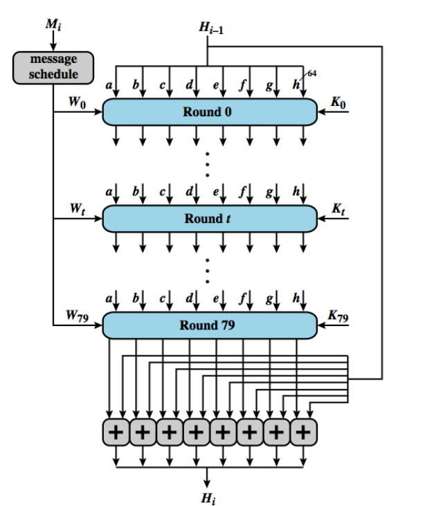

# Módulo: Autenticação e Hashes

------

## Pré-Requisitos

São requisitos para essa aula o conhecimento de:

- Redes de Computadores (conceitos gerais)
- Módulo 1: princípios básicos
- Módulo 2: ameaças
- Módulo 3: requisitos
- Módulo 4: malware e vírus
- Módulo 5: worms
- Módulo 6: engenharia social e carga útil
- Módulo 7: contramedidas
- Módulo 8: negação de serviço
- Módulo 9: criptografia simétrica
- Módulo 10: modos de operação

------

## Tópicos

- Autenticação de Mensagens
- Hashes

# Autenticação de Mensagens e Funções de Hash

## Autenticação de Mensagens

- A cifração fornece proteção contra ataques passivos (escutas)
- Um requisito diferente é proteger contra ataques ativos (falsificação de dados e transações)
- A proteção contra tais ataques é conhecida como **autenticação** de mensagens ou de
dados
- Diz-se que uma mensagem, arquivo, documento ou outra coleção de dados é
autêntica quando é genuína e veio de sua fonte alegada
- Autenticação de mensagens ou dados é um procedimento que permite que as partes comunicantes
verifiquem se as mensagens recebidas ou armazenadas são autênticas
- Os dois aspectos importantes são verificar se o conteúdo da mensagem não foi alterado e
se a fonte é autêntica
- Também podemos desejar verificar se uma mensagem foi
transmitida no momento correto (se ela não foi artificialmente atrasada ou
repetida) e a sequência em relação a outras mensagens que fluem entre duas
partes

## Autenticação usando cifração simétrica

- Parece possível somente utilizar cifração simétrica para autenticação perfeita
   * Afinal, como ambos lados possuem a mesma chave, somente assim seria possível cifrar ou decifrar uma mensagem válida
- Reordenação de blocos em Modo ECB pode alterar o significado das mensagens!
- Introdução de código de sequência ainda garante mais a ordenação das mensagens (como no IP), contra qualquer adulteração
   * Porém, tipicamente não é colocado em cada bloco, pois pode introduzir novas fragilidades
- Então, precisamos de mecanismos melhores para autenticação

## Autenticação de mensagem sem cifração de mensagem

- Estudamos possibilidades de autenticação sem cifração
    * Introdução de um tag/etiqueta de autenticação nas mensagens
- A mensagem em si não é cifrada e pode ser lida por qualquer um
- É possível combinar essas técnicas com as de cifração, para oferecer confidencialidade e autenticação
    * Tipicamente, são oferecidas **separadamente**
- Três situações em que autenticação sem confidencialidade é preferível
    * Mesma mensagem transmitida a diversos destinos: mais barato e confiável somente um destino verificar a autenticidade
    * Carga computacional muito alta no destino, inviabilização decifração de tempo real
    * Programas de computador podem ser executados como texto às claras mais uma etiqueta de autenticação, sem exigir decifração em tempo real

## Message authentication code (MAC)

- Técnica que usa chave secreta para geração de pequeno código de autenticação
- Ambos lados A e B compartilham chave secreta comum $K_{AB}$
- Aplicam função : $MAC_M = F(K_{AB}, M)$
- Transmite mensagem mais o código
- Destinatário efetua mesmo cálculo da origem e verifica autenticação
- Introduzindo número de sequência nas mensagens (como no IP), é fácil garantir que a ordem esteja correta
- NIST FIPS PUB 113 recomenda a utilização do DES para geração de tal código (cifra o texto e usa últimos 16 ou 32 bits como código)
- Algoritmo não precisa ser reversível, como na cifração

## Ilustração MAC

{width=90%}

## Função de hash de uma via

- Alternativa é utilizar funções de hash de uma única via, ou **não inversíveis**
- Assim como o MAC, é uma função H(M) que aceita M de tamanho variável e gera um código
- Existe *padding* em M, até que atinja um comprimento fixo
- Existe comprimento da mensagem, para evitar ataques de mensagem alternativa com mesmo hash
- Não toma chave secreta como entrada!
- Para prover autenticação, existem três formas:
   * usando cifração simétrica, como visto anteriormente
   * usando chave pública (a ver)
   * usando um código secreto K adicionado no início e fim da mensagem, e uma função de hash de uma via (não exige cifração, mas ambos lados precisam conhecer K)
- Veja ilustração do hash de uma via no próximo slide

## Ilustração: hash de uma via

{width=60%}

## Funções de hash seguras

- Existem seis requisitos básicos para produzir uma "impressão digital" de um arquivo ou mensagem (1-5 é hash fraco; com 6, é hash forte):

1. H pode ser aplicada a um bloco de dados de qualquer tamanho.
2. H produz uma saída de comprimento fixo.
3. H(x) é relativamente fácil de computar para qualquer x dado, tornando práticas
implementações em hardware e em software.
4. Para qualquer código dado h, é inviável em termos computacionais achar x tal
que H(x) = h. Uma função de hash com essa propriedade é denominada **via** ou
**resistente à pré-imagem**.
5. Para qualquer bloco dado x, é inviável em termos computacionais achar $y \not= x$
tal que H(y) = H(x). Uma função de hash com essa propriedade é denominada
**resistente à segunda pré-imagem**, às vezes denominada **resistente a colisão fraca**.
6. É inviável, em termos computacionais, achar qualquer par (x, y) tal que H(x) =
H(y). Uma função de hash com essa propriedade é denominada **resistente a colisão**, às vezes, **resistente a colisão forte**.

## Segurança de funções de hash

- Assim como na cifração simétrica, existem dois tipos de ataque: **criptoanálise** e **força bruta**
- A força de uma função de hash contra ataques de força bruta depende exclusivamente do comprimento do código de hash produzido pelo algoritmo
- Como regra geral, para um tamanho $n$, temos:
   * Resistência à pré-imagem: $2^n$
   * Resistência à segunda pré-imagem: $2^n$
   * Resistência à colisão: $2^{n/2}$ (*birthday attack*)
- Em 1994, Van Oorschot e Wiener apresentaram uma máquina de 10 M USD para colisões de MD5 com 128 bits
   * colisão encontrada em 24 dias
   * tamanho de 128 bits visto hoje como inadequado!
   * será que tentamos 128+32=160 bits? ainda suspeito...

## FUNÇÕES SIMPLES DE HASH
- Uma função de hash unidirecional ou segura
usada na autenticação de mensagens,
assinaturas digitais
- Todas as funções hash processam a entrada de
um bloco de cada vez de uma forma iterativa
- Uma das funções hash mais simples é o XOR
bit-by-bit de cada bloco: $C_i = b_{i1} \oplus b_{i2} \oplus ... \oplus b_{im}$
   * Verificação efetiva da integridade dos dados em
dados aleatórios
   * Menos eficaz em dados mais previsíveis
   * Praticamente inútil para segurança
 de dados

## Algoritmos de função de hash seguros

- O Secure Hash Algorithm (SHA — algoritmo de hash seguro)  foi desenvolvido pelo
National Institute of Standards and Technology (NIST) e publicado como Padrão
Federal de Processamento de Informações (FIPS 180) em 1993 (conhecida como SHA-0)
- versão revisada foi publicada como FIPS 180-1 em 1995 (SHA-1)
- O SHA-1 produz um valor de hash de 160 bits
- Em 2002, o NIST produziu uma versão revisada do padrão, o FIPS 180-2, que definiu três novas versões do SHA
   * comprimentos de valor de hash de 256, 384 e 512 bits, conhecidas como SHA-256, SHA-384 e SHA-512
   * mesma estrutura subjacente e usam os mesmos tipos de operações de aritmética modular e binárias lógicas que o SHA-1
-  pesquisadores têm demonstrado que o SHA-1 é muito mais fraco do que o seu comprimento de hash de 160 bits sugere
   * é necessário passar para as versões mais novas do SHA.
- Em 2012, padronização do Keccak como SHA-3
- Veja: https://en.wikipedia.org/wiki/Secure_Hash_Algorithms

## Outras aplicações de funções de hash

### Senhas
esquema no qual um hash de senha é
armazenado por um sistema operacional em vez da senha em si. Assim, a
senha verdadeira não pode ser recuperada por um hacker que obtenha acesso
ao arquivo de senhas. Essa aplicação requer resistência à pré-imagem e talvez
resistência à segunda pré-imagem.

### Detecção de intrusão

Armazenar H(F) para cada arquivo em um sistema e
proteger os valores de hash (por exemplo, em um CD gravável mantido em
segurança). Poderemos determinar mais tarde se um arquivo foi modificando
calculando novamente H(F). Um intruso precisaria mudar F sem mudar H(F). Essa aplicação requer resistência fraca à segunda pré-imagem.

## Estrutura geral do SHA-2

- IV criado com base 8 partes: 32 bits de dígitos fracionários dos primeiros 8 números primos (2..19)
- 64 rodadas de execução: cada rodada tem um valor de 32 bits retirado da raiz cúbica dos primeiros 64 primos (2..311)
   * para SHA-512 são 80 rodadas
- blocos de tamanho 512
   * para SHA-512 é 1024
- operações de shift, rotate, soma, etc
- bastante complexo! veja próximos slides...
- detalhes somente aqui: https://en.wikipedia.org/wiki/SHA-2

## Estrutura do SHA-512

## Rodada SHA-512

{width=70%}

## HMAC para autenticação

- O hash SHA-1 não é adequado para MAC, dado que não possui chave de entrada K
- Diversas adaptações de algoritmos de hash com chave foram feitas, sendo a mais popular é o HMAC
- O HMAC (Hash-based Message Authentication Code) ou código de autenticação de mensagem baseado em hash, publicado na RFC 2104
- Funciona com função de hash subjacente e é comprovadamente seguro!
   * Dado que a função de hash também seja segura
- O HMAC trata a função de hash como uma "caixa-preta", o que tem dois benefícios
   * a implementação existente de uma função de hash pode ser usada como um módulo na implementação do HMAC
   * caso seja necessário substituir uma função de hash dada em uma implementação de HMAC, basta remover o módulo de função de hash existente e instalar o novo módulo
- Escolhido HMAC para implementação no IP Security (IPSec)
- Algoritmo em poucas etapas (veja próximos slides)

## HMAC - terminologia

- H = função de hash subjacente (p. ex., SHA)
- n = comprimento do código de hash produzido pela função de hash H
- M = mensagem passada como entrada para o HMAC (incluindo o preenchimento especificado na função de hash subjacente)
- L = número de blocos em M
- $Y_i$ = i-ésimo bloco de M, $0 \leq i \leq (L - 1)$
- b = número de bits em um bloco
- K = chave secreta; se o comprimento da chave for maior que b, a chave é
passada como entrada para a função de hash para produzir uma chave de $n$
bits; o comprimento recomendado é $\geq n$
- $K^+$ = K preenchida com zeros à esquerda de modo que o resultado tenha b bits de comprimento
- ipad = 00110110 (36 em hexadecimal) repetido b/8 vezes
- opad = 01011100 (5C em hexadecimal) repetido b/8 vezes

## Ilustração do HMAC

{height=90%}

## OUTRAS FUNÇÕES DE HASH SEGURAS

- Mais baseado no projeto de funções de hash iteradas
    * Se a função de compressão for resistente à colisão...
    * ...então é função de hash iterada resultante também é
- MD5 (RFC1321)
    * Foi um hash amplamente utilizado desenvolvido por Ron Rivest
    * Produz hash de 128 bits, agora muito pequeno
    * Também tem preocupações criptoanalíticas
- Whirlpool (hash endossado pela NESSIE)
    * Desenvolvido por Vincent Rijmen e Paulo Barreto
    * Função de compressão é derivada do AES
    * Produz hash de 512 bits

# Discussão

## Breve discussão

### Cenário atual

- Como o MAC pode resolver um problema de autenticação envolvendo um email? Como as partes poderiam compartilhar uma mesma chave secreta para esse fim?

- Veja próximo módulo sobre Criptografia de Chave Pública

------

## Leia mais

Livro: 

- "Segurança de Computadores - Princípios e Práticas - 2012" - Stallings, William; Brown, Lawrie & Lawrie Brown & Mick Bauer & Michael Howard
    * Em Português do Brasil, CAMPUS - GRUPO ELSEVIER, 2ª Ed. 2014

Veja Capítulo 7, todas seções e finaliza o capítulo 7.

# Agradecimentos

-----

## Pessoas

Em especial, agradeço aos colegas que elaboraram bons materiais, como o prof. Raphael Machado, Kowada e Viterbo cujos conceitos formam o cerne desses slides.

Estendo os agradecimentos aos demais colegas que colaboraram com a elaboração do material do curso de [Pesquisa Operacional](https://github.com/igormcoelho/curso-pesquisa-operacional-i), que abriu caminho para verificação prática dessa tecnologia de slides.

-----

## Software

Esse material de curso só é possível graças aos inúmeros projetos de código-aberto que são necessários a ele, incluindo:

- pandoc
- LaTeX
- GNU/Linux
- git
- markdown-preview-enhanced (github)
- visual studio code
- atom
- revealjs
- groomit-mpx (screen drawing tool)
- xournal (screen drawing tool)
- ...

-----

## Empresas

Agradecimento especial a empresas que suportam projetos livres envolvidos nesse curso:

- github
- gitlab
- microsoft
- google
- ...

-----

## Reprodução do material

Esses slides foram escritos utilizando pandoc, segundo o tutorial ilectures:

- https://igormcoelho.github.io/ilectures-pandoc/

Exceto expressamente mencionado (com as devidas ressalvas ao material cedido por colegas), a licença será Creative Commons.

**Licença:** CC-BY 4.0 2020

Igor Machado Coelho

-------

## This Slide Is Intentionally Blank (for goomit-mpx)
