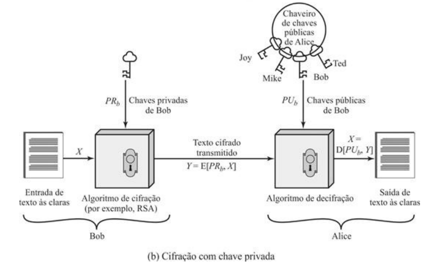
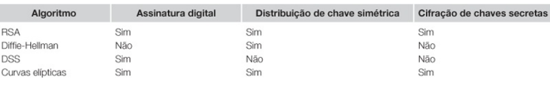
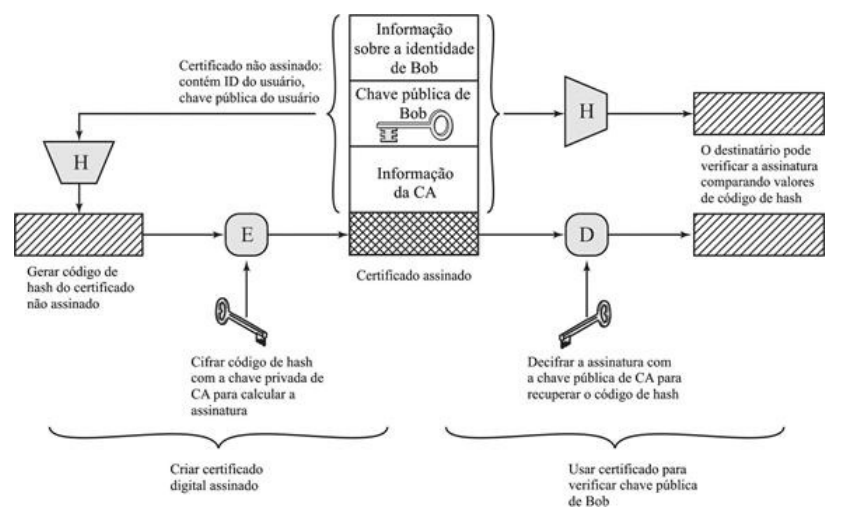

# Módulo: Criptografia de Chave Pública e Aleatoriedade

------

## Pré-Requisitos

São requisitos para essa aula o conhecimento de:

- Redes de Computadores (conceitos gerais)
- Módulo 1: princípios básicos
- Módulo 2: ameaças
- Módulo 3: requisitos
- Módulo 4: malware e vírus
- Módulo 5: worms
- Módulo 6: engenharia social e carga útil
- Módulo 7: contramedidas
- Módulo 8: negação de serviço
- Módulo 9
- Módulo 10
- Módulo 11

------

## Tópicos

- Chaves Públicas

# Criptografia de Chave Pública

## Estrutura de criptografia de chave pública

- Criptografia de chave pública: primeiro avanço verdadeiramente revolucionário na criptografia em milhares de anos literalmente
- Criptografia de chave pública proposta publicamente pela primeira vez por Diffie e Hellman em 1976 
    * Nota 1: agora sabe-se que Williamson (CESG/UK) propôs secretamente o conceito em 1969
    * Nota 2: patente US 4,200,77 expirada credita Hellman, Diffie e Ralph Merkle como inventores
    * Nota 3: em 2006, Hellman sugeriu que o nome fosse modificado para "Diffie-Hellman-Merkle key exchange" em homenagem às contribuições de Ralph Merkle ao projeto
- a criptografia de chave pública é **assimétrica**
    * utilização de duas chaves separadas
    * em contraste com a criptografia simétrica, que usa somente uma chave
- Método prático para trocar uma chave secreta
- Usado em vários produtos comerciais
- Segurança depende da dificuldade de calcular logaritmos discretos

## Componentes Criptografia de Chave Pública (Parte 1/2)

### Texto às claras
É a mensagem ou dados legíveis passados para o algoritmo
como entrada.

### Algoritmo de cifração
O algoritmo criptográfico executa várias
transformações no texto às claras.

### Chave pública e privada
É um par de chaves que foi selecionado de modo
que, se uma é usada para cifrar, a outra é usada para decifrar. As
transformações exatas executadas pelo algoritmo criptográfico dependem da
chave pública ou privada que é passada como entrada.

## Componentes Criptografia de Chave Pública (Parte 2/2)

### Texto cifrado
É a mensagem embaralhada e ininteligível produzida como
saída. Ela depende do texto às claras e da chave. Para dada mensagem, duas
chaves diferentes produzirão dois textos cifrados diferentes.

### Algoritmo de decifração
Esse algoritmo aceita o texto cifrado e a chave
correspondente, e produz o texto às claras original.

## Ilustração Criptografia Chave Pública: Confidencialidade

## Ilustração Criptografia Chave Pública: Autenticação

## Aplicações para Chaves Públicas

- Sistemas de chave pública são caracterizados pela utilização de um tipo de algoritmo criptográfico
com duas chaves
   * uma mantida em privado
   * uma disponível publicamente
- Podem ser utilizadas em três categorias
   * assinatura digital
   * distribuição de chave simétrica
   * cifração de chaves secretas
- Algoritmos populares são: Diffie-Helman; RSA; DSS; Curvas Elípticas

## RSA

- Um dos primeiros esquemas de chave pública proposto em 1977
    * Desenvolvido por Ron Rivest, Adi Shamir e Len Adleman no MIT
    * Publicado pela primeira vez em 1978 
- Cifra de bloco na qual o texto às claras e o texto cifrado são inteiros entre 0 e n - 1 para algum n
- Em 1977, os três inventores do RSA desafiaram os leitores da revista Scientific American a decodificar um texto cifrado na coluna "Mathematical Games" de Martin Gardner
   * Recompensa de 100 dólares
   * Em abril de 1994, um grupo trabalhando via Internet e usando mais de 1.600 computadores reclamou o prêmio
   *  desafio usou um tamanho de chave pública (comprimento de n) de 129 dígitos decimais, ou cerca de 428 bits
   * Atualmente, um tamanho de chave de 1024 bits (cerca de 300 dígitos decimais) é considerado forte o suficiente para aplicações comuns
- esquema RSA tem reinado soberano como a mais amplamente aceita e implementada abordagem da criptografia de chave pública

## Acordo de chaves de Diffie-Hellman

- Artigo seminal de Diffie e Hellman, que definiu a criptografia de chave pública em 1976
- finalidade do algoritmo é permitir que dois usuários cheguem a um acordo
seguro sobre um segredo compartilhado 
- segredo pode ser usado como chave secreta para subsequente aplicação de criptografia simétrica sobre mensagens
- O algoritmo em si é limitado à troca das chaves

## Digital signature standard

- NIST publicou FIPS PUB 186, conhecido como Digital Signature Standard (DSS -- padrão de assinatura digital)
- O DSS faz uso do SHA-1 e apresenta uma nova técnica de assinatura digital, o Digital Signature
Algorithm (DSA -- algoritmo de assinatura digital)
- DSS foi proposto originalmente em 1991 e revisado em 1993 em resposta a comentários públicos
referentes à segurança do esquema
- Houve ainda mais uma pequena revisão em 1996
- DSS usa um algoritmo projetado para prover somente a função assinatura digital
- Diferentemente do RSA, ele não pode ser usado para cifração ou troca de chaves

## Criptografia de curvas elípticas
- vasta maioria dos produtos e padrões que usam criptografia de chave pública
para cifração e assinaturas digitais usa RSA
- O comprimento em bits para uso seguro do RSA vem aumentando nos últimos anos, e isso colocou uma carga de processamento mais pesada sobre aplicações que usam RSA
- Esse problema tem ramificações, especialmente para sites de comércio eletrônico que executam
grande número de transações seguras
- Recentemente, um sistema concorrente começou a desafiar o RSA: a criptografia de curvas elípticas (Elliptic Curve Cryptography -- ECC)
- A ECC já está aparecendo em esforços de padronização, incluindo o Standard for Public-Key Cryptography (padrão para criptografia de chave pública) P1363 do IEEE
- ela parece oferecer segurança igual para um tamanho de bits muito menor, o que reduz os
custos de processamento
   *  nível de confiança na ECC ainda não é tão alto quanto no RSA

## Visualização Prática das Curvas Elípticas

- Acesse site do Andre Corbellini
- https://andrea.corbellini.name/2015/05/17/elliptic-curve-cryptography-a-gentle-introduction/
- https://github.com/andreacorbellini/ecc
- Entenda o processo de Soma em curvas elípticas
    * https://andrea.corbellini.name/ecc/interactive/reals-add.html
- Entenda o processo de Multiplicação em curvas elípticas
    * https://andrea.corbellini.name/ecc/interactive/reals-mul.html
- Reverter a multiplicação (também chamada de logaritmo discreto em curvas elípticas) é algo ainda altamente desafiador!
    * Para computadores convencionais (não-quânticos)...

# Assinaturas Digitais e Gerenciamento de Chaves

## Aspectos Diversos das Chaves Públicas

- Três grandes aspectos de chaves públicas:
   1. A distribuição segura de chaves públicas
   2. Uso de chave pública para distribuir chaves secretas
   3. A utilização de criptografia de chave pública para criar chaves temporárias para a cifração de mensagens
- Assinatura Digital: Bob quer enviar uma mensagem não-secreta a Alice e garantir autenticidade
   * Bob usa uma função de hash segura, como a SHA-512, para gerar um valor de hash para a mensagem
   * Bob cifra o código de hash com sua chave privada, criando uma **assinatura digital**
   * Alice recebe a mensagem mais a assinatura e decifra com a chave pública de Bob
   * assinatura digital não provê confidencialidade
- Certificados de chave pública: qualquer um pode forjar um anúncio público de chaves
   * A solução para esse problema é o **certificado de chave pública**
   * chave pública mais um ID de usuário do proprietário da chave, e o bloco inteiro assinado por uma terceira entidade confiável (CA)

## Certificado de Chave Pública: Padrão X.509

## Cifração de Enlace

- Possível cifrar enlaces de comunicação
- Requer bastante poder computacional nos enlaces, mas é bastante seguro
- Cada nó do enlace precisa decifrar as mensagens e cifrar novamente, de forma a rotear corretamente o conteúdo
   * Difícil de verificar pelo usuário final
- Veja ilustração no próximo slide

## Ilustração da Cifração de Enlace

# Discussão

## Breve discussão

### Cenário atual

- Quais técnicas criptográficas já teve acesso? Ao visualizar um certificado digital de um site, quais informações estão disponíveis? Ele foi feito em RSA ou com ECC? Quantos bits são necessários?
- Verifique novas técnicas criptográficas da atualidade e contraste com as apresentadas nesse material.

------

## Leia mais

Livro: 

- "Segurança de Computadores - Princípios e Práticas - 2012" - Stallings, William; Brown, Lawrie & Lawrie Brown & Mick Bauer & Michael Howard
    * Em Português do Brasil, CAMPUS - GRUPO ELSEVIER, 2ª Ed. 2014

Veja Capítulo 7, todas seções e finaliza o capítulo 7.

# Agradecimentos

-----

## Pessoas

Em especial, agradeço aos colegas que elaboraram bons materiais, como o prof. Raphael Machado, Kowada e Viterbo cujos conceitos formam o cerne desses slides.

Estendo os agradecimentos aos demais colegas que colaboraram com a elaboração do material do curso de [Pesquisa Operacional](https://github.com/igormcoelho/curso-pesquisa-operacional-i), que abriu caminho para verificação prática dessa tecnologia de slides.

-----

## Software

Esse material de curso só é possível graças aos inúmeros projetos de código-aberto que são necessários a ele, incluindo:

- pandoc
- LaTeX
- GNU/Linux
- git
- markdown-preview-enhanced (github)
- visual studio code
- atom
- revealjs
- groomit-mpx (screen drawing tool)
- xournal (screen drawing tool)
- ...

-----

## Empresas

Agradecimento especial a empresas que suportam projetos livres envolvidos nesse curso:

- github
- gitlab
- microsoft
- google
- ...

-----

## Reprodução do material

Esses slides foram escritos utilizando pandoc, segundo o tutorial ilectures:

- https://igormcoelho.github.io/ilectures-pandoc/

Exceto expressamente mencionado (com as devidas ressalvas ao material cedido por colegas), a licença será Creative Commons.

**Licença:** CC-BY 4.0 2020

Igor Machado Coelho

-------

## This Slide Is Intentionally Blank (for goomit-mpx)
