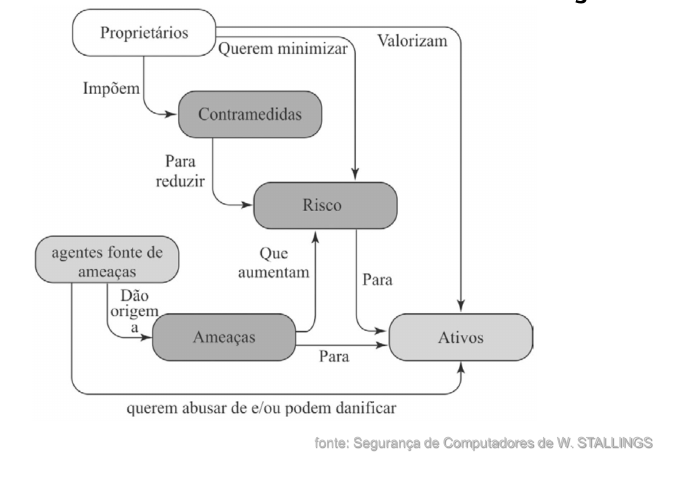
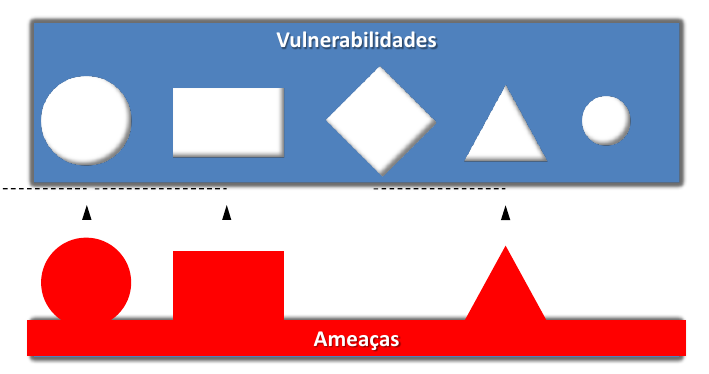
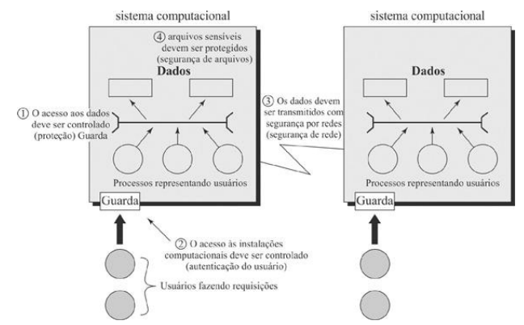
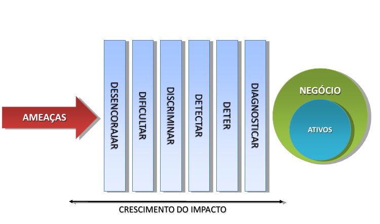

# Módulo: Ameaças, Ataques e Ativos

------

## Pré-Requisitos

São requisitos para essa aula o conhecimento de:

- Redes de Computadores (conceitos gerais)
- Módulo 1: princípios básicos

------

## Tópicos

- Ameaças
- Ataques
- Ativos

# Ameaças, Ataques e Ativos

------

## Terminologia

A terminologia da área de segurança, em especial conceitos tratados nesse módulo, podem ser encontrados em RFCs

- RFC 2828 - Internet Security Glossary (maio./2000)
   * https://www.rfc-editor.org/rfc/pdfrfc/rfc2828.txt.pdf
- RFC 4949 - Internet Security Glossary, Version 2 (ago./2007) 
   * expande a RFC2828
   * https://www.rfc-editor.org/rfc/pdfrfc/rfc4949.txt.pdf

Observações: ver notações de RFCs em geral. 

- Observar SHOULD, MUST, etc, e prefixos: (I) - Informational; (O) - Optional; (N) - Normative; etc
- Essas RFCs representam uma opinião, não sendo totalmente impositivas (veja preâmbulo da RFC 2828/4949)

-------

## Elementos da SI

### Ativo

Todo elemento que compõe os processos que manipulam e processam a informação, a contar a própria informação, o meio em que ela é armazenada, os equipamentos em que ela é manuseada, transportada e descartada

### Ameaças

Agentes ou condições que causam incidentes que comprometem as informações e seus ativos por meio da exploração de vulnerabilidades, provocando perdas de confidencialidade, integridade e disponibilidade e, consequentemente, causando impactos aos negócios de uma organização

### Vulnerabilidades

Fragilidade presente ou associada a ativos que manipulam e/ou processam informações que, ao ser explorada por ameaças, permite a ocorrência de um incidente de segurança, afetando negativamente um ou mais princípios da segurança da informação: confidencialidade, integridade e disponibilidade

-------

## Diagrama para Terminologia de Segurança

-------

## ATIVOS

- É tudo aquilo que possui valor para uma organização

### Ativos Tangíveis

- Informações impressas ou digitais
- Impressoras
- Móveis de escritório

### Ativos Intangíveis

- Imagem de uma empresa
- Confiabilidade de um órgão federal
- Marca de um produto

### Tipos de ativos

- Lógicos: Dados armazenados em um servidor
- Físicos: Estação de trabalho, sistema de ar condicionado
- Humanos: Empregados, prestadores de serviços

-------

## AMEAÇAS (threats)

- Agentes ou condições que causam incidentes que comprometem as informações e seus ativos por meio da exploração de vulnerabilidades, provocando perdas de confidencialidade, integridade e disponibilidade e, consequentemente, causando impactos aos negócios de uma organização

-------

## Tipos de Ameaças

### Naturais

Ameaças decorrentes de fenômenos da natureza, como incêndios naturais, enchentes, terremotos, tempestades eletromagnéticas, maremotos, aquecimento, poluição, etc

### Involuntárias

Ameaças inconscientes, quase sempre causadas pelo desconhecimento. 
Podem ser causadas por acidentes, erros, falta de energia, etc

### Voluntárias

Ameaças propositais causadas por agentes humanos como hackers, invasores, espiões, ladrões, criadores e disseminadores de vírus de computador, incendiários

-------

## VULNERABILIDADES

- **Fragilidades** presentes ou associadas a ativos que manipulam e/ou processam informações que, ao serem **exploradas por ameaças**, permitem a ocorrência de um **incidente de segurança**, afetando negativamente um ou mais princípios da segurança da informação: **Confidencialidade**, **Integridade** e **Disponibilidade**
- Por si só não provocam incidentes, são **elementos passivos**, necessitando para tanto de um **agente causador ou condição favorável**, que são as **ameaças**
- São as falhas que são exploradas pelas ameaças

-------

## Vulnerabilidades (parte 1/2)

- **Físicas:** Instalações prediais fora do padrão; salas de CPD mal planejadas; falta de extintores; detectores de fumaça e de outros recursos para combate a incêndio em sala  com armários e fichários estratégicos; risco de explosões; vazamentos ou incêndio
- **Naturais:** Computadores são suscetíveis a desastres naturais, como incêndios, enchentes, terremotos, tempestades, e outros, como falta de energia, acúmulo de poeira, aumento de umidade e de temperatura, etc
- **Hardware:** Falhas nos recursos tecnológicos (desgaste, obsolescência, má utilização) ou erros durante a instalação
- **Software:** Erros na instalação ou na configuração podem acarretar acessos indevidos, vazamento de informações, perda de dados ou indisponibilidade do recurso quando necessário
- **Mídias:** Discos, fitas, relatórios e impressos podem ser perdidos ou danificados. A radiação eletromagnética pode afetar diversos tipos de mídias magnéticas
- **Comunicação:** Acessos não autorizados ou perda de comunicação

-------

## Vulnerabilidades (parte 2/2)

- **Humanas:** Falta de treinamento, compartilhamento de informações confidenciais, não execução de rotinas de segurança, erros ou omissões; ameaça de bomba, sabotagens, distúrbios civis, greves, vandalismo, roubo, destruição da propriedade ou dados, invasões ou guerras

-------

## Vulnerabilidades X Ameaças

Como peças que se encaixam, **ameaças** específicas exploram **vulnerabilidades** compatíveis

-------

## Vulnerabilidades e Ataques

- as vulnerabilidades dos recursos do sistema podem
   * ser corrompidas (perda de integridade)
   * ser vazadas (perda de confidencialidade)
   * tornar-se indisponíveis (perda de disponibilidade)
- ataques são **ameaças realizadas** e podem ser:
   * passivos
   * ativos
   * internos
   * externos

**Desafio:** Quais tipos de Ataque existem na RFC 2828/4949? (**Dica:** procure por *"$ attack"*)

-------

## Ataques de Segurança de Rede

- Classificar como passivo ou ativo
- Ataques passivos são espionagem
   * divulgação do conteúdo da mensagem
   * análise de tráfico
   * são difíceis de detectar, então busca-se evitar
- Ataques ativos modificam/falsificam dados
   * mascaramento
   * reprodução
   * modificação
   * negação de serviço
   * difícil de evitar, então busca-se detectar

-------

## Contramedidas

- Meios utilizados para lidar com ataques de segurança
   * prevenir
   * detectar
   * recuperar
- Pode resultar em novas vulnerabilidades
- Terá vulnerabilidade residual
- Objetivo é minimizar o risco dadas as restrições

-------

## Medidas de Segurança

- **Preventivas:** objetivam evitar que incidentes venham a ocorrer. Visam
manter a segurança já implementada por meio de mecanismos que
estabeleçam a conduta e a ética da segurança na instituição. Ex.: **políticas de segurança**, instruções e procedimentos de trabalho, especificação de
segurança, campanhas e **palestras de conscientização de usuários**;
ferramentas para implementação da política de segurança (**firewall**, **antivírus**, configurações adequadas de roteadores e dos sistemas operacionais, etc).
- **Detectáveis:** visam identificar condições ou indivíduos causadores de
ameaças, a fim de evitar que as mesmas explorem vulnerabilidades. Ex.:
**análise de riscos**, **sistemas de detecção de intrusão**, alertas de segurança, **câmeras de vigilância**, alarmes, etc.
- **Corretivas:** Ações voltadas à correção de uma estrutura tecnológica e humana para que as mesmas se adaptem às condições de segurança
estabelecidas pela instituição, ou voltadas à redução dos impactos: **equipes para emergências**, **restauração de backup**, plano de continuidade
operacional, **plano de recuperação de desastres**.

-------

## Escopo da Segurança (parte 1/2)

Consideramos quatro tipos de ativos com exemplos de ameaça:

- **Hardware:** 
   * o equipamento é roubado ou desabilitado e, por consequência, há negação de serviço (Disp.)
   
- **Software:**
   * Programas são removidos negando acesso a usuários (Disp.)
   * Uma cópia não autorizada do software é feita (Conf.)
   * Programa instalado é modificado, seja para fazê-lo falhar durante a execução ou efetuar tarefa não pretendida (Integ.)
- **Dados:**
   * Arquivos são removidos, prevenindo seu acesso por usuários (Disp.)
   * É realidade leitura não autorizada de dados (Conf.)
   * Arquivos existentes são modificados (Integ.)
- **Enlaces de Comunicação:**
   * Mensagens são destruídas ou eliminadas (Disp.)
   * Mensagens são lidas (Conf.)
   * Padrão de tráfego observado / análise estatística (Conf.)
   * Mensagens são modificadas, atrasadas, reordenadas, etc (Integ.)

-------

## Escopo da Segurança (parte 2/2)

-------

## Barreiras Clássicas de Segurança

-------

## Barreiras de Segurança (1/6)

### 1. Desencorajar

Esta é a primeira das cinco barreiras de segurança e
cumpre o papel importante de desencorajar as ameaças.
Estas, por sua vez, podem ser desmotivadas ou podem
perder o interesse e o estímulo pela tentativa de quebra
de segurança por efeito de mecanismos físicos,
tecnológicos ou humanos. A simples presença de uma
câmera de vídeo, mesmo falsa, de um aviso da
existência de alarmes, campanhas de divulgação da
política de segurança ou treinamento dos funcionários
informando as práticas de auditoria e monitoramento de
acesso aos sistemas, já são efetivos nesta fase.

-------

## Barreiras de Segurança (2/6)

### 2. Dificultar
O papel desta barreira é complementar a anterior através
da adoção efetiva dos controles que irão dificultar o
acesso indevido. Como exemplo, podemos citar os
dispositivos de autenticação para acesso físico, como
roletas, detectores de metal e alarmes, ou lógicos,
como leitores de cartão magnético, senhas, smartcards
e certificados digitais, além da criptografia, firewall, etc.

-------

## Barreiras de Segurança (3/6)

### 3.  Discriminar
Aqui o importante é se cercar de recursos que permitam
identificar e gerir os acessos, definindo perfis e
autorizando permissões. Os sistemas são largamente
empregados para monitorar e estabelecer limites de
acesso aos serviços de telefonia, perímetros físicos,
aplicações de computadores e bancos de dados. Os
processos de avaliação e gestão do volume de uso dos
recursos, como e-mail, impressora, ou até mesmo o fluxo
de acesso físico aos ambientes, são bons exemplos das
atividades desta barreira.

-------

## Barreiras de Segurança (4/6)

### 4. Detectar
Mais uma vez agindo de forma complementar às suas
antecessoras, esta barreira deve munir a solução de
segurança de dispositivos que sinalizem, alertem, e
instrumentem os gestores da segurança na detecção de
situações de risco. Seja em uma tentativa de invasão, uma
possível contaminação por vírus, o descumprimento da
política de segurança da empresa, ou a cópia e envio de
informações sigilosas de forma inadequada. Entram aqui
os sistemas de monitoramento e auditoria para auxiliar na
identificação de atitudes de exposição, como o antivírus e
o sistema de detecção de intrusos, que reduziram o tempo
de resposta a incidentes.

-------

## Barreiras de Segurança (5/6)

### 5. Deter
Representa o objetivo de impedir que a ameaça atinja os
ativos que suportam o negócio. O acionamento desta
barreira, ativando seus mecanismos de controle, é um
sinal de que as barreiras anteriores não foram suficientes
para conter a ação da ameaça. Neste momento, medidas
de detenção, como ações administrativas, punitivas e
bloqueio de acessos físicos e lógicos, respectivamente
a ambientes e sistemas, são bons exemplos.

-------

## Barreiras de Segurança (6/6)

### 6. Diagnosticar
Apesar de representar a última barreira no diagrama, esta
fase tem um sentido especial de representar a
continuidade do processo de gestão de segurança da
informação. Pode parecer o fim, mas é o elo de ligação
com a primeira barreira, criando um movimento cíclico e
contínuo. Devido a esses fatores esta é a barreira de
maior importância. Deve ser conduzida por atividades de
análise de riscos que considerem tanto os aspectos
tecnológicos quanto os físicos e humanos, sempre
orientados às características e às necessidades
específicas dos processos de negócio de uma empresa.

-------

## Consequências da Ameaça

- Revelação não autorizada
   * exposição, intercepção, inferência, intrusão
- Fraude
   * mascaramento, falsificação, repúdio
- Disrupção
   * incapacitação, corrupção, obstrução
- Usurpação
   * apropriação indevida, uso indevido

# Discussão

## Breve discussão

### Cenário atual: ataques comuns

- Quais ataques são mais comuns no nosso cotidiano?
- Como novos avanços tecnológicos tem trazido benefícios mas também, novas vulnerabilidades e ameaças?

------

## Leia mais

Livro: 

- "Segurança de Computadores - Princípios e Práticas - 2012" - Stallings, William; Brown, Lawrie & Lawrie Brown & Mick Bauer & Michael Howard
    * Em Português do Brasil, CAMPUS - GRUPO ELSEVIER, 2ª Ed. 2014

Veja Capítulo 1, "Seção 1.2 - Conceitos de Segurança de Computadores".

# Agradecimentos

-----

## Pessoas

Em especial, agradeço aos colegas que elaboraram bons materiais, como o prof. Raphael Machado, Kowada e Viterbo cujos conceitos formam o cerne desses slides.

Estendo os agradecimentos aos demais colegas que colaboraram com a elaboração do material do curso de [Pesquisa Operacional](https://github.com/igormcoelho/curso-pesquisa-operacional-i), que abriu caminho para verificação prática dessa tecnologia de slides.

-----

## Software

Esse material de curso só é possível graças aos inúmeros projetos de código-aberto que são necessários a ele, incluindo:

- pandoc
- LaTeX
- GNU/Linux
- git
- markdown-preview-enhanced (github)
- visual studio code
- atom
- revealjs
- groomit-mpx (screen drawing tool)
- xournal (screen drawing tool)
- ...

-----

## Empresas

Agradecimento especial a empresas que suportam projetos livres envolvidos nesse curso:

- github
- gitlab
- microsoft
- google
- ...

-----

## Reprodução do material

Esses slides foram escritos utilizando pandoc, segundo o tutorial ilectures:

- https://igormcoelho.github.io/ilectures-pandoc/

Exceto expressamente mencionado (com as devidas ressalvas ao material cedido por colegas), a licença será Creative Commons.

**Licença:** CC-BY 4.0 2020

Igor Machado Coelho

-------

## This Slide Is Intentionally Blank (for goomit-mpx)
