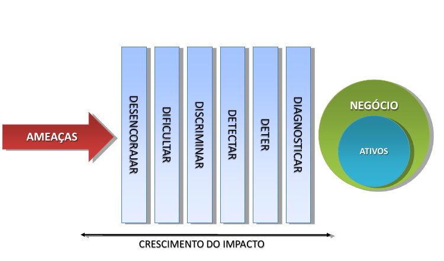
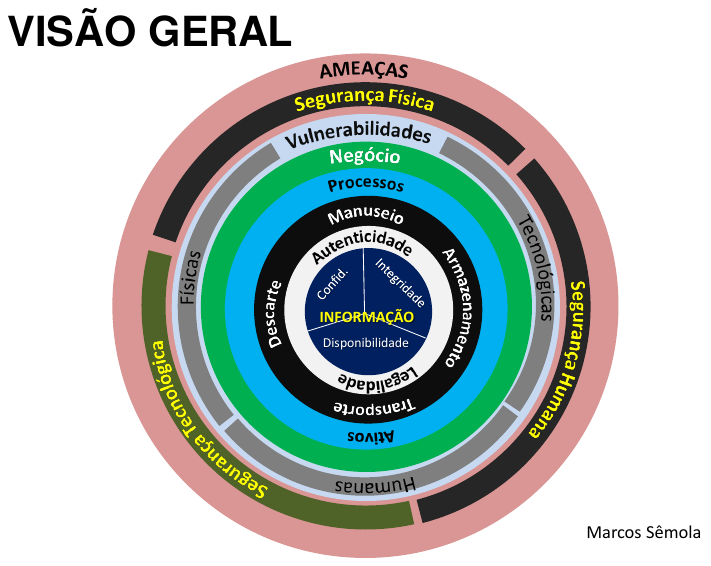
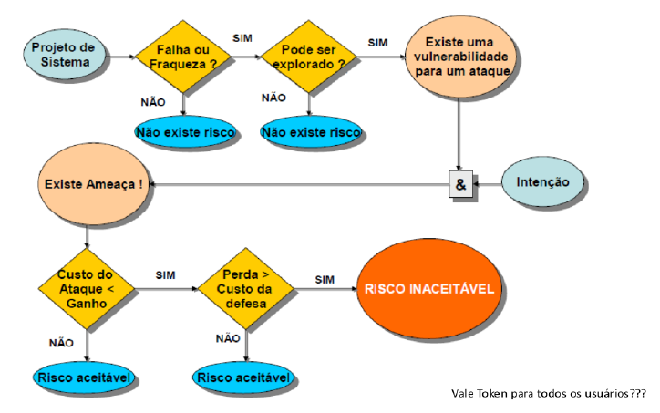
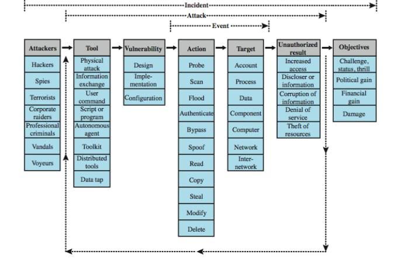
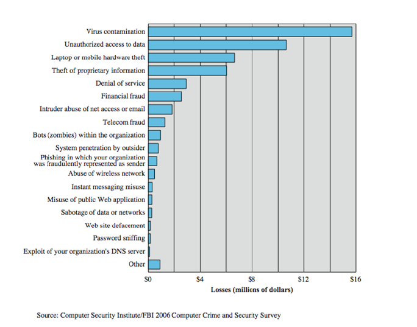
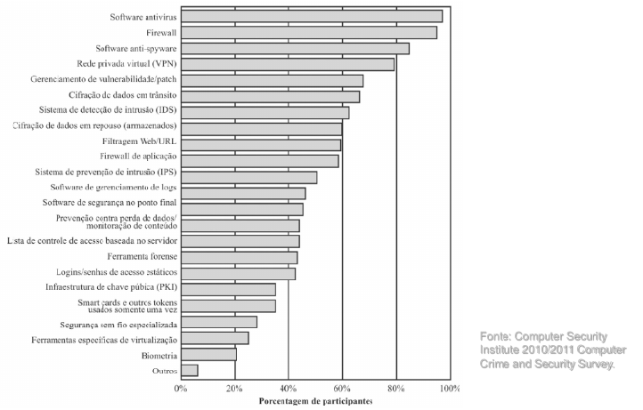

# Módulo: Requisitos e Arquitetura de Segurança

------

## Pré-Requisitos

São requisitos para essa aula o conhecimento de:

- Redes de Computadores (conceitos gerais)
- Módulo 1: princípios básicos
- Módulo 1: ameaças

------

## Tópicos

- Requisitos de Segurança
- Arquitetura de Segurança

# Requisitos e Arquitetura de Segurança

------

## Terminologia

A terminologia da arquitetura e dos requisitos de segurança podem ser encontrados na X.800:

- ITU-T X.800  (22/03/1991)
   * X.800 : Security architecture for Open Systems Interconnection for CCITT applications
   * 48 páginas
   * https://www.itu.int/rec/T-REC-X.800/en
   * https://www.itu.int/rec/dologin_pub.asp?lang=e&id=T-REC-X.800-199103-I!!PDF-E&type=items

As definições da X.800 são em cima da OSI (X.200)

-------

## Requisitos e barreiras de segurança

Existem várias formas de classificar e caracterizar as contramedidas que podem ser usadas para reduzir vulnerabilidades e lidar com ameaças a ativos de sistema

- Exploraremos a classificação da FIPS PUB 200 (*Minimum Security Requirements for Federal Information and Information Systems*) que enumera 17 áreas
- Antes de adentrar na FIPS PUB 200, apresentamos algumas barreiras clássicas de segurança

-------

## Barreiras Clássicas de Segurança

-------

## Barreiras de Segurança (1/6)

### 1. Desencorajar

Esta é a primeira das cinco barreiras de segurança e
cumpre o papel importante de desencorajar as ameaças.
Estas, por sua vez, podem ser desmotivadas ou podem
perder o interesse e o estímulo pela tentativa de quebra
de segurança por efeito de mecanismos físicos,
tecnológicos ou humanos. A simples presença de uma
câmera de vídeo, mesmo falsa, de um aviso da
existência de alarmes, campanhas de divulgação da
política de segurança ou treinamento dos funcionários
informando as práticas de auditoria e monitoramento de
acesso aos sistemas, já são efetivos nesta fase.

-------

## Barreiras de Segurança (2/6)

### 2. Dificultar
O papel desta barreira é complementar a anterior através
da adoção efetiva dos controles que irão dificultar o
acesso indevido. Como exemplo, podemos citar os
dispositivos de autenticação para acesso físico, como
roletas, detectores de metal e alarmes, ou lógicos,
como leitores de cartão magnético, senhas, smartcards
e certificados digitais, além da criptografia, firewall, etc.

-------

## Barreiras de Segurança (3/6)

### 3.  Discriminar
Aqui o importante é se cercar de recursos que permitam
identificar e gerir os acessos, definindo perfis e
autorizando permissões. Os sistemas são largamente
empregados para monitorar e estabelecer limites de
acesso aos serviços de telefonia, perímetros físicos,
aplicações de computadores e bancos de dados. Os
processos de avaliação e gestão do volume de uso dos
recursos, como e-mail, impressora, ou até mesmo o fluxo
de acesso físico aos ambientes, são bons exemplos das
atividades desta barreira.

-------

## Barreiras de Segurança (4/6)

### 4. Detectar
Mais uma vez agindo de forma complementar às suas
antecessoras, esta barreira deve munir a solução de
segurança de dispositivos que sinalizem, alertem, e
instrumentem os gestores da segurança na detecção de
situações de risco. Seja em uma tentativa de invasão, uma
possível contaminação por vírus, o descumprimento da
política de segurança da empresa, ou a cópia e envio de
informações sigilosas de forma inadequada. Entram aqui
os sistemas de monitoramento e auditoria para auxiliar na
identificação de atitudes de exposição, como o antivírus e
o sistema de detecção de intrusos, que reduziram o tempo
de resposta a incidentes.

-------

## Barreiras de Segurança (5/6)

### 5. Deter
Representa o objetivo de impedir que a ameaça atinja os
ativos que suportam o negócio. O acionamento desta
barreira, ativando seus mecanismos de controle, é um
sinal de que as barreiras anteriores não foram suficientes
para conter a ação da ameaça. Neste momento, medidas
de detenção, como ações administrativas, punitivas e
bloqueio de acessos físicos e lógicos, respectivamente
a ambientes e sistemas, são bons exemplos.

-------

## Barreiras de Segurança (6/6)

### 6. Diagnosticar
Apesar de representar a última barreira no diagrama, esta
fase tem um sentido especial de representar a
continuidade do processo de gestão de segurança da
informação. Pode parecer o fim, mas é o elo de ligação
com a primeira barreira, criando um movimento cíclico e
contínuo. Devido a esses fatores esta é a barreira de
maior importância. Deve ser conduzida por atividades de
análise de riscos que considerem tanto os aspectos
tecnológicos quanto os físicos e humanos, sempre
orientados às características e às necessidades
específicas dos processos de negócio de uma empresa.

------

## Requisitos Funcionais de Segurança

- **Medidas técnicas:**
   * controle de acesso; identificação e autenticação; sistema e proteção de comunicação; integridade de sistemas e informações
- **Controles e procedimentos de gerenciamento:**
   * conscientização e treinamento; auditoria e responsabilização;
certificação, acreditação e avaliações de segurança; planejamento
de contingência; manutenção; proteção física e ambiental;
planejamento; segurança do pessoal; avaliação de risco; aquisição
de sistemas e serviços
- **Sobreposição técnica e de gestão:**
   * gerenciamento de configurações; resposta ao incidente; proteção de mídias

-------

## 17 Requisitos de Segurança

Os requisitos apresentados no FIPS PUB 200 abrangem ampla gama de
contramedidas para vulnerabilidades e ameaças à segurança.

### 1. Controle de acesso
Limitar acesso a sistemas de informação a
usuários autorizados, processos que agem em nome de usuários
autorizados ou dispositivos (incluindo outros sistemas de
informação) e aos tipos de transações e funções que usuários
autorizados têm permissão de exercer.

### 2. Conscientização e treinamento
*(i)* Assegurar que gerentes e
usuários de sistemas de informação organizacionais se
conscientizem dos riscos à segurança associados às suas atividades
e das leis, regulamentações e políticas relacionadas à segurança de
sistemas de informação organizacionais; e (ii) assegurar que o
pessoal seja adequadamente treinado para executar seus deveres e
responsabilidades relacionados à segurança das informações.

## 17 Requisitos de Segurança

### 3. Auditoria e responsabilidade
*(i)* Criar, proteger e manter registros
de auditoria do sistema de informação pelo período que seja
necessário para facilitar monitoramento, análise, investigação e
relato de atividades ilegítimas, não autorizadas ou inadequadas do
sistema de informação; e (ii) assegurar que as ações de usuários
individuais do sistema de informação possam ser rastreadas
exclusivamente até esses usuários de modo a poder cobrar deles a
responsabilidade por suas ações.

### 4. Avaliações de certificação, credenciamento e segurança
*(i)*
Avaliar periodicamente os controles de segurança em sistemas de
informação organizacionais para determinar se os controles são
efetivos em sua aplicação; (ii) desenvolver e implementar planos de
ação projetados para corrigir deficiências e reduzir ou eliminar
vulnerabilidades em sistemas de informação organizacionais; (iii)
autorizar a operação de sistemas de informação organizacionais e
quaisquer conexões associadas ao sistema de informação; e (iv)
monitorar continuamente os controles de segurança.

------

## 17 Requisitos de Segurança

### 5. Gerenciamento de configuração
*(i)* Estabelecer e manter
configurações e inventários básicos de sistemas de informação
organizacionais (incluindo hardware, software, firmware e
documentação) por todos os ciclos de vida do desenvolvimento do
sistema respectivo; e (ii) estabelecer e garantir o cumprimento das
configurações de segurança para produtos de tecnologia da
informação  empregados  em  sistemas  de  informação organizacionais.

### 6. Planejamento de contingência
Estabelecer, manter e implementar
planos para respostas a emergências, operações de backup e
recuperação pós-desastre para sistemas de informação
organizacionais, para assegurar a disponibilidade de ativos de
informação críticos e a continuidade de operações em situações de
emergência.

## 17 Requisitos de Segurança

### 7. Identificação e autenticação
Identificar usuários do sistema de
informação, processos que agem em nome de usuários ou
dispositivos e autenticar (ou verificar) as identidades desses
usuários, processos ou dispositivos, como pré-requisito para
permitir acesso a sistemas de informação organizacionais.

### 8. Resposta a incidentes
*(i)* Estabelecer uma capacidade operacional
de lidar com incidentes relativos a sistemas de informação
organizacionais, incluindo atividades adequadas de preparação,
detecção, análise, contenção, recuperação e resposta do usuário; e
(ii) rastrear, documentar e relatar incidentes aos responsáveis
organizacionais e/ou autoridades adequadas.

## 17 Requisitos de Segurança

### 9. Manutenção
*(i)* Realizar manutenção periódica e oportuna em
sistemas de informação organizacionais; e (ii) prover controles
efetivos de ferramentas, técnicas, mecanismos e pessoal usados para
executar a manutenção do sistema de informação.

### 10. Proteção da mídia
*(i)* Proteger a mídia do sistema de informação,
seja em papel, seja digital; (ii) limitar acesso a informações relativas
a mídias do sistema de informação a usuários autorizados; e (iii)
apagar ou destruir uma mídia do sistema de informação antes de
descartá-la ou liberá-la para reutilização.

## 17 Requisitos de Segurança

### 11. Proteção física e ambiental
*(i)* Limitar o acesso físico a sistemas
de informação, equipamentos e respectivos ambientes operacionais
a indivíduos autorizados; (ii) proteger as instalações físicas e a
infraestrutura de suporte aos sistemas de informação; (iii) prover
serviços de suporte a sistemas de informação; (iv) proteger sistemas
de informação contra perigos ambientais; e (v) prover controles
ambientais adequados em instalações que contenham sistemas de
informação.

### 12. Planejamento
Desenvolver, documentar, atualizar periodicamente
e implementar planos de segurança para sistemas de informação
organizacionais que descrevam os controles de segurança instalados
ou planejados para os sistemas de informação e as regras de
comportamento para indivíduos que acessam os sistemas de
informação.

## 17 Requisitos de Segurança

### 13. Segurança de pessoal
*(i)* Assegurar que indivíduos que ocupam
posições de responsabilidade dentro de organizações (incluindo
prestadores de serviços terceirizados) são confiáveis e cumprem os
critérios de segurança estabelecidos para essas posições; (ii)
assegurar que informações organizacionais e sistemas de
informação estejam protegidos durante e depois de ações relativas a
gerenciamento de pessoal, como demissões e transferências; e (iii)
aplicar sanções formais ao pessoal que não cumpra as políticas e
procedimentos de segurança organizacional.

### 14. Avaliação de risco
Avaliar periodicamente o risco às operações
organizacionais (incluindo missão, funções, imagem ou reputação),
ativos organizacionais e indivíduos, resultante da operação de
sistemas de informação organizacionais e do processamento,
armazenamento ou transmissão de informações organizacionais.

## 17 Requisitos de Segurança

### 15. Aquisição de sistemas e serviços
*(i)* Alocar ativos suficientes para
proteger sistemas de informação organizacionais; (ii) empregar
processos de ciclo de vida de desenvolvimento de sistemas que
incorporem considerações sobre segurança das informações; (iii)
aplicar restrições à utilização e instalação de software; e (iv)
assegurar que provedores de serviços terceirizados empreguem
medidas de segurança adequadas para proteger informações,
aplicações e/ou serviços terceirizados da organização.

### 16. Proteção de sistemas e comunicações
*(i)* Monitorar, controlar e
proteger comunicações organizacionais (isto é, informações
transmitidas ou recebidas por sistemas de informação
organizacionais) nas fronteiras externas e nas principais fronteiras
internas dos sistemas de informação; e (ii) empregar projetos de
arquitetura, técnicas de desenvolvimento de software e princípios de
engenharia de sistemas que promovam a efetiva segurança de
informações dentro de sistemas de informação organizacionais.

## 17 Requisitos de Segurança

### 17. Integridade de sistemas e informações
*(i)* Identificar, relatar e
corrigir a tempo falhas de informação e sistemas de informação; (ii)
prover proteção contra código malicioso em locais adequados
dentro de sistemas de informação organizacionais; e (iii) monitorar
alertas e auditorias de segurança do sistema de informação e tomar
as providências adequadas para enfrentá-los.

-------

## Risco

- [**Riscos:**]{.underline} **Probabilidade** de **ameaças** explorarem
**vulnerabilidades**, provocando perdas de confidencialidade,
integridade e disponibilidade, causando possivelmente, **impactos**
nos negócios.
- [**Probabilidade:**]{.underline}  Chances de uma ameaça explorar uma
vulnerabilidade.
- [**Impacto:**]{.underline}  Abrangência dos danos causados por um incidente de
segurança sobre um ou mais processo ou ativos de negócio.
- **Risco = Probabilidade x Impacto**
   * **Risco** também pode ser compreendido como **Exposição** (*risk exposure*)

### Segurança

**Segurança** é uma prática voltada à eliminação de **Vulnerabilidades**
para reduzir os **Riscos** de uma **Ameaça** se concretizar no ambiente
que se quer proteger.

------ 

## Visão Geral/Macro da Área de Segurança

------ 

## Risco Aceitável/Inaceitável (Stoneburner, 2001)

------ 

## Arquitetura de Segurança: X.800

- Arquitetura de segurança para OSI (X.200)
- Maneira sistemática de definir requisitos de segurança e caracterizar abordagens para
satisfazê-los
- Define:
   * ataques de segurança - comprometimentos de segurança
   * mecanismo de segurança - agir para detectar, prevenir, recuperar do ataque
   * serviço de segurança - contra-ataques de segurança
- Leia na norma suas 6 categorias e 14 serviços específicos

-----

## Taxonomia de Segurança: Incidentes, Ataques e Eventos

-----

## Perdas em Segurança Computacional

-----

## Tecnologias de Segurança Utilizadas

------

## Estratégia de Segurança Computacional

- Especificação / Política
   * O que o esquema de segurança deve fazer?
   * codificar em políticas e procedimentos
- Implementação / Mecanismos
   * como ele faz isso?
   * prevenção, detecção, resposta, recuperação
- Correção / Garantia
   * isso realmente funciona?
   * garantia, avaliação

# Discussão

## Breve discussão

### Cenário atual: centralização vs descentralização

- Será que a centralização dos dados em plataformas é benéfico ao usuário? O que se ganha? O que se perde?
- Como usuários enxergam alternativas modernas com sistemas federados (Mastodon/ActivityPub) e descentralizados (Blockchain)?
- Recomendada leitura de material complementar (material acessível a executivos e público-geral): "SÊMOLA, Marcos. Gestão da Segurança da Informação, 2a Ed. Elsevier Brasil, 2014."

------

## Leia mais

Livro: 

- "Segurança de Computadores - Princípios e Práticas - 2012" - Stallings, William; Brown, Lawrie & Lawrie Brown & Mick Bauer & Michael Howard
    * Em Português do Brasil, CAMPUS - GRUPO ELSEVIER, 2ª Ed. 2014

Veja Capítulo 1, seções 1.3 a 1.6 (finaliza capítulo 1).

# Agradecimentos

-----

## Pessoas

Em especial, agradeço aos colegas que elaboraram bons materiais, como o prof. Raphael Machado, Kowada e Viterbo cujos conceitos formam o cerne desses slides.

Estendo os agradecimentos aos demais colegas que colaboraram com a elaboração do material do curso de [Pesquisa Operacional](https://github.com/igormcoelho/curso-pesquisa-operacional-i), que abriu caminho para verificação prática dessa tecnologia de slides.

-----

## Software

Esse material de curso só é possível graças aos inúmeros projetos de código-aberto que são necessários a ele, incluindo:

- pandoc
- LaTeX
- GNU/Linux
- git
- markdown-preview-enhanced (github)
- visual studio code
- atom
- revealjs
- groomit-mpx (screen drawing tool)
- xournal (screen drawing tool)
- ...

-----

## Empresas

Agradecimento especial a empresas que suportam projetos livres envolvidos nesse curso:

- github
- gitlab
- microsoft
- google
- ...

-----

## Reprodução do material

Esses slides foram escritos utilizando pandoc, segundo o tutorial ilectures:

- https://igormcoelho.github.io/ilectures-pandoc/

Exceto expressamente mencionado (com as devidas ressalvas ao material cedido por colegas), a licença será Creative Commons.

**Licença:** CC-BY 4.0 2020

Igor Machado Coelho

-------

## This Slide Is Intentionally Blank (for goomit-mpx)
