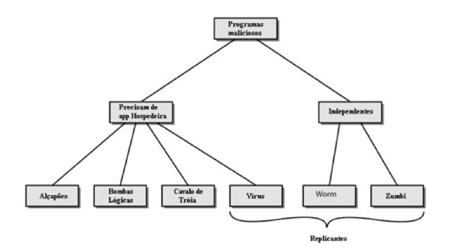
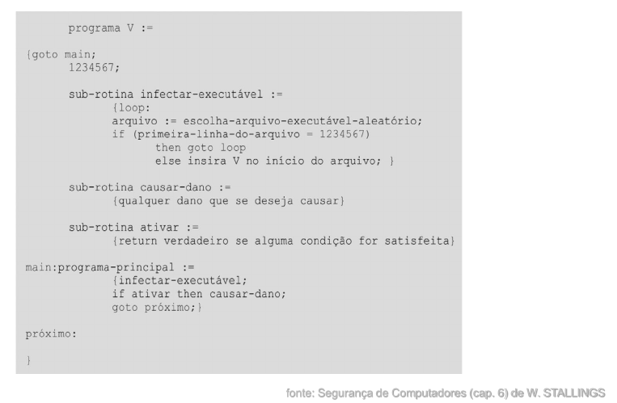

# Módulo: Malware e Vírus

------

## Pré-Requisitos

São requisitos para essa aula o conhecimento de:

- Redes de Computadores (conceitos gerais)
- Módulo 1: princípios básicos
- Módulo 2: ameaças
- Módulo 3: requisitos

------

## Tópicos

- Malware: terminologia
- Propagação de vírus

# Malware e Vírus

------

## Malware

- Programas que exploram vulnerabilidades do sistema
- Conhecido como **software malicioso** ou **malware**
- Categorias principais
   (I) Fragmentos de programas que precisam de um programa host
       * ex. vírus, bombas lógicas (técnica), e backdoors
   (I) Programas autônomos independentes
       * ex. vermes (*worms*), bots
- Outras categorias
   * Se replicam ou não
- Ameaças sofisticadas aos sistemas computacionais

-------

## Malware: Definição NIST

Na publicação do NIST 800-83 *Guide to Malware Incident Prevention and Handling* de novembro de 2005,
temos a seguinte definição de Malware (tradução Stallings):

### Definição NIST 800
**Malware:** *um programa que é inserido em um sistema, usualmente às escondidas, com a intenção de comprometer a confidencialidade, a integridade ou a disponibilidade dos dados, aplicações ou sistema operacional da vítima ou, possivelmente, apenas aborrecer ou perturbar a vítima.*

-------

## Malware: Guia Útil (parte 1/7)

Não há concordância geral na área sobre os termos, dado que há sobreposição entre as diversas
categorias de malware.
Uma guia útil de Stallings:

### Adware
Propaganda que é integrada ao software. Pode resultar em pop-ups de propaganda ou no
redirecionamento de um navegador para um site comercial.
Veja wiki: https://en.wikipedia.org/wiki/Adware

### Kit de ataque / *crimeware kit* / *exploit kit*
Conjunto de ferramentas para gerar um novo malware automaticamente usando uma
variedade de mecanismos de propagação e cargas úteis fornecidos.

- Veja wiki: https://en.wikipedia.org/wiki/Crimeware
- Veja wiki: https://en.wikipedia.org/wiki/Exploit_kit

-------

## Malware: Guia Útil (parte 2/7)

### Auto-Rooter

Ferramentas maliciosas de hackers usadas para invadir remotamente novas máquinas.

### Backdoor (*trapdoor*/alçapão)

Qualquer mecanismo que burle uma verificação de segurança normal; 
pode permitir acesso não autorizado a funcionalidades em um programa ou a um sistema comprometido.
Veja Wiki: https://en.wikipedia.org/wiki/Backdoor_(computing)

### Downloaders

Códigos que instalam outros itens em uma máquina sob ataque. São normalmente
incluídos no código do malware primeiramente inserido em um sistema comprometido
para depois importar um pacote de malware maior.

-------

## Malware: Guia Útil (parte 3/7)

### Drive-by-Download

Um ataque que usa código colocado em um site comprometido que explora vulnerabilidades de navegadores para atacar um sistema cliente quando o site é visitado.

### Exploits (Explorações)

Códigos específicos para uma única vulnerabilidade ou conjunto de vulnerabilidades.

### Flooders (cliente de DoS)

Usados para gerar grande volume de dados para atacar sistemas de computadores em rede, 
executando alguma forma de ataque de negação de serviço (Denial of Service, ou DoS).

### Keyloggers

Capturam teclas digitadas no teclado de um sistema comprometido.

-------

## Malware: Guia Útil (parte 4/7)

### Bomba lógica / *Logic Bomb*

Código inserido em um malware por um intruso. Uma bomba lógica permanece em
hibernação até ocorrer uma condição predefinida; então, o código ativa uma ação não
autorizada.
Veja wiki: https://en.wikipedia.org/wiki/Logic_bomb

### Vírus de macro

Um tipo de vírus que usa código de macro ou de linguagem de script, tipicamente
embutido em um documento e ativado quando o documento é visualizado ou editado,
executando e reproduzindo a si mesmo em outros documentos do mesmo tipo.

### Código móvel

Software (p. ex., script, macro ou outra instrução portável) que pode ser distribuído sem
alterações para um conjunto heterogêneo de plataformas e executado com semântica
idêntica.

-------

## Malware: Guia Útil (parte 5/7)

### Rootkit

Conjunto de ferramentas de hacker usadas depois que o atacante invadiu um sistema
computacional e conseguiu acesso ao nível raiz (root).
Veja wiki: https://en.wikipedia.org/wiki/Rootkit

### Spammers

Usados para enviar grande volume de e-mail indesejado.

### Spyware

Software que coleta informações de um computador e as transmite a outro sistema.
Informações podem ser obtidas via monitoração de tecladas digitadas, dados de tela
e/ou tráfego na rede, ou por escaneamento de arquivos no sistema em busca de
informações sensíveis.
Veja wiki: https://en.wikipedia.org/wiki/Spyware

-------

## Malware: Guia Útil (parte 6/7)

### Cavalo de Troia

Programa de computador que parece ter uma função útil, mas também tem uma função
oculta e potencialmente maliciosa que escapa aos mecanismos de segurança, às
vezes explorando autorizações legítimas de uma entidade de sistema que invoca o
programa de cavalo de Troia.
Veja wiki: https://en.wikipedia.org/wiki/Trojan_horse_(computing)

### Vírus

Malware que, quando executado, tenta se reproduzir na forma de outro código de máquina
executável ou código de script. Quando consegue, diz-se que o código está infectado.
Quando o código infectado é executado, o vírus também é executado.
Veja wiki: https://en.wikipedia.org/wiki/Computer_virus

-------

## Malware: Guia Útil (parte 7/7)

### Verme / *Worm*

Programa de computador que pode ser executado independentemente e propagar uma
cópia funcional completa de si mesmo para outras estações em uma rede, usualmente
explorando vulnerabilidades de software no sistema-alvo.
Veja wiki: https://en.wikipedia.org/wiki/Computer_worm

### Zumbi / *bot*

Programa ativado em uma máquina infectada que é usado para lançar ataques contra
outras máquinas.
Veja wiki: https://en.wikipedia.org/wiki/Zombie_(computing)

------

## Duas classificações

-------

## Classificação de Malwares

-  Outra abordagem útil classifica o malware em
duas grandes categorias:
   (I) **Propagação:** como se espalha ou se propaga para
alcançar os alvos desejados
       1. Conteúdo infectado
       1. Exploração de vulnerabilidades
       1. Engenharia Social
   (I) **Carga útil:** ações que executa uma vez atingido o alvo.
       1. Corrupção do sistema
       1. Agente de ataque
       1. Roubo de informações
       1. Camuflagem

-------

## Categoria I.1: Propagação por Conteúdo Infectado

### Vírus

Malware que, quando executado, tenta
replicar-se em outra máquina executável
ou código de script; quando é bem-
sucedido, o código é dito estar infectado.
Quando o código infectado é executado,
o vírus também é executado.

------

## Vírus

- Trecho de software que infecta programas
   * Modificam programas para incluir uma cópia do vírus
   * São executados secretamente junto com o programa hospedeiro
- Específico para sistema operacional e hardware
   * Se aproveitando de seus detalhes e fraquezas
- Os vírus biológicos são pequenos fragmentos de código genético que podem assumir o controle de uma célula viva e para fazer milhares de réplicas suas.
- O vírus de computador carrega em seu código instruções para fazer cópias perfeitas de si
 
------

## Vírus

- Um vírus de computador tem três componentes:
   * **Mecanismo de infecção (ou vetor de infecção):** meio pelo qual um vírus se espalha ou se propaga permitindo sua replicação.
   * **Carga útil:** atividade do vírus. Pode envolver danos
ou pode envolver atividade benigna, mas notável.
   * **Mecanismo de ativação (ou *bomba lógica*):** evento ou condição que determina quando a carga útil é ativada ou entregue.

-  Muitos tipos contemporâneos de malware também incluem uma ou mais variantes de cada um desses componentes

------

## Vírus

Um vírus típico passa por fases de:

- **Dormência** - o vírus está ocioso.
    * Ativado por algum evento, como uma data, a presença de outro
programa ou arquivo, ou a capacidade do disco excedendo algum limite.
Nem todos os vírus têm esse estágio.
- **Propagação** - o vírus coloca uma cópia de si mesmo em outros programas ou em determinadas áreas do sistema no disco.
    * Geralmente se transformam para evadir a detecção. Programas
infectados conterão clones do vírus.
- **Ativação (ou desencadeamento)** - o vírus está ativado para executar sua função
    *  Pode ser causada por uma variedade de eventos do sistema, incluindo
uma contagem do número de vezes que essa cópia do vírus fez cópias.
- **Execução** - a função é executada.
    * Pode ser inofensiva, como uma mensagem na tela, ou prejudicial, como
a destruição de programas e arquivos de dados.

------

## Estrutura do Vírus

- O código do vírus pode ser anexado antes, depois ou
embutido no programa hospedeiro
- Quando o programa infectado é invocado, executa
código de vírus e então o código de programa original
- Pode-se bloquear a infecção inicial (difícil)
- Pode-se evitar a propagação (com controles de acesso)

------

## Estrutura do Vírus (introdução no início do programa)

------

## Classificação de Vírus (Por Alvo)

### Vírus de infectante de setor de inicialização (boot sector)

Infecta um registro de inicialização mestre ou um registro de inicialização e se espalha
quando um sistema é iniciado a partir do disco que contém o vírus.

### Vírus de infectante de arquivo

Infecta arquivos que o sistema operacional ou o shell considera como executável.

### Vírus de macro

Infecta arquivos com código de macro ou de script que é interpretado por uma aplicação.

### Vírus multipartido

Infecta arquivos de vários modos (vários locais de infecção)

------

## Vírus de Macro
- Tornou-se muito comum em meados da década de 1990
   * Independentes de plataforma
   * infectam documentos
   * Se espalham facilmente
- Exploram a função macro de aplicativos de escritório
   * programa executável incorporado em documentos de escritório
   * muitas vezes uma forma de Basic
- Os lançamentos mais recentes incluem proteção
- Reconhecido por muitos programas anti-vírus

------

## Vírus de e-mail
- Desenvolvimento mais recente
- Exemplo: Melissa (1998)
   * explora a macro MS Word no documento anexado
   * se o anexo for aberto, a macro é ativada
   * envia e-mail para todos na lista de endereços dos usuários
   * e faz danos locais
- Propagação muito mais rápida
- Características de verme/*worm* (exploração de vulnerabilidades)

------

## Classificação de Vírus (Por Estratégia de Ocultação)

### vírus cifrado

Vírus cifrado: Uma abordagem típica é descrita a seguir. Uma porção do
vírus cria uma chave criptográfica aleatória e cifra o restante do vírus. A
chave é armazenada com o vírus. Não há padrão de bits a observar.

### vírus camuflado

Uma forma de vírus projetado explicitamente para se
esconder de detecção por software antivírus. Desse modo, o vírus inteiro, e
não apenas uma carga útil, fica oculto (tipicamente via *compressão*).

### vírus polimórfico

Um vírus que muda a cada infecção (funcionalmente equivalentes com *instruções supérfluas*), impossibilitando
detecção pela "assinatura" do vírus.

### vírus metamórfico

Como ocorre com um vírus polimórfico, um vírus metamórfico muda a cada infecção, se reescrevendo **completamente**.

------

## Timeline dos Virus e Exploits Recentes

- Todos os dias surgem novos tipos de vírus e ataques
- Para observar a timeline dos virus sugerimos
    * Veja wiki: https://en.wikipedia.org/wiki/Timeline_of_computer_viruses_and_worms
- Para observar exploits recentes, recomendamos projetos como Metasploit (Rapid7)
   * Veja link: https://www.metasploit.com/

------

# Discussão

## Breve discussão

### Cenário atual

- Já teve alguma experiência de infecção por vírus de computador?
- Qual o sistema operacional? Windows? Android? Linux?
- Quais sistemas são mais suscetíveis a vírus? Por qual razão?

------

## Leia mais

Livro: 

- "Segurança de Computadores - Princípios e Práticas - 2012" - Stallings, William; Brown, Lawrie & Lawrie Brown & Mick Bauer & Michael Howard
    * Em Português do Brasil, CAMPUS - GRUPO ELSEVIER, 2ª Ed. 2014

Veja Capítulo 6, seções 6.1 e 6.2.

# Agradecimentos

-----

## Pessoas

Em especial, agradeço aos colegas que elaboraram bons materiais, como o prof. Raphael Machado, Kowada e Viterbo cujos conceitos formam o cerne desses slides.

Estendo os agradecimentos aos demais colegas que colaboraram com a elaboração do material do curso de [Pesquisa Operacional](https://github.com/igormcoelho/curso-pesquisa-operacional-i), que abriu caminho para verificação prática dessa tecnologia de slides.

-----

## Software

Esse material de curso só é possível graças aos inúmeros projetos de código-aberto que são necessários a ele, incluindo:

- pandoc
- LaTeX
- GNU/Linux
- git
- markdown-preview-enhanced (github)
- visual studio code
- atom
- revealjs
- groomit-mpx (screen drawing tool)
- xournal (screen drawing tool)
- ...

-----

## Empresas

Agradecimento especial a empresas que suportam projetos livres envolvidos nesse curso:

- github
- gitlab
- microsoft
- google
- ...

-----

## Reprodução do material

Esses slides foram escritos utilizando pandoc, segundo o tutorial ilectures:

- https://igormcoelho.github.io/ilectures-pandoc/

Exceto expressamente mencionado (com as devidas ressalvas ao material cedido por colegas), a licença será Creative Commons.

**Licença:** CC-BY 4.0 2020

Igor Machado Coelho

-------

## This Slide Is Intentionally Blank (for goomit-mpx)
