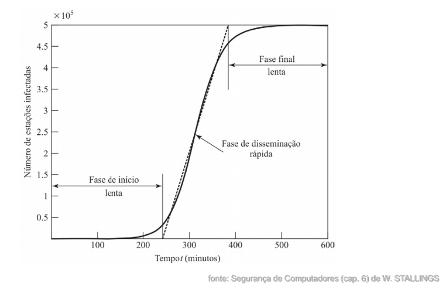
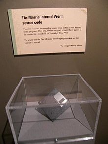

# Módulo: Propagação por Vulnerabilidades e Vermes

------

## Pré-Requisitos

São requisitos para essa aula o conhecimento de:

- Redes de Computadores (conceitos gerais)
- Módulo 1: princípios básicos
- Módulo 2: ameaças
- Módulo 3: requisitos
- Módulo 4: malware e vírus

------

## Tópicos

- Propagação por vulnerabilidades

# Propagação por Vulnerabilidades e Vermes

-------

## Classificação de Malwares (revisão)

-  **Vimos anteriormente que** uma abordagem útil classifica o malware em
duas grandes categorias:
   (I) **Propagação:** como se espalha ou se propaga para
alcançar os alvos desejados
       1. Conteúdo infectado
       1. **Exploração de vulnerabilidades**
       1. Engenharia Social
   (I) **Carga útil:** ações que executa uma vez atingido o alvo.
       1. Corrupção do sistema
       1. Agente de ataque
       1. Roubo de informações
       1. Camuflagem
- Nessa categoria (I.2), falaremos de **vermes**, **código móvel** e **downloads não autorizados**

-------

## Categoria I.2: Propagação por Exploração de Vulnerabilidades

### Worm

**Verme**/***Worm***: Um programa de computador que pode
ser executado de forma independente e
pode propagar uma versão de trabalho
completa de si mesmo em outros hosts
em uma rede, geralmente explorando
vulnerabilidades de software no sistema
de destino.

------

## Worm

::::::::::::: {.columns}

::::: {.column width=70%}

- Programa de replicação que se propaga sobre a rede
   * Usando e-mail, execução remota, login remoto
- Tem fases como um vírus:
   * Dormência, propagação, ativação, execução
   * Fase de propagação: busca outros sistemas, se
conecta a eles, se copia e executa
- Pode disfarçar-se como um processo do
sistema
- Conceito primeiramente visto no romance "Shockwave Rider" de John
Brunner em 1975
   * [Veja link The_Shockwave_Rider na Wikipedia](https://en.wikipedia.org/wiki/The_Shockwave_Rider)
- Primeiro Worm: *Creeper* (1971)
   * Não causava danos, apenas se propagava na ARPANET com a mensagem *"I'M THE CREEPER : CATCH ME IF YOU CAN"*
- Segundo Worm: *Reaper* (1972)
   * Feito como anti-vírus para pegar o Creeper

:::::

::::: {.column width=30%}

:::::

:::::::::::::

------

## Replicação de Vermes (parte 1/3)

- Meios para se replicar e acessar sistemas
remotos:
   * Correio eletrônico ou mensagens instantâneas
   * Compartilhamento de arquivos
   * Capacidade de execução remota
   * Acesso remoto ao arquivo ou capacidade de
transferência
   * Capacidade de login remoto
- Veja detalhes de cada um deles nos próximos slides

------

## Replicação de Vermes (parte 2/3)

###  Recursos de correio eletrônico ou de mensagem instantânea

Um verme
envia por e-mail uma cópia de si mesmo a outros sistemas ou envia a si
mesmo como um anexo via um serviço de mensagens instantâneas, de modo
que o seu código é executado quando o e-mail ou o anexo é recebido ou
visualizado.

### Compartilhamento de arquivo
Um verme cria uma cópia de si mesmo ou
infecta outros arquivos adequados, da mesma forma que um vírus, em mídia
removível como um pen drive USB; ele executa quando o pen drive é
conectado a outro sistema que esteja usando o mecanismo de autoexecução,
explorando alguma vulnerabilidade de software ou quando um usuário abre o
arquivo infectado no sistema visado.

------

## Replicação de Vermes (parte 3/3)

### Capacidade de execução remota
Um verme executa uma cópia de si
mesmo em outro sistema usando um recurso explícito de execução remota ou
explorando uma falha de programação em um serviço em rede para subverter
suas operações

### Capacidade de acesso a arquivos remotos ou transferência de arquivos remotos
Um verme usa um serviço de acesso a arquivos remotos de outro
sistema ou de transferência de arquivos remotos para outro sistema, para
copiar a si mesmo de um sistema para o outro, de modo que os usuários
nesse sistema-alvo podem executá-lo.

### Capacidade de login remoto
Um verme acessa um sistema remoto como
usuário e então usa comandos para copiar a si mesmo de um sistema para o
outro, onde então é executado.

------

## Fase de Escaneamento (parte 1/6)
- A primeira função na fase de propagação é que
procurar outros sistemas para infectar, no
processo chamado escaneamento ou
impressão digital.
   * Deve identificar potenciais sistemas que executam o
serviço vulnerável e depois infectá-los
   * O verme depois de instalado nas máquinas
infectadas repete o mesmo processo até que uma
grande rede distribuída de máquinas infectadas seja
criada.

------

## Fase de Escaneamento (parte 2/6)

- As estratégias de escaneamento de endereços
de rede podem ser:
   * Aleatório
   * Lista de execução
   * Topológico
   * Sub-rede local
- Veja detalhes de cada um deles nos próximos slides

------

## Fase de Escaneamento (parte 3/6)

### Escaneamento Aleatório
- Cada host comprometido examina endereços
aleatórios no espaço de endereço IP, usando uma
semente diferente.
- Esta técnica produz um alto volume de tráfego na
Internet, o que pode causar perturbações
generalizadas mesmo antes do lançamento do
ataque real.

------

## Fase de Escaneamento (parte 4/6)

###  Escaneamento por Lista de Execução
- O atacante primeiro compila uma longa lista de
potenciais máquinas vulneráveis.
- Este pode ser um processo lento feito durante um
longo período para evitar a detecção de que um
ataque está em andamento.
- Uma vez compilada a lista, o atacante começa a
infectar máquinas na lista. Cada máquina infectada
possui uma parte da lista a ser digitalizada.
- Esta estratégia resulta em um período de varredura
muito curto, o que pode dificultar a detecção de que a
infecção esteja ocorrendo.

------

## Fase de Escaneamento (parte 5/6)

###  Escaneamento Topológico
- Este método usa informações sobre a topologia da
rede contidas em uma máquina vítima infectada para
encontrar mais hosts para digitalizar.

------

## Fase de Escaneamento (parte 6/6)

###  Escaneamento de Sub-rede Local
- Se um host pode ser infectado por trás de um
firewall, esse host então procura por destinos em sua
própria rede local.
- O host usa a estrutura de endereços da sub-rede
para encontrar outros hosts que de outra forma
seriam protegidos pelo firewall.

------

## Modelo de Propagação

------

## O verme de Morris

::::::::::::: {.columns}

::::: {.column width=70%}

- Um dos vermes mais conhecidos
- Lançado por Robert Morris (1988)
- Vários ataques em sistemas UNIX
   * arquivo de senha prováveis para usar login/senha e
se logar em outros sistemas
   * explorando um bug no sendmail
- Quando bem sucedido obtinha acesso remoto
ao shell
   * enviava programa de bootstrap para copiar o verme
- Gerou a primeira condenação nos EUA pela *Computer Fraud and Abuse Act* (1986)
- https://en.wikipedia.org/wiki/Morris_worm

:::::

::::: {.column width=30%}

:::::

:::::::::::::

-------

## ALGUNS ATAQUES DE VERMES

- Code Red (julho de 2001)
   * explorando o bug do MS IIS
   * identifica o endereço IP aleatório, realiza ataque DDoS
   * consome capacidade significativa quando ativo
- Code Red II (agosto de 2001)
   * variante que inclui backdoor
- SQL Slammer (2003)
   * ataca MS SQL Server
   * distribuição compacta e muito rápida
- Mydoom (2004)
   * verme que envia e-mails em massa
   * instala backdoors de acesso remoto em sistemas infectados

-------

## VERMES EM SMARTPHONES
- Podem desativar completamente o telefone, excluir dados no
telefone ou forçar o dispositivo a enviar mensagens dispendiosas
para números com preço premium.
- Cabir (2004), Lasco e CommWarrior (2005), CommWarrior (2007)
   * Sistema operacional Symbian
   * Se replicam por meio de Bluetooth para outros telefones na área de
recepção.
   * Também se enviam como um arquivo MMS para números no catálogo
de endereços do telefone e em respostas automáticas para mensagens
de texto
   * Se copiam no cartão de memória removível e insere-se nos arquivos de
instalação do programa no telefone.
- Mais recentes visam sistemas Android e iPhone
- A grande maioria dos malwares de telefones celulares observados
usam aplicativos cavalos de Tróia para se instalarem.

-------

## Tecnologias de Vermes (parte 1/3)

Apresentamos sete tecnologias de worms: Multiplataforma,
Multiexploração, Disseminação ultrarrápida,
Polimórfico, Metamórfico,
Veículos de transporte, Exploit de dia zero

### Multiplataforma

Vermes mais novos não estão limitados a máquinas
Windows, mas podem também atacar uma variedade de plataformas,
especialmente as variantes populares do UNIX, ou explorar linguagem de
macro ou de script suportadas em tipos de documentos populares.

### Multiexploração
Novos vermes penetram em sistemas de uma variedade de
formas, explorando vulnerabilidades de servidores Web, browsers, e-mail,
compartilhamento de arquivos e outras aplicações baseadas em rede, ou via
mídia compartilhada.

-------

## Tecnologias de Vermes (parte 2/3)

### Disseminação ultrarrápida
Explora várias técnicas para otimizar a taxa de
disseminação do verme, de modo a maximizar a probabilidade de ele
localizar o maior número possível de máquinas vulneráveis em um curto
período de tempo.

### Polimórfico
Para escapar à detecção, burlar filtros e frustrar tentativas de
análise em tempo real, os vermes adotam a técnica de vírus polimórficos.
Cada cópia do verme tem novo código gerado no momento de sua criação,
usando instruções funcionalmente equivalentes e técnicas de cifração.

### Metamórfico
Além de mudar sua aparência, os vermes metamórficos têm
um repertório de padrões de comportamento que são utilizados em diferentes
estágios de propagação.

-------

## Tecnologias de Vermes (parte 3/3)

### Veículos de transporte
Como podem comprometer rapidamente grande
número de sistemas, os vermes são ideais para espalhar ampla variedade de
cargas úteis maliciosas, como bots de negação de serviço distribuída,
rootkits, geradores de spam por e-mail e spyware.

### Exploit do dia zero
Para conseguir maximizar sua capacidade de
surpreender e se distribuir, um verme deve explorar uma vulnerabilidade
desconhecida que só é descoberta pela comunidade geral de redes quando o
verme é lançado.

-------

## Categoria I.2: Propagação por Exploração de Vulnerabilidades

### Código Móvel

Softwares (por exemplo, script, macro, etc.) que podem ser enviados sem
alterações para uma coleção heterogênea
de plataformas e executar com semântica
idêntica.

-------

## CÓDIGO MÓVEL
- Geralmente age como um mecanismo para que um
vírus, verme ou cavalo de Tróia seja transmitido para a
estação de trabalho do usuário.
- Pode aproveitar vulnerabilidades para executar suas
próprias explorações, como o acesso a dados não
autorizados ou o comprometimento da raiz.
- Veículos populares para código móvel incluem applets
Java, ActiveX, JavaScript e VBScript.
- Os métodos mais comuns são scripts entre sites, sites
interativos e dinâmicos, anexos de e-mail e downloads
de sites não confiáveis ou de software não confiável.

-------

## Categoria I.2: Propagação por Exploração de Vulnerabilidades

### Downloads Não Autorizados / *drive-by download*

Software que causa um download que foi possivelmente autorizado pelo usuário,
mas sem conhecimento do que está sendo baixado (como no caso dos Trojans).
Pode ser também um download sem conhecimento do usuário.

Veja: https://en.wikipedia.org/wiki/Drive-by_download

-------

## Downloads Não Autorizados / *drive-by download*

- Técnica comum que explora as vulnerabilidades do
navegador
- Quando o usuário visualiza uma página da Web
controlada pelo invasor, esta contém código que explora
o erro do navegador para baixar e instalar malware no
sistema sem o conhecimento ou o consentimento do
usuário.
- Na maioria dos casos, este malware não se propaga
ativamente como um verme, mas espera que os
usuários desavisados visitem a página da Web mal-
intencionada para se espalharem para seus sistemas.

# Discussão

## Breve discussão

### Cenário atual

- Já teve alguma experiência de infecção por verme de computador?
- No cotidiano, como evitar que downloads mal intencionados ou códigos móveis
possam contaminar seus dispositivos?
   * Veja mais sobre isolamento por micro-serviços, estilo Docker e Devcontainers no VSCode

------

## Leia mais

Livro: 

- "Segurança de Computadores - Princípios e Práticas - 2012" - Stallings, William; Brown, Lawrie & Lawrie Brown & Mick Bauer & Michael Howard
    * Em Português do Brasil, CAMPUS - GRUPO ELSEVIER, 2ª Ed. 2014

Veja Capítulo 6, seção 6.3.

# Agradecimentos

-----

## Pessoas

Em especial, agradeço aos colegas que elaboraram bons materiais, como o prof. Raphael Machado, Kowada e Viterbo cujos conceitos formam o cerne desses slides.

Estendo os agradecimentos aos demais colegas que colaboraram com a elaboração do material do curso de [Pesquisa Operacional](https://github.com/igormcoelho/curso-pesquisa-operacional-i), que abriu caminho para verificação prática dessa tecnologia de slides.

-----

## Software

Esse material de curso só é possível graças aos inúmeros projetos de código-aberto que são necessários a ele, incluindo:

- pandoc
- LaTeX
- GNU/Linux
- git
- markdown-preview-enhanced (github)
- visual studio code
- atom
- revealjs
- groomit-mpx (screen drawing tool)
- xournal (screen drawing tool)
- ...

-----

## Empresas

Agradecimento especial a empresas que suportam projetos livres envolvidos nesse curso:

- github
- gitlab
- microsoft
- google
- ...

-----

## Reprodução do material

Esses slides foram escritos utilizando pandoc, segundo o tutorial ilectures:

- https://igormcoelho.github.io/ilectures-pandoc/

Exceto expressamente mencionado (com as devidas ressalvas ao material cedido por colegas), a licença será Creative Commons.

**Licença:** CC-BY 4.0 2020

Igor Machado Coelho

-------

## This Slide Is Intentionally Blank (for goomit-mpx)
