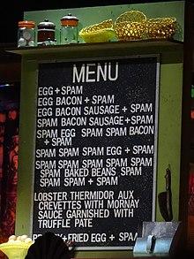
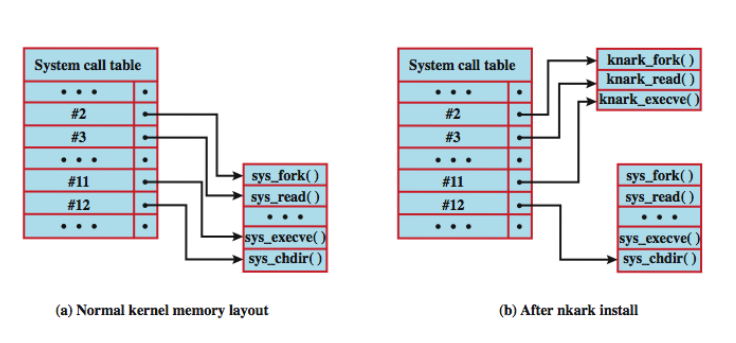

# Módulo: Propagação de Malware por Engenharia Social e Carga Útil

------

## Pré-Requisitos

São requisitos para essa aula o conhecimento de:

- Redes de Computadores (conceitos gerais)
- Módulo 1: princípios básicos
- Módulo 2: ameaças
- Módulo 3: requisitos
- Módulo 4: malware e vírus
- Módulo 5: worms

------

## Tópicos

- Propagação por engenharia social
- carga útil de malware (quatro tipos)

# Propagação de Malware por Engenharia Social e Carga Útil

-------

## Classificação de Malwares (revisão)

-  **Vimos anteriormente que** uma abordagem útil classifica o malware em
duas grandes categorias:
   (I) **Propagação:** como se espalha ou se propaga para
alcançar os alvos desejados
       1. Conteúdo infectado
       1. Exploração de vulnerabilidades
       1. **Engenharia Social**
   (I) **Carga útil:** ações que executa uma vez atingido o alvo.
       1. Corrupção do sistema
       1. Agente de ataque
       1. Roubo de informações
       1. Camuflagem
- Nessa categoria (I.3), falaremos de **spam** e **cavalos de troia**
- Na categoria II, falaremos dos diversos tipos de cargas úteis

-------

## PROPAGAÇÃO POR ENGENHARIA SOCIAL
- Envolve engenharia social, "enganando" os
usuários para ajudar no comprometimento de
seus próprios sistemas ou informações
pessoais.
- Isso pode ocorrer quando um usuário visualiza e
responde a algum e-mail de spam, ou permite a
instalação e execução de algum programa de
cavalo de Tróia ou código de script.
- Falaremos de **spam** e **cavalos de tróia**

-------

## Categoria I.3: Propagação por Engenharia Social

::::::::::::: {.columns}

::::: {.column width=70%}

### Spam

**Spam**: uso de **sistemas de mensagem** para envio de mensagens não solicitadas,
geralmente propagandas ou usos fraudulentos. 
Tipicamente enviado por **email**, mas também em outras plataformas, como **usenet**, 
chat online (**AOL**), discussões de wiki, redes sociais, mensagens de dispositivos móveis, etc.

:::::

::::: {.column width=30%}

:::::

:::::::::::::

Veja wiki: https://en.wikipedia.org/wiki/Spamming

Veja wiki: https://en.wikipedia.org/wiki/Spam_(food)

------

## SPAM POR E-MAIL (parte 1/3)
- Era enviado a partir de servidores de correio
legítimos
- Mais recentemente é enviado por botnets
usando sistemas de usuários comprometidos
- Parte significativa é apenas publicidade,
tentando convencer o destinatário a comprar
algum produto
- Pode ser usado em golpes do tipo scam
   * oferta inacreditável para enganar o usuário e obter
dinheiro
- Também é um importante suporte de malware.

-------

## SPAM POR E-MAIL (parte 2/3)
- Pode ter um documento em anexo, que, se
aberto, explora vulnerabilidades para instalar
malwares
- Pode ter um programa anexado (cavalo de
Tróia, código de script) que, se executado,
instala malware no sistema
   * Alguns cavalos de Tróia evitam a necessidade do
aprovação do usuário para se instalarem

-------

## SPAM POR E-MAIL (parte 3/3)
- Pode ser usado em um ataque do tipo **hoax**
   * Pede para completar algum formulário com detalhes
pessoais suficientes para permitir que o invasor se
faça representar o usuário em um roubo de
identidade.
- Pode ser usado em um ataque de **phishing**
   * Dirige o usuário para um site falso que espelha algum
serviço legítimo, como um site bancário online, onde
tenta capturar os detalhes de login e senha do
usuário

-------

## Categoria I.3: Propagação por Engenharia Social

::::::::::::: {.columns}

::::: {.column width=70%}

### Cavalo de Tróia / *Trojan Horse* ou *Trojan*

Programa de computador que parece ter
uma função útil, mas também tem uma
função oculta e potencialmente maliciosa
que escapa aos mecanismos de
segurança, às vezes explorando
autorizações legítimas de uma entidade
de sistema que invoca o programa
de cavalo de Tróia.

:::::

::::: {.column width=30%}

Cavalo de Tróia foi mencionado na *Odisseia* de Homero, como parte da guerra de gregos e troianos.

:::::

:::::::::::::

Veja wiki: https://en.wikipedia.org/wiki/Trojan_horse_(computing)

-------

## CAVALOS DE TROIA
- Programa aparentemente útil com código oculto
que executa funções indesejadas ou prejudiciais
- Pode ser usado para desempenhar
indiretamente funções que o invasor não
conseguiu realizar diretamente
   * Para obter acesso a informações pessoais e
confidenciais armazenadas nos arquivos de um
usuário
- Os autores estimulam os usuários a executar o
programa, incorporando-o em um jogo ou
programa de utilidade, e tornando-o disponível
através de um site de distribuição conhecido.

-------

## CAVALOS DE TROIA
- Alguns cavalos de troia exploram
vulnerabilidades do software para permitir a sua
instalação e execução automática.
   * Compartilham característica de um verme, mas ao
contrário, eles não se replicam.
- Hydraq (2009) usado na Operação Aurora.
   * Explorou uma vulnerabilidade no Internet Explorer
para instalar-se e direcionou várias empresas de alto
perfil.
   * Geralmente, ele era distribuído usando e-mail de
spam ou através de um site comprometido usando
um ataque de download não-autorizado.

-------

## CAVALOS DE TROIA EM SMARTPHONES
- Os primeiros atacavam aparelhos Symbian - Skuller
(2004)
- Mais recentemente, detectaram-se números
significativos que visam telefones Android e iPhones,
distribuídos pelos sites de aplicativos respectivos.
- Em 2011, o Google removeu uma série de aplicativos
que continham o malware DroidDream.
   * Poderoso agente zumbi que explorou vulnerabilidades para
obter acesso total ao sistema, monitorar dados e instalar código
extra.
- Em 2012 um estudo identificou 49 famílias de malware
para o Android.
   * 90% são agentes zumbis com suporte para acessar serviços
premium ou para colher informações do usuário.
   * Nenhum dos antivírus móveis testados foi capaz de detectar
todas essas famílias.

-------

## Categoria II.1 - CARGA ÚTIL DE CORRUPÇÃO DO SISTEMA
- Inicialmente, vários vírus e vermes resultavam na
destruição de dados no sistema infectado quando certas
condições de disparo eram atendidas.
   * Chernobyl [1998], Klez [2001]
   * Alternativamente, malware podem criptografar os dados do
usuário e exigir pagamento para acessar a chave necessária
para recuperar essa informação. Ransomware
- Uma carga útil relacionada é aquela que exibe
mensagens indesejadas ou conteúdo no sistema do
usuário quando acionado.
- Uma variante mais grave tenta infligir danos no mundo
real
   * Chernobyl tenta reescrever o código BIOS tornando o sistema é
inutilizável até o chip da BIOS ser reprogramado ou substituído
   * Stuxnet visa softwares específicos de sistemas de controle
industrial da Siemens

-------

## Categoria II.1: Bomba Lógica

### Bomba Lógica / *Logic Bomb*

Código inserido em um malware por um
intruso. Uma bomba lógica
permanece em hibernação até ocorrer
uma condição predefinida;
então, o código ativa uma ação não
autorizada.

Veja Wiki: https://en.wikipedia.org/wiki/Logic_bomb

-------

## BOMBA LÓGICA
- Componente-chave do malware de corrupção
de dados
- Código incorporado ao malware que está
configurado para “explodir” quando
determinadas condições são atendidas.
   * A presença ou ausência de determinados arquivos ou
dispositivos no sistema,
   * Um determinado dia da semana ou data,
   * Uma versão específica ou configuração de algum
software
   * Um usuário específico executado a aplicação.

-------

## Categoria II.2 - CARGA ÚTIL DE AGENTE DE ATAQUE
- Conhecido como um **bot** (robô), **zumbi** ou **drone** (androide)
    * Secretamente assume outro computador conectado à
Internet
    * Usa esse computador para iniciar ou gerenciar
ataques que são difíceis de rastrear até o criador do
bot.
- O bot é tipicamente plantado em centenas ou
milhares de computadores pertencentes a
terceiros desavisados.
   * O conjunto de bots muitas vezes é capaz de atuar de
forma coordenada: **botnet**
- Este tipo de carga útil ataca a integridade e a
disponibilidade do sistema infectado.

------

## BOTS E ZUMBIS/DRONES

### Bot 
Programa ativado em uma máquina
infectada (**zumbi** ou **drone**) que é usado para
lançar ataques contra outras máquinas.

Características:
- facilidade de controle remoto
   *  via IRC/HTTP etc
- mecanismo de propagação
   * software de ataque, vulnerabilidade, estratégia de
digitalização
- Várias contramedidas aplicáveis

-------

## Categoria II.3: CARGA ÚTIL DE ROUBO DE INFORMAÇÕES
- Malware reúne dados armazenados no sistema
infectado para uso pelo atacante
- Um alvo comum são as credenciais de login e
senha do usuário para bancos, jogos e sites
relacionados
   * Invasor usa esses dados para se passar pelo o
usuário, acessar esses sites e obter ganhos.
- Menos comumente, pode ter como alvo
documentos ou detalhes de configuração do
sistema com o objetivo de reconhecimento ou
espionagem
- Falaremos de **Keylogger**, **Spyware**, **Phishing** (e **Spear-Phishing**)
- Falaremos também dos *kits de ataque* / *crimeware*

------

## KEYLOGGER
- Captura as teclas pressionadas na máquina
infectada para permitir que um invasor monitore
essas informações sensíveis.
   * Geralmente implementam alguma forma de
mecanismo de filtragem que apenas retorna
informações próximas às palavras-chave desejadas
("login", "senha", "paypal.com", etc).
- Alguns bancos e outros sites passaram a usar
um applet gráfico para inserir informações
críticas, como senhas.
   * Como estes não utilizam texto inserido através do
teclado, os keyloggers tradicionais não capturam
essas informações.

------

## SPYWARE

### Spyware
Software que coleta informações de um
computador e as transmite a outro
sistema. Informações podem ser
obtidas via monitoração de tecladas
digitadas, dados de tela e/ou tráfego na
rede, ou por escaneamento de arquivos
no sistema em busca de informações
sensíveis.

------

## SPYWARE
- Subvertem a máquina comprometida para
permitir o monitoramento de uma ampla gama
de atividades no sistema
   * Monitoramento do histórico e do conteúdo da
atividade de navegação,
   * Redirecionamento de determinados pedidos de
páginas da Web para sites falsos controlados pelo
invasor
   * Modificação dinâmica de dados trocados entre o
navegador e determinados sites de interesse.
- Estas ações podem resultar em
comprometimento significativo das informações
pessoais do usuário.

-------

## PHISHING E ROUBO DE IDENTIDADE
- Abordagem usada para capturar as credenciais
de login e senha de um usuário
- Consiste em incluir um URL em um e-mail de
spam que leva a um site falso, que imita a
página login bem conhecida, mas é controlado
pelo atacante.
   * Associado a mensagem sugerindo que uma ação
urgente é necessária pelo usuário para autenticar sua
conta, para evitar que ela seja bloqueada.
   * Se o usuário é descuidado, não percebe que é uma
fraude, e fornece os detalhes solicitados, resulta em
invasores explorando sua conta usando as
credenciais capturadas.

------

## SPEAR-PHISHING
- Uma variante mais perigosa do phishing
- Também é um e-mail afirmando ser de uma fonte
confiável
   * Destinatários são cuidadosamente pesquisados pelo atacante
   * Cada e-mail é cuidadosamente elaborado para se adequar ao
seu destinatário especificamente
   * Cita informações reais para convencer de sua autenticidade.
   * Aumenta consideravelmente a probabilidade de o destinatário
responder conforme desejado pelo atacante.
- Este tipo de ataque é particularmente usado em formas
industriais e outras formas de espionagem por grandes
organizações.

-------

## RECONHECIMENTO DE TERRENO, ESPIONAGEM E EXTRAÇÃO DE DADOS
- Roubo de credencial e roubo de identidade são
casos especiais de uma carga útil de
reconhecimento mais geral, que visa obter
certos tipos de informações desejadas e
devolver isso ao atacante.
- Estes casos especiais são certamente os mais
comuns, mas há outros alvos conhecidos.
   * Obter acesso e modificar repositórios de código fonte
em uma variedade de grandes empresas - Operação
Aurora [2009]
   * Capturar detalhes de configuração de hardware e
software para determinar se comprometeu os
sistemas alvo específicos desejados - Stuxnet [2010]

-------

## KITS DE ATAQUE / *crimeware*

Finalizando as quatro categorias, apresentamos um ferramental importante de *crimeware*: os Kits de Ataque

### Kits de Ataque
Conjunto de ferramentas para gerar
um novo malware automaticamente
usando uma variedade de mecanismos
de propagaçãoe cargas úteis
fornecidos.

Veja wiki: https://en.wikipedia.org/wiki/Crimeware

-------

## KITS DE ATAQUE
- Inicialmente, o desenvolvimento e a implantação
de malwares requeriam habilidades técnicas
consideráveis.
- No início da década de 1990 foram desenvolvidas
ferramentas de criação de vírus
- Em 2000 surgiram os **kits de ataque** mais gerais,
que ajudaram muito no desenvolvimento e
implantação de malware.
   * Conjuntos de ferramentas também conhecidos como
**crimeware**
   * Incluem diversos mecanismos de propagação e módulos
de carga útil, que facilitam a combinação, seleção e
implantação.

-------

## KITS DE ATAQUE: ZEUS

-  [Symantec] Toolkit that is readily available on underground
marketplaces used by online criminals. There are different versions
available, from free ones (often back doored themselves) to those an
attacker must pay up to $700 USD for in order to use.

-------

## Categoria II.4: CARGA ÚTIL DE CAMUFLAGEM
- Diz respeito às técnicas utilizadas pelo malware
para ocultar sua presença no sistema infectado
e para fornecer acesso secreto a esse sistema
   * Falaremos de **Backdoors** e **Rootkits**
- Este tipo de carga útil também ataca a
integridade do sistema infectado.

------

## BACKDOOR

### Backdoor
Qualquer mecanismo que burle uma
verificação de segurança
normal; pode permitir acesso não
autorizado a funcionalidades
em um programa ou a um sistema
comprometido.

-------

## BACKDOORS
- Ponto de entrada secreto em um programa que
permite que alguém obtenha acesso sem
passar pelos procedimentos habituais de
acesso à segurança.
   * Também conhecidas como **trapdoors (alçapão)**
- Usada legitimamente por muitos anos para que
programadores pudessem depurar e testar
programas
- Tornam-se ameaças quando programadores
sem escrúpulos as utilizam para obter acesso
não autorizado.

-------

## ROOTKITS

### Rootkit
Conjunto de ferramentas de hacker
usadas depois que o atacante
invadiu um sistema computacional e
conseguiu acesso ao nível
raiz (root).

Veja wiki: https://en.wikipedia.org/wiki/Rootkit

-------

## ROOTKITS
- Conjunto de programas instalados para acesso
de administrador
- Pode esconder sua existência
   * subvertendo mecanismos de relatório em processos,
arquivos, registros, etc.
- Pode ser:
   * persistente ou baseado na memória
   * usuário ou kernel
- Instalado pelo usuário através de cavalo de Troia ou intruso no sistema
- Gama de contramedidas necessárias

-------

## ROOTKITS
Há três técnicas que podem ser usadas para mudar as chamadas do sistema:

1. Modificar a tabela de chamadas do sistema
   - o invasor modifica os endereços syscall selecionados
armazenados na tabela de chamadas do sistema. Permite
que o rootkit direcione uma chamada do sistema para longe
da rotina legítima para a substituição do rootkit.
2. Modificar alvos da tabela de chamada do sistema
   - o invasor substitui as rotinas de chamada de sistema
legítimas selecionadas por código malicioso. A tabela de
chamadas do sistema não é alterada.
3. Redirecionar a tabela de chamadas do sistema
   - o invasor redireciona as referências para toda a tabela de
chamadas do sistema para uma nova tabela em uma nova
localização da memória do kernel.

-------

## MODIFICAÇÕES DAS TABELAS DO SISTEMA POR ROOTKIT

# Discussão

## Breve discussão

### Cenário atual

- Já teve alguma experiência de ataque por engenharia social?
   * Qual população está mais vulnerável a esse tipo de ataque?
- Leia sobre a diferença de Engenharia Social e seus impactos em outras áreas do conhecimento:
   * Segurança: https://en.wikipedia.org/wiki/Social_engineering_(security)
   * Ciências Políticas: https://en.wikipedia.org/wiki/Social_engineering_(political_science)

------

## Leia mais

Livro: 

- "Segurança de Computadores - Princípios e Práticas - 2012" - Stallings, William; Brown, Lawrie & Lawrie Brown & Mick Bauer & Michael Howard
    * Em Português do Brasil, CAMPUS - GRUPO ELSEVIER, 2ª Ed. 2014

Veja Capítulo 6, seções 6.4 até 6.8.

# Agradecimentos

-----

## Pessoas

Em especial, agradeço aos colegas que elaboraram bons materiais, como o prof. Raphael Machado, Kowada e Viterbo cujos conceitos formam o cerne desses slides.

Estendo os agradecimentos aos demais colegas que colaboraram com a elaboração do material do curso de [Pesquisa Operacional](https://github.com/igormcoelho/curso-pesquisa-operacional-i), que abriu caminho para verificação prática dessa tecnologia de slides.

-----

## Software

Esse material de curso só é possível graças aos inúmeros projetos de código-aberto que são necessários a ele, incluindo:

- pandoc
- LaTeX
- GNU/Linux
- git
- markdown-preview-enhanced (github)
- visual studio code
- atom
- revealjs
- groomit-mpx (screen drawing tool)
- xournal (screen drawing tool)
- ...

-----

## Empresas

Agradecimento especial a empresas que suportam projetos livres envolvidos nesse curso:

- github
- gitlab
- microsoft
- google
- ...

-----

## Reprodução do material

Esses slides foram escritos utilizando pandoc, segundo o tutorial ilectures:

- https://igormcoelho.github.io/ilectures-pandoc/

Exceto expressamente mencionado (com as devidas ressalvas ao material cedido por colegas), a licença será Creative Commons.

**Licença:** CC-BY 4.0 2020

Igor Machado Coelho

-------

## This Slide Is Intentionally Blank (for goomit-mpx)
