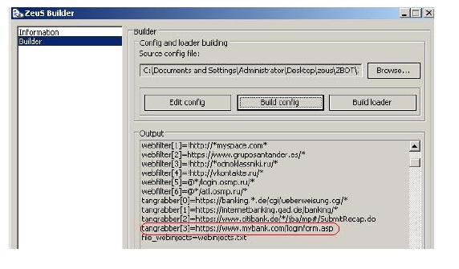
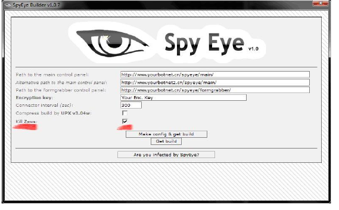
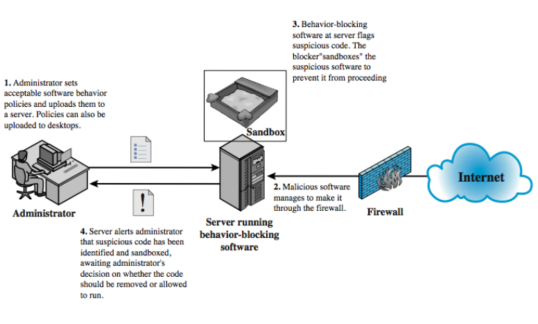
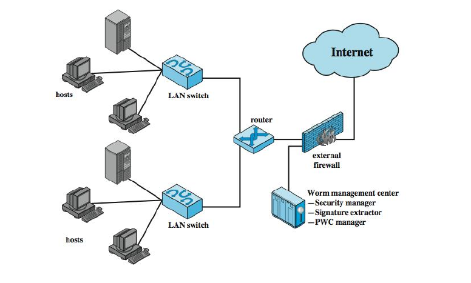
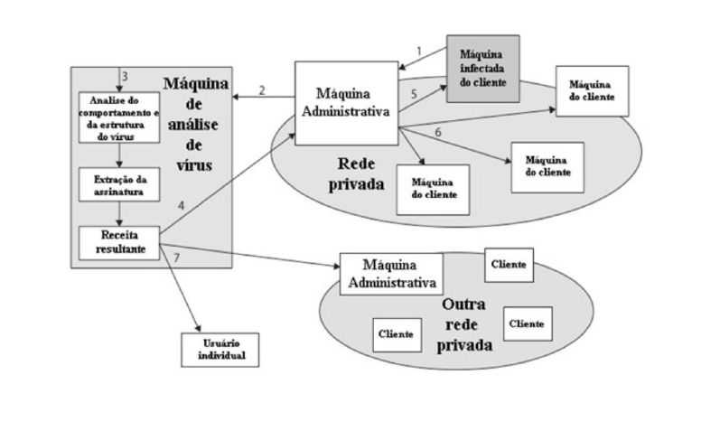
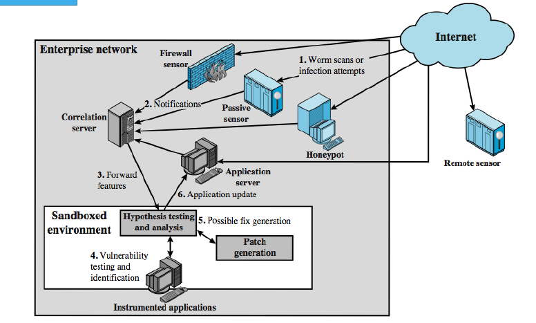

# Módulo: Contramedidas

------

## Pré-Requisitos

São requisitos para essa aula o conhecimento de:

- Redes de Computadores (conceitos gerais)
- Módulo 1: princípios básicos
- Módulo 2: ameaças
- Módulo 3: requisitos
- Módulo 4: malware e vírus
- Módulo 5: worms
- Módulo 6: engenharia social e carga útil

------

## Tópicos

- Contramedidas

# Contramedidas

-------

## CONTRAMEDIDAS PARA MALWARE
- Prevenção - solução ideal, mas difícil
- Elementos da prevenção:
   * Política
   * Conscientização
   * Mitigação de vulnerabilidades
   * Mitigação de ameaças
- Em alguns casos a estratégia é similar, como no caso do worm *Creeper* e a contramedida (também um worm) *Reaper*
   * Exemplo prático no próximo slide para kits de ataque

-------

## Relembrando o Kit de Ataque Zeus

-  [Symantec] Toolkit that is readily available on underground
marketplaces used by online criminals. There are different versions
available, from free ones (often back doored themselves) to those an
attacker must pay up to $700 USD for in order to use.

-------

## Contramedida para o Kit de Ataque Zeus

- [Softpedia News, 2010] Researchers from security giant Symantec
are announcing that a new botnet toolkit is threatening the infamous
Zeus trojan. Dubbed SpyEye and priced at $500, the crimeware
comes with a "Zeus killer" feature.

--------

## CONTRAMEDIDAS PARA MALWARE
- Política adequada em relação à prevenção
oferece uma base para implementar
contramedidas preventivas
   * Sistemas em sua versão mais atualizada
   * Controles de acesso adequados às aplicações e dados
   * Visam prevenir contra vírus, vermes e cavalos de Troia
- Propagação por engenharia social pode ser combatida com treinamento e conscientização

-------

## CONTRAMEDIDAS PARA MALWARE
- Se a prevenção falhar, mecanismos técnicos
podem dar suporte às seguintes opções de
mitigação das ameaças:
   * detecção
   * identificação
   * remoção
- Se for detectado, mas não é possível identificar
ou remover, deve-se descartar e substituir os
arquivos ou programas infectados ou maliciosos
- Infecções perniciosas podem exigir limpeza
completa dos dispositivos de armazenamento

--------

## CONTRAMEDIDAS PARA MALWARE (parte 1/2)
**Requisitos:** Generalidade; Ação imediata; Resiliência; Custos mínimos de negação de serviço; 
Transparência; Abrangência global e local

### Generalidade
A abordagem adotada deve ser capaz de manipular ampla
variedade de ataques.

### Ação imediata
A abordagem deve responder rapidamente de modo a limitar
o número de programas ou sistemas infectados e a consequente atividade.

### Resiliência
A abordagem deve ser resistente a técnicas de evasão
empregadas por atacantes para ocultar a presença de seu malware.

-------

## CONTRAMEDIDAS PARA MALWARE (parte 2/2)

### Custos mínimos de negação de serviço
A abordagem deve resultar em
redução mínima de capacidade ou serviço como resultado das ações do
software de contramedida, e não deve causar disrupção significativa da
operação normal.

### Transparência
O software e os dispositivos de contramedida não devem
exigir a modificação de sistemas operacionais, softwares de aplicação e
hardware existentes (atuais ou legados).

### Abrangência global e local
A abordagem deve ser capaz de lidar com
fontes de ataque internas, bem como externas à rede da empresa.

--------

## CONTRAMEDIDAS PARA MALWARE
A detecção pode ocorrer em três locais distintos:

### C.1 Escaneadores baseados em estações
No sistema infectado, por programas antivírus que
monitoram dados importados para dentro do sistema
e a execução e o comportamento de programas

### C.2 Abordagens de escaneamento de perímetro
No perímetro do sistema, com o uso de firewalls e
sistemas de detecção de intrusão (IDS)

### C.3 Abordagens de coleta de informação distribuída
De forma distribuída, por mecanismos que coletam
dados de sensores em estações e no perímetro

---------

## C.1 EVOLUÇÃO DOS ANTIVÍRUS
- Vírus e tecnologia antivírus ambos evoluíram
- Código simples dos primeiros vírus, facilmente
removido
- Como se tornam mais complexas, também
devem as contramedidas

---------

## EVOLUÇÃO DOS ANTIVIRUS - GERAÇÕES

**Primeira geração**

- Escaneadores (varredura) simples (de assinatura)

**Segunda geração**

- escaneadores heurísticos
- Ou usam hash de programas para encontrar
mudanças

**Terceira geração**

- armadilhas de atividade (verificam as ações)

**Quarta geração**

- proteção ampla: varredura, armadilhas, controle de
acesso,...

--------

## DECODIFICAÇÃO GENÉRICA
- Executa arquivos executáveis através da
tecnologia de decifração genérica:
   * Emulador de CPU para interpretar instruções
   * Scanner de vírus para verificar assinaturas de vírus
conhecidas
   * Módulo de controle de emulação para gerenciar o
processo
- Permite que o vírus se decodifique no
interpretador
- Verifica periodicamente as assinaturas de vírus
- O problema é longo para interpretar e digitalizar
   * detecção x tempo

--------

## SOFTWARE DE BLOQUEIO DE COMPORTAMENTO (parte 1/2)
- Monitora os seguintes comportamentos
   * Tentativas de abrir, acessar, remover e/ou modificar
arquivos
   * Tentativa de formatar drives de disco e outras
operações irreversíveis de disco
   * Modificações na lógica de arquivos ou macros
executáveis
   * Modificações de configurações críticas dos sistema,
como as de inicialização
   * Exploração de scripts de clientes de e-mail e de
mensagens instantâneas para enviar conteúdo
executável
   * Iniciação de comunicações em rede

-------

## SOFTWARE DE BLOQUEIO DE COMPORTAMENTO (parte 2/2)

----------

## C.2 ABORDAGENS DE ESCANEAMENTO DE PERÍMETRO
- Usado no firewall ou IDS de uma organização
- Está limitada a escanear o conteúdo do
malware, já que não fornece acesso ao
comportamento de execução
- Firewalls externos ou honeypots
- Monitores de entrada
   * Localizados na borda entre a rede organizacional e a Internet
- Monitores de saída
   * Localizados nos pontos de saída de LANs

---------

## CONTRAMEDIDAS DE VERMES
- Sobrepõe-se a técnicas antivírus (A/V)
- Uma vez que o verme está no sistema, A/V pode detectar
- Os vermes também causam atividade significativa na rede
- As abordagens de defesa de vermes incluem:
   * filtragem de verificação de vermes baseada em assinatura
   * contenção de vermes baseada em filtro
   * contenção de vermes baseada na classificação da carga útil
   * detecção de varredura de caminhada aleatória
   * limitação de taxa e parada de taxa

--------

## CONTENÇÃO PROATIVA DE VERMES

---------

## C.3 ABORDAGENS DE COLETA DE INFORMAÇÃO DISTRIBUÍDA
- Sistema de análise central que recebe dados de
sensores baseados em estação e de perímetro
distribuídos
- Sistema imunológico digital
   * Abordagem abrangente de proteção desenvolvida pela IBM
   * Em 2010: 240 mil sensores 133 milhões de sistemas clientes

---------

## SISTEMA IMUNOLÓGICO DIGITAL

---------

## DEFESA DE VERMES BASEADA EM REDE

# Discussão

## Breve discussão

### Cenário atual

- Já teve alguma experiência de uso de anti-virus? 
   * Qual utilizado no momento? 
   * Qual impacto no desempenho do sistema operacional?

------

## Leia mais

Livro: 

- "Segurança de Computadores - Princípios e Práticas - 2012" - Stallings, William; Brown, Lawrie & Lawrie Brown & Mick Bauer & Michael Howard
    * Em Português do Brasil, CAMPUS - GRUPO ELSEVIER, 2ª Ed. 2014

Veja Capítulo 6, seção 6.9 e finaliza o capítulo 6.

# Agradecimentos

-----

## Pessoas

Em especial, agradeço aos colegas que elaboraram bons materiais, como o prof. Raphael Machado, Kowada e Viterbo cujos conceitos formam o cerne desses slides.

Estendo os agradecimentos aos demais colegas que colaboraram com a elaboração do material do curso de [Pesquisa Operacional](https://github.com/igormcoelho/curso-pesquisa-operacional-i), que abriu caminho para verificação prática dessa tecnologia de slides.

-----

## Software

Esse material de curso só é possível graças aos inúmeros projetos de código-aberto que são necessários a ele, incluindo:

- pandoc
- LaTeX
- GNU/Linux
- git
- markdown-preview-enhanced (github)
- visual studio code
- atom
- revealjs
- groomit-mpx (screen drawing tool)
- xournal (screen drawing tool)
- ...

-----

## Empresas

Agradecimento especial a empresas que suportam projetos livres envolvidos nesse curso:

- github
- gitlab
- microsoft
- google
- ...

-----

## Reprodução do material

Esses slides foram escritos utilizando pandoc, segundo o tutorial ilectures:

- https://igormcoelho.github.io/ilectures-pandoc/

Exceto expressamente mencionado (com as devidas ressalvas ao material cedido por colegas), a licença será Creative Commons.

**Licença:** CC-BY 4.0 2020

Igor Machado Coelho

-------

## This Slide Is Intentionally Blank (for goomit-mpx)
