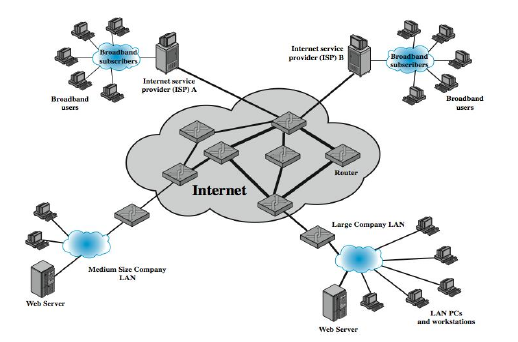
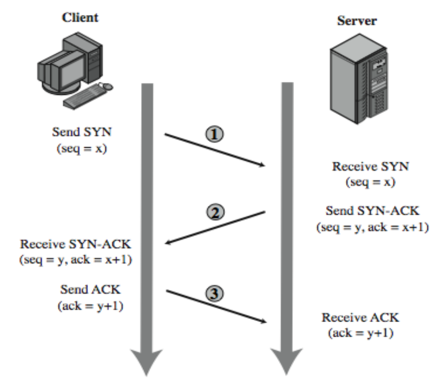
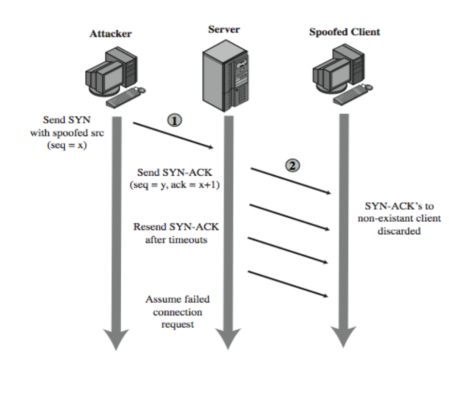
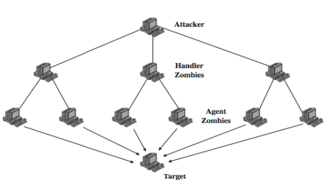
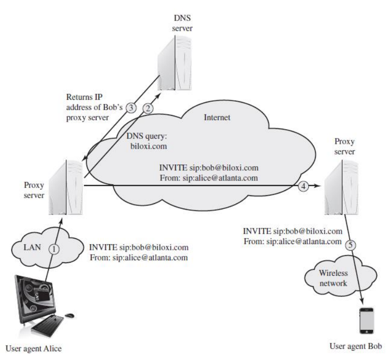
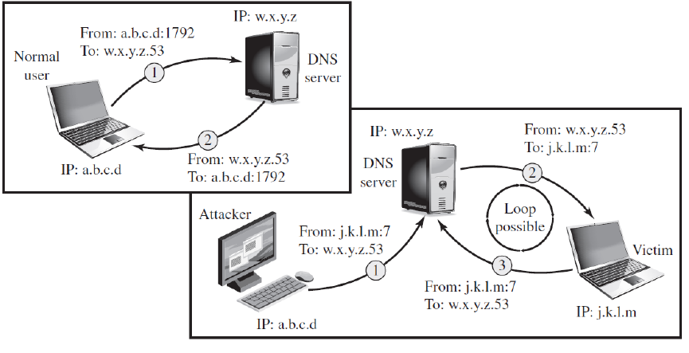
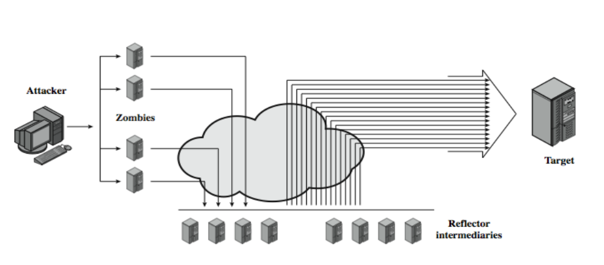

# Módulo: Negação de Serviço

------

## Pré-Requisitos

São requisitos para essa aula o conhecimento de:

- Redes de Computadores (conceitos gerais)
- Módulo 1: princípios básicos
- Módulo 2: ameaças
- Módulo 3: requisitos
- Módulo 4: malware e vírus
- Módulo 5: worms
- Módulo 6: engenharia social e carga útil
- Módulo 7: contramedidas

------

## Tópicos

- Negação de Serviço
- DoS e DDoS
- Módulo pode ser dividido em duas aulas
- Dividido em três partes:
   * Introdução
   * Ataques Principais
   * Contramedidas

# Introdução a Negação de Serviço

-------

## AGENDA
- Ataques de negação de serviço (DoS)
- Inundações clássicas e ataques de falsificação
de SYN
- Inundações de ICMP, UDP, TCP SYN
- Ataques distribuídos de negação de serviço
(DDoS)
- Ataques de reflexão e amplificação
- Defesas contra ataques DoS
- Respondendo aos ataques DoS

-------

## NEGAÇÃO DE SERVIÇO

### Negação de serviço (DoS)
É uma ação que
impede ou prejudica o uso autorizado de redes,
sistemas ou aplicativos, esgotando recursos
como unidades de processamento (CPU),
memória, largura de banda e espaço em disco

-------

## NEGAÇÃO DE SERVIÇO
- Hackers realizam ataques de DDoS há mais de uma
década
- Potência aumenta constantemente ao longo do
tempo
   * De 400 MBps (2002) para 100 GBps (2010), para 300
GBps no ataque Spamhaus (2013)
- Ataques maciços na faixa de 50 GBps podem
exceder a capacidade de praticamente qualquer
alvo pretendido
- Criminosos usam ataques de DDoS em sistemas
bancários como desvio do ataque real contra redes
ATM

----------

## Dados Atuais: Ataques de Negação de Serviço

- A partir de 2016, já temos ataques de Terabit/segundo
- Ataques podem ser formas de protesto por *hacktivists* 
   * Em 2013 o grupo Anonymous pediu aos EUA que reconhecessem essa
   forma de protesto não como crime cibernético
   * EUA tem punições de prisão pela *Computer Fraud and Abuse Act*
   * Outros países tem punições semelhantes

Leia mais em: https://en.wikipedia.org/wiki/Denial-of-service_attack

Leia mais em: [wiki Timeline_of_events_associated_with_Anonymous](https://en.wikipedia.org/wiki/Timeline_of_events_associated_with_Anonymous)

-------

## Breve Revisão de TCP/IP

- Relembrando protocolo TCP
   * Orientado a conexão, através de pacotes SYN, SYN+ACK e ACK
   * Camada OSI de Transporte
   * https://en.wikipedia.org/wiki/Transmission_Control_Protocol
- Relembrando protocolo UDP
   * Pacotes leves e sem conexão
   * Camada OSI de Transporte
   * https://en.wikipedia.org/wiki/User_Datagram_Protocol
- Relembrando protocolo ICMP
   * Pacotes leves para diagnóstico da rede (tipicamente ping)
   * Camada OSI de Rede
   * https://en.wikipedia.org/wiki/Internet_Control_Message_Protocol

-------

## Recursos Atacados
Ataques podem ser dirigidos a:

### Largura de banda da rede

Está relacionada à capacidade dos links de rede
que conectam um servidor à Internet mais ampla

### Recursos do sistema

- Sobrecarrega ou danifica o software de tratamento
de rede (implementações de sockets, etc)
- Falsificação de SYN e Pacote envenenado

### Recursos de aplicação

- Envolve várias solicitações válidas, cada uma
consumindo recursos significativos
- Explora falhas específicas de aplicações, 
como chamadas bancos de dados, e demais respostas mais "pesadas"

----

## ATAQUES CLÁSSICOS DE NEGAÇÃO DE SERVIÇO

- Pode usar uma simples inundação ping
   * Usado para testar a conectividade com o destino
especificado
   * Envia pacotes de solicitação de eco TCP/IP ICMP ao
destino e mede o tempo de resposta.
   * Geralmente os pacotes são enviados a uma taxa
controlada
   * Opção `ping -f` especifica envio de pacotes o mais
rápido possível

----

## ATAQUES CLÁSSICOS DE NEGAÇÃO DE SERVIÇO
- Causa perda de tráfego
Origem deve ter maior largura de banda que o
alvo
Endereço de origem nos pacotes de requisição
de eco é aquele da fonte
   * Fonte de ataque é facilmente identificada
   * O sistema alvo irá responder os pacotes gerando
tráfego

----

## Exemplo de Organização de Redes

----

## FALSIFICAÇÃO DE ENDEREÇO DE ORIGEM
- Usa endereços de origem falsificados
- Gera grandes volumes de pacotes
- Direcionado ao alvo
- Com endereços de fonte diferentes, aleatórios
- Causa o mesmo congestionamento
- Respostas são espalhadas pela Internet
- A fonte real é muito mais difícil de identificar

------

## FALSIFICAÇÃO DE ENDEREÇO DE ORIGEM
- Endereços de origem falsificados
   * Fácil de criar, dado o privilégio suficiente para
"sockets diretos"
      - Remonta o desenvolvimento do TCP/IP, que ocorreu em
ambiente cooperativo e confiável
   * Por padrão, o TCP/IP não inclui a capacidade de
garantir que o endereço de origem em um pacote
corresponda realmente ao endereço do sistema de
origem
      - É possível impor a filtragem nos roteadores para garantir
isso (ou pelo menos que o endereço de origem seja válido)

-----

## FALSIFICAÇÃO DE ENDEREÇO DE ORIGEM
- Respostas espalhadas pela Internet
   * Isso é conhecido como retrodifusão de tráfego
(*backscatter traffic*)
   * Efeito colateral útil: pesquisadores anunciam rotas
para blocos de endereços IP não utilizados e coletam
detalhes de pacotes enviados para esses endereços.
      - Qualquer pacote recebido ou está corrompido ou é o
resultado direto ou indireto de ataques de rede
      - Projeto Honeynet: grupo que investiga ataques e propõe softwares de código-aberto para segurança
      - Veja: https://en.wikipedia.org/wiki/Honeynet_Project
      - O monitoramento do tipo de pacote fornece informações
valiosas sobre o tipo e a escala dos ataques que estão
sendo usados
      - Esta informação é usada para desenvolver respostas a
esses ataques

-----

## FALSIFICAÇÃO DE ENDEREÇO DE ORIGEM
- Fonte real difícil de identificar
   * Requer a cooperação dos engenheiros de rede que
gerenciam todos esses roteadores
   * Tarefa muito mais difícil do que simplesmente ler o
endereço de origem
   * Não pode ser solicitada automaticamente pelos
destinatários do pacote

-----

## FALSIFICAÇÃO DE SYN
- Outro ataque comum
- Ataca a capacidade de um servidor para
responder a pedidos de conexão TCP
- Transborda tabelas usadas para gerenciá-las
- Resulta em ataque ao recurso do sistema

-----

## Handshake de Conexão TCP

------

## ATAQUE DE FALSIFICAÇÃO DE SYN

-------

## ATAQUE DE FALSIFICAÇÃO DE SYN
- O atacante geralmente usa
   * endereços de fontes aleatórias ou a de um servidor
sobrecarregado
   * para bloquear o retorno (da maioria) dos pacotes de
reinicialização
- Tem volume de tráfego muito menor
   * O atacante pode estar em um link de capacidade
muito menor

# Principais Ataques de Negação de Serviço

## Tipos Principais de Ataque de Negação de Serviço

Listamos quatro tipos principais de Ataque de Negação de Serviço (DoS):

- A.1 - Ataques de Inundação
- A.2 - Ataques de Negação de Serviço Distribuídos (DDoS)
- A.3 - Ataques de Largura de Banda baseados em Aplicação
- A.4 - Ataques Refletores e Amplificadores

------

## A.1 TIPOS DE ATAQUES DE INUNDAÇÃO
- Ataques podem ser realizado diretamente ou
através de intermediários
- Classificados com base no protocolo de rede
usado
   * Inundação ICMP
   * Inundação UDP
   * Inundação TCP SYN

-----

## A.1 ATAQUES DE INUNDAÇÃO DIRETOS
- Inundação ICMP
   * Internet Control Message Protocol
   * Usa pacotes ICMP de solicitação de eco
      - Normalmente permitido, em alguns casos necessário
   * Muitas organizações restringiram a capacidade de
pacotes ICMP de solicitação de eco passarem por
seus firewalls
      - Atacantes começaram a usar outros tipos de pacotes ICMP.
      - Pacotes ICMP de destino inacessível e tempo excedido

------

## A.1 ATAQUES DE INUNDAÇÃO DIRETOS
- Inundação UDP
   * Alternativa ao uso de pacotes ICMP
   * Envio de pacotes UDP para alguma porta
      - Pacote direcionado ao serviço de diagnóstico de eco
      - Se o servidor tiver esse serviço em execução, ele responde
com um pacote UDP de volta à fonte indicada contendo o
conteúdo dos pacotes de dados originais.
      - Se o serviço não estiver em execução, o pacote será
descartado e um pacote ICMP de destino inacessível é
retornado

-------

## A.1 ATAQUES DE INUNDAÇÃO DIRETOS
- Inundação TCP SYN
   * Usa pacotes TCP SYN (pedido de conexão)
   * Mas para ataque de volume
   * Também pode usar pacotes de dados TCP
      - Seriam rejeitados pelo servidor como não pertencentes a
nenhuma conexão conhecida.

-------

## A.1 ATAQUES DE INUNDAÇÃO INDIRETOS
- Ataques de inundação diretos
   * São limitadas ao volume total de tráfego que pode
ser gerado por um único sistema
   * O atacante é mais fácil de rastrear
Por isso, foram desenvolvidos ataques mais
sofisticados, com múltiplos sistemas de ataque

------

## A.1 ATAQUES DE INUNDAÇÃO INDIRETOS
- Ao usar vários sistemas, o invasor pode ampliar
significativamente o volume de tráfego gerado
   * Cada um desses sistemas não precisa ser
particularmente potente ou ter um enlace de alta
capacidade
   * O que eles não têm individualmente é compensando
pelo grande número de atacantes intermediários
- No ataque através de intermediários, o invasor
fica ainda mais distanciado do alvo
   * Mais difícil de localizar e identificar

-------

## A.1 ATAQUES DE INUNDAÇÃO INDIRETOS
- Tipos de ataques indiretos que utilizam vários
sistemas incluem outras formas de ataque:
   * Ataques de negação de serviço distribuídos (A.2)
   * Ataques refletores e amplificadores (A.4)

--------

## A.2 ATAQUES DE NEGAÇÃO DE SERVIÇOS DISTRIBUÍDO
- Um dos primeiros desenvolvimentos significativos
em ferramentas de ataque DoS
- Vários sistemas permitem volumes de tráfego
muito maiores para formar um ataque de negação
distribuída de serviço (DDoS)
- Muitos PCs/estações de trabalho comprometidos
   * Bots com programas de backdoor instalados
   * Formando uma botnet
- Por exemplo, Tribe Flood Network (TFN), TFN2K

-------

## A.2 ATAQUES DE NEGAÇÃO DE SERVIÇOS DISTRIBUÍDO
- O atacante pode comandar cada bot
individualmente
- Mas geralmente é usada uma hierarquia de
controle
   * Um pequeno número de sistemas atua como
encarregados
   * Controlam um número muito maior de sistemas
agentes

--------

## A.2 HIERARQUIA DE CONTROLE DDOS

--------

## A.2 ATAQUES DE NEGAÇÃO DE SERVIÇOS DISTRIBUÍDOS
- Tribe Flood Network (1990’s) e TFN2K (2000)
   * Alguns dos ataques DDoS mais antigos e mais
conhecidos
   * Usa uma versão da hierarquia de comando de duas
camadas
   * O agente era um Cavalo de Troia que era copiado e
executado em sistemas comprometidos
   * Implementava ataques DoS de inundação ICMP,
SYN e UDP e amplificação ICMP
   * Não falsificava endereços de origem nos pacotes de
ataque

-------

## A.2 ATAQUES DE NEGAÇÃO DE SERVIÇOS DISTRIBUÍDOS
- A melhor defesa contra ser um participante
involuntário em um ataque DDoS é impedir que
seus sistemas sejam comprometidos
- Isso requer boas práticas de segurança do
sistema e manter atualizados e corrigidos os
sistemas operacionais e aplicativos em tais
sistemas

-------

## A.3 Ataques de largura de banda baseados em aplicação
- Uma estratégia potencialmente efetiva para negação de serviço é forçar o alvo a
executar operações que consomem recursos de forma desproporcional ao esforço
do ataque
- Por exemplo, sites da Web podem dedicar-se a operações longas
como buscas, em resposta a uma requisição simples
- Tipos de protocolos: SIP (telefonia VoIP) e HTTP (web)

-------

## A.3 INUNDAÇÃO SIP
- VoIP é amplamente usado na Internet.
- O protocolo SIP, tem dois tipos diferentes de
mensagens SIP: solicitações e respostas.
Uma única solicitação INVITE aciona um
consumo considerável de recursos.
   * O invasor pode inundar um proxy SIP com várias
solicitações INVITE com endereços IP falsificados
   * Alternativamente, um ataque DDoS usando uma
botnet para gerar várias solicitações INVITE.

--------

## A.3 Inundação SIP (exemplo)

-------

## A.3 INUNDAÇÃO SIP
- Esse ataque coloca uma carga nos servidores
proxy SIP de duas maneiras.
   * Os recursos do servidor são esgotados no
processamento das solicitações INVITE.
   * A capacidade da rede é consumida.
Receptores de chamadas também são vítimas
desse ataque.
   * Sistema de destino será inundado com chamadas
VoIP forjadas, tornando o sistema indisponível para
chamadas de entrada legítimas.

--------

## A.3 ATAQUES BASEADOS EM HTTP
- Inundação HTTP
   * Refere-se a um ataque que bombardeia servidores
da Web com solicitações HTTP
   * Normalmente, é um ataque DDoS, com solicitações
HTTP vindas de muitos bots diferentes
   * Solicitações projetadas para consumir recursos
consideráveis
      - Solicitação HTTP para baixar um arquivo grande do destino
      - Servidor lê arquivo do disco, armazena na memória,
converte em um fluxo de pacotes e, em seguida, transmite
os pacotes.
      - Consome recursos de memória, processamento e
transmissão

--------

## A.3 ATAQUES BASEADOS EM HTTP

### Slowloris

- Explora a técnica de servidor de usar várias threads
para suportar várias solicitações para o mesmo
aplicativo
- Tenta monopolizar todas as threads enviando
solicitações HTTP que nunca são concluídas
   * RFC2616 especifica que uma linha em branco deve ser
usada para indicar o fim dos cabeçalhos da solicitação e o
início da carga, se houver.
- Como cada solicitação consome uma thread, o
ataque consome toda a capacidade de conexão do
servidor, negando efetivamente o acesso a usuários
legítimos

-------

## SLOWLORIS
- Diversas contramedidas podem ser adotadas
   * Limitação da taxa de conexões de entrada de um
determinado host
   * Variação do tempo limite em conexões como uma
função do número de conexões
   * Binding atrasado
      - o balanceador de carga realiza uma verificação de
completude do cabeçalho da solicitação HTTP
      - Uma solicitação HTTP não será enviada ao servidor até que
a terminação do cabeçalho seja enviada pelo cliente

-------

## Melhorias do HTTP

- O HTTP tem buscado melhorias ao longo dos anos, o que pode trazer novos ataques
- HTTP/1.1 criado em 1997 (HTTP/0.9 de 1991 e HTTP/1.0 de 1996 são obsoletos)
- HTTP/2 criado em 2015
   * Ataque de DoS em janelas de continuação (03 de abril de 2024): https://kb.cert.org/vuls/id/421644
   * Veja mais: https://en.wikipedia.org/wiki/HTTP/2
- HTTP/3 criado em 2022
   * Veja mais: https://en.wikipedia.org/wiki/HTTP/3

-------

## A.4 ATAQUES REFLETORES E AMPLIFICADORES
- Usam como intermediários sistemas da rede
que estão funcionando normalmente
- O atacante envia pacote para um intermediário
- O endereço de origem falsificado indica o alvo
do ataque
- Mais difíceis de rastrear
- Pode ser evitado se pacotes com falsificação de
fonte forem bloqueados

------

## A.4 ATAQUES REFLETORES
- Implementação direta
   * O invasor envia pacote para um intermediário com o
endereço de origem falsificado indicando o alvo para
o ataque
   * A resposta do intermediário (refletor) é direcionada
ao alvo
- Se enviar muitos pedidos para vários
servidores, a resposta pode inundar o alvo
- Idealmente quer resposta maior do que o pedido

-------

## A.4 ATAQUES REFLETORES
- Serviços UDP comuns são frequentemente
usados para essa finalidade.
- Os serviços chargen, DNS, SNMP ou ISAKMP
são também utilizados
   * Podem gerar grandes pacotes de resposta
direcionados ao alvo.
- Refletores devem ser servidores ou roteadores
de alta capacidade e com conexões de rede
muito boas.
   * Podem gerar grandes volumes de tráfego
   * O tráfego de ataque é obscurecido nos altos volumes
normais

---------

## A.4 ATAQUES REFLETORES
- Uma variação cria um loop autocontido entre o
intermediário e o alvo
   * Atacante envia uma consulta ao servidor DNS com um endereço
IP de origem falsificado (do alvo)
   * Usa a porta 7, associada ao eco
   * DNS envia uma resposta para a vítima do ataque endereçada à
porta 7
   * Se a vítima estiver oferecendo o serviço de eco, criará um
pacote que ecoa os dados recebidos de volta para o servidor
DNS
- Bastante fácil de filtrar e bloquear
   * As combinações de portas de serviço usadas nunca devem
ocorrer na operação normal da rede

--------

## A.4 ATAQUES REFLETORES

--------

## A.4 ATAQUES AMPLIFICADORES
- Variante de ataques refletores e também envolvem o
envio de pacote para intermediário com origem
falsificada
- O diferencial é a geração de vários pacotes de resposta
para cada pacote original enviado
   * Direcionamento da solicitação original para o endereço de
broadcast de alguma rede
   * Todos os hosts nessa rede podem responder à solicitação,
gerando uma enxurrada de respostas
- Atacantes verificam a Internet à procura de redes bem
conectadas que permitem transmissões direcionadas

--------

## A.4 Ataques Amplificadores

--------

## A.4 ATAQUES AMPLIFICADORES DE DNS
- Usa solicitações de DNS com o endereço de origem
falsificado sendo o destino
- Explorar o comportamento do DNS para converter uma
pequena solicitação em uma resposta muito maior
   * Pedido de 60 bytes para resposta de 512 - 4000 bytes
- Atacante envia solicitações para vários servidores bem
conectados, que inundam o destino
   * Precisa apenas de fluxo moderado de pacotes de solicitação
   * Servidores DNS também serão carregados

# Contramedidas

## DEFESAS CONTRA ATAQUE DOS
- Esses ataques não podem ser inteiramente evitados
- Volumes de alto tráfego podem ser legítimos
   * resultado de alta publicidade - “slashdotted”
   * ou para um site muito popular, e. Jogos Olímpicos etc
- Ou tráfego legítimo criado por um invasor
- Quatro linhas de defesa contra (D) DoS:
   * Prevenção e preempção de ataques
   * Detecção e filtragem de ataques
   * Rastreamento retroativo e identificação da fonte de ataque
   * Reação ao ataque

------

## PREVENÇÃO CONTRA ATAQUES
- Bloquear endereços de origem falsificados
   * em roteadores o mais próximo possível da fonte
   * ainda muito raramente implementado
- Controles de taxa em redes de distribuição
ascendente
   * sobre tipos de pacotes específicos
   * por exemplo, alguns pacotes ICMP, UDP, TCP / SYN
- Usar manipulação de conexão TCP modificada
   * uso de cookies SYN quando a tabela estiver cheia
   * ou queda seletiva ou aleatória quando a tabela está
cheia

------

## PREVENÇÃO CONTRA ATAQUES
- Bloquear a utilização de broadcast dirigido a IPs
- Bloquear serviços e combinações suspeitas
- Gerenciar ataques de aplicativos com “quebra-
cabeças” para distinguir solicitações humanas
legítimas
- Boas práticas gerais de segurança do sistema
- Usar servidores espelhados e replicados
quando for necessário alto desempenho e
confiabilidade

-------

## RESPONDENDO A ATAQUES
- Precisa de um bom plano de resposta a
incidentes
   * com contatos dos ISP
   * necessário impor a filtragem de tráfego ascendente
   * detalhes do processo de resposta
- Envolve filtros padrão
- Idealmente, há monitores de rede e IDS
   * para detectar e notificar padrões de tráfego anormais

------

## RESPONDENDO A ATAQUES
- Identificar tipo de ataque
   * capturar e analisar pacotes
   * projetar filtros para bloquear o tráfego de ataque
ascendente
   * ou identificar e corrigir bugs do sistema/aplicativo
- Ter rastreio do fluxo de pacotes pelo ISP de
volta à origem
   * pode ser difícil e demorado
   * necessário se desejar mover ação legal
- Implementar plano de contingência
- Atualizar plano de resposta a incidentes

# Discussão

## Breve discussão

### Cenário atual

- Já teve alguma experiência de lentidão de serviços ou ataque? Qual a mensagem/objetivo do ataque? Qual plataforma afetada?
- Quais plataformas sofrem lentidão frequentemente, mesmo que não sejam ataques intencionais?

------

## Leia mais

Livro: 

- "Segurança de Computadores - Princípios e Práticas - 2012" - Stallings, William; Brown, Lawrie & Lawrie Brown & Mick Bauer & Michael Howard
    * Em Português do Brasil, CAMPUS - GRUPO ELSEVIER, 2ª Ed. 2014

Veja Capítulo 7, todas seções e finaliza o capítulo 7.

# Agradecimentos

-----

## Pessoas

Em especial, agradeço aos colegas que elaboraram bons materiais, como o prof. Raphael Machado, Kowada e Viterbo cujos conceitos formam o cerne desses slides.

Estendo os agradecimentos aos demais colegas que colaboraram com a elaboração do material do curso de [Pesquisa Operacional](https://github.com/igormcoelho/curso-pesquisa-operacional-i), que abriu caminho para verificação prática dessa tecnologia de slides.

-----

## Software

Esse material de curso só é possível graças aos inúmeros projetos de código-aberto que são necessários a ele, incluindo:

- pandoc
- LaTeX
- GNU/Linux
- git
- markdown-preview-enhanced (github)
- visual studio code
- atom
- revealjs
- groomit-mpx (screen drawing tool)
- xournal (screen drawing tool)
- ...

-----

## Empresas

Agradecimento especial a empresas que suportam projetos livres envolvidos nesse curso:

- github
- gitlab
- microsoft
- google
- ...

-----

## Reprodução do material

Esses slides foram escritos utilizando pandoc, segundo o tutorial ilectures:

- https://igormcoelho.github.io/ilectures-pandoc/

Exceto expressamente mencionado (com as devidas ressalvas ao material cedido por colegas), a licença será Creative Commons.

**Licença:** CC-BY 4.0 2020

Igor Machado Coelho

-------

## This Slide Is Intentionally Blank (for goomit-mpx)
