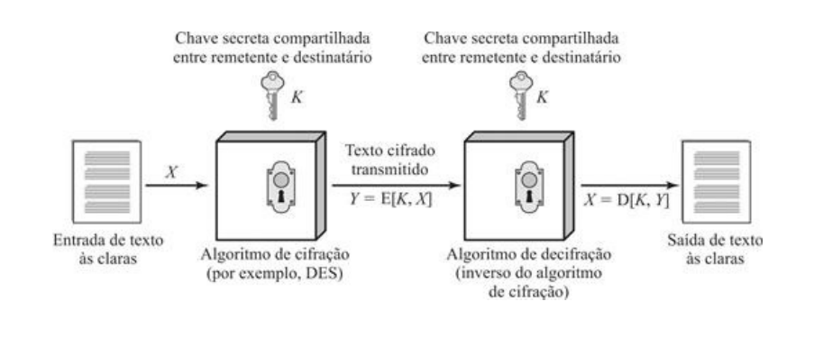
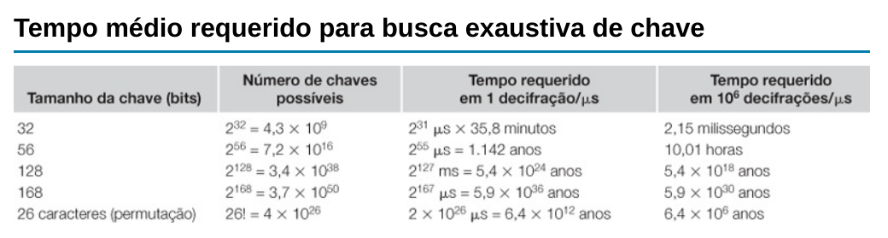
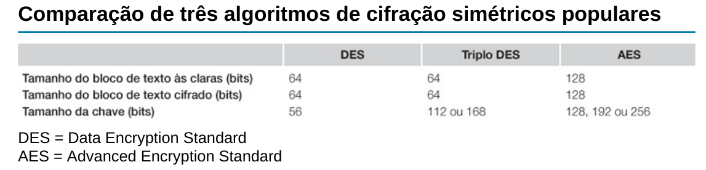
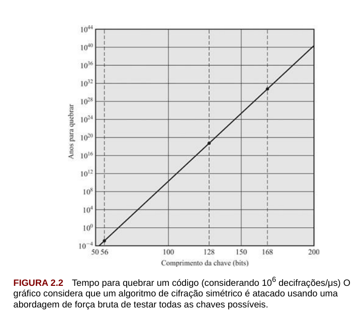
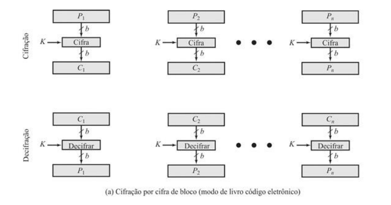
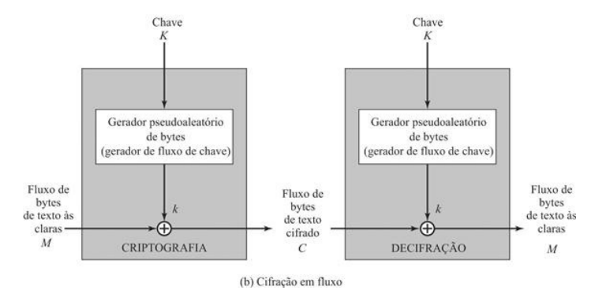

# Módulo: Fundamentos de Criptografia

------

## Pré-Requisitos

São requisitos para essa aula o conhecimento de:

- Redes de Computadores (conceitos gerais)
- Módulo 1: princípios básicos
- Módulo 2: ameaças
- Módulo 3: requisitos
- Módulo 4: malware e vírus
- Módulo 5: worms
- Módulo 6: engenharia social e carga útil
- Módulo 7: contramedidas
- Módulo 8: negação de serviço

------

## Tópicos

- Fundamentos de Criptografia
- xxxxx

# Fundamentos de Criptografia

-------

## AGENDA
- Fundamentos de Criptografia 
- Criptografia Simétrica

-------

## Breve história

- Ocultação de informações para fins de segurança e inteligência é uma tarefa de milhares de anos
- Fatos marcantes: cifras de Júlio César e força-tarefa do U-boat alemão
- Avanços na cifração simétrica e introdução de cifra de chave pública na década de 1970
- Desafio constante para manter ou aumentar resistência com os avanços dos sistemas computacionais

# Confidencialidade com Criptografia Simétrica

## Criptografia Simétrica

- Também conhecido como criptografia convencional, de
chave secreta ou de chave única
   * Única alternativa antes da criptografia de chave pública (anos 70)
   * Alternativa ainda mais amplamente utilizada
- Componentes:  texto simples, algoritmo de cifração, chave secreta,
texto cifrado e algoritmo de decifração

### Texto Simples ou Texto às claras
É a mensagem ou dados originais alimentados ao algoritmo
como entrada.

### Algoritmo de cifração
O algoritmo de cifração executa várias substituições
e transformações no texto às claras.

------

## Criptografia Simétrica: Componentes

### Chave secreta
A chave secreta é também fornecida como entrada para o
algoritmo de cifração. As substituições e transformações exatas realizadas
pelo algoritmo dependem da chave.

### Texto cifrado
É a mensagem embaralhada produzida como saída. Ele
depende do texto às claras e da chave secreta. Para dada mensagem, duas
chaves diferentes produzirão dois textos cifrados diferentes.

### Algoritmo de decifração
É, essencialmente, o algoritmo de cifração
executado ao contrário. Toma o texto cifrado e a chave secreta como entradas
e produz o texto às claras original.

------

## Ilustração do Processo de Criptografia Simétrica

------

## Classificações/Dimensões 

### Tipo de operações usadas para transformar texto às claras em texto cifrado
Dois princípios
gerais: substituição, na qual cada elemento no texto às claras (bit, letra, grupo
de bits ou letras) é mapeado para um outro elemento, e transposição, na qual
elementos no texto às claras são rearranjados. O requisito fundamental é que
nenhuma informação seja perdida (operações reversíveis). Tipicamente, múltiplos estágios.

### Número de chaves
Remetente e o destinatário com mesma
chave: simétrico, de chave única, de chave secreta
ou de cifração convencional. Caso contrário: assimétrico, de duas chaves ou
cifração de chave pública.

### Modo como o texto às claras é processado
Uma cifra de bloco processa um
único bloco de elementos da entrada por vez, produzindo um bloco de saída
para cada bloco de entrada. Uma cifra de fluxo processa elementos de entrada
continuamente, produzindo um elemento de saída por vez.

------

## Requisitos da Criptografia Simétrica

### Cifração Forte

No mínimo, gostaríamos que o
algoritmo fosse tal que um oponente que conheça o algoritmo e tenha acesso
a um ou mais textos cifrados não seria capaz de decifrar o texto cifrado ou
adivinhar a chave. Esse requisito é usualmente enunciado de uma forma mais
forte: o oponente deve ser incapaz de decifrar o texto cifrado ou descobrir a
chave mesmo que esteja de posse de vários textos cifrados juntamente com o
texto às claras que produziu cada texto cifrado.

### Cópias da Chave Secreta
Remetente e destinatário devem obter cópias da chave secreta de maneira
segura e mantê-las em segurança. Se alguém conseguir descobrir a chave e
conhecer o algoritmo, toda comunicação que usar essa chave pode ser lida.

### Métodos de Ataque
Existem dois métodos de ataque: **criptoanálise** ou **força-bruta**

------

## Criptoanálise

- Ataques criptoanalíticos recorrem à natureza do algoritmo
- possivelmente algum conhecimento das características gerais do texto às claras 
- possivelmente algumas amostras de pares de texto às claras e texto cifrado correspondente
- explora as características do algoritmo para tentar deduzir
um texto às claras específico ou deduzir a chave que está sendo usada
- **Resultado:** efeito é catastrófico
   * todas as mensagens **futuras** e **passadas** cifradas com aquela chave são comprometidas

## Ataques Criptoanalíticos (Parte 1/2)

- Apenas algoritmos fracos falham em ataque **somente texto cifrado**
    * geralmente projetados para resistir a **texto às claras conhecido**

### somente texto cifrado
Menos informação, mais difícil de ocorrer.

Conhece Algoritmo de Cifração (assumimos isso em todos os casos) e também conhece o texto cifrado a ser decodificado

### texto às claras conhecido
Adiciona alguns pares às claras/cifrados

### texto às claras escolhido
O criptoanalista consegue escolher pares às claras/cifrados

----

## Ataques Criptoanalíticos (Parte 2/2)

### texto cifrado escolhido
O criptoanalista consegue escolher texto cifrado-alvo.

### texto escolhido
Mais informação, mais fácil (embora mais raro de ocorrer).

O criptoanalista consegue escolher todo o esquema, exceto chave privada.

-------

## Ataque de Força Bruta

- O segundo método, conhecido como ataque de força bruta, é tentar todas as
chaves possíveis em uma amostra de texto cifrado até obter tradução que leve a
um texto às claras inteligível
- Deve ser tentado um valor proporcional ao quantitativo de todas as chaves possíveis para conseguir sucesso (tipicamente metade, em média)
- nesse nível de desempenho, uma chave de 56 bits não pode mais ser considerada segura em termos computacionais

## ALGORITMOS COMPUTACIONALMENTE SEGUROS

- A criptografia é computacionalmente segura se:
   * Custo de quebrar cifra excede o valor da informação
   * Tempo necessário para quebrar a cifra excede a vida útil da informação
- Geralmente muito difícil estimar a quantidade de esforço necessária para quebrar
- Pode-se estimar tempo/custo de um ataque de força bruta

## Algoritmos simétricos de cifração de bloco
- Os algoritmos de cifração simétricos mais comumente usados são cifras de
bloco
- Uma cifra de bloco processa o texto às claras fornecido como entrada em
blocos de tamanho fixo e produz um bloco de texto cifrado de tamanho igual
para cada bloco de texto às claras
- O algoritmo processa cadeias mais longas de
texto às claras como uma série de blocos de tamanho fixo
- Os algoritmos
simétricos mais importantes, todos eles cifra de blocos, são o Data Encryption
Standard (DES), o Triple DES (DES triplo) e o Advanced Encryption Standard
(AES).

## Data encryption standard (DES) - História

- O esquema de cifração mais amplamente usado é baseado no Data Encryption
Standard (DES), adotado em 1977 pelo National Bureau of Standards (Escritório
Nacional de Padrões), agora National Institute of Standards and Technology
(NIST — Instituto Nacional de Padrões e Tecnologia)
- Publicado no Federal Information Processing Standard 46 (FIPS PUB 46)
- O algoritmo em si é conhecido como Data Encryption Algorithm (DEA -- algoritmo de cifração de dados)
- O DES toma como entrada um bloco de texto às claras de 64 bits e uma chave de 56 bits, para produzir um bloco de texto cifrado de 64 bits.
- NIST retira em 2005 o FIPS 46-3: https://pt.wikipedia.org/wiki/Data_Encryption_Standard
- Em 2007, máquina paralela de FPGA da Universidade de Bochum e Kiel, Alemanha, viola o DES em aproximadamente seis dias e meio por um custo de $10,000 em hardware

## DES - Preocupações (História)

- Preocupações com a resistência do DES caem em duas categorias:
preocupações com o algoritmo em si e preocupações com a utilização de uma
chave de 56 bits
- A primeira preocupação refere-se à possibilidade de uma
criptoanálise pela exploração das características do algoritmo DES
   * Ao longo dos anos houve numerosas tentativas de encontrar e explorar fraquezas no
algoritmo, o que transformou o DES no mais estudado algoritmo de cifração
existente. 
   * Apesar das numerosas abordagens, até agora ninguém relatou fraqueza
fatal no DES.
- Uma preocupação mais séria é o comprimento da chave
    * Com comprimento de chave de 56 bits, há $2^{56}$ chaves possíveis, o que equivale a aproximadamente
$7,2 \times 10^{16}$ chaves. 
    * Assim, à primeira vista, um ataque de força bruta parece não
ser prático
    * O DES provou-se definitivamente inseguro em julho de
1998, quando a Electronic Frontier Foundation (EFF) anunciou que tinha
decifrado uma cifração DES usando uma máquina especializada denominada
"decifradora DES" (DES cracker) construída por menos de USD 250k

## DES - Estratégias de Ataque e Contra-Ataque

- Há mais por trás de um ataque de busca de chave
do que simplesmente executar todas as chaves possíveis
- A menos que um texto às claras seja fornecido, o analista deve reconhecer o texto às
claras como sendo de fato um texto às claras
-  Se a mensagem for composta apenas por texto às claras em português, o resultado surgirá facilmente, se bem que a tarefa de reconhecer a língua portuguesa terá de ser automatizada
-  Se a mensagem de texto foi comprimida antes da cifração, o reconhecimento será
mais difícil
- Mensagem como dado mais geral (arquivo numérico), e se esse arquivo foi comprimido: ainda
mais difícil de automatizar
- Assim, para suplementar a abordagem de força bruta,
é preciso algum grau de conhecimento sobre o texto às claras esperado e alguns
meios de distinguir automaticamente o texto às claras de um texto qualquer
- **Solução:** se a única forma de ataque que poderia ser feita a um
algoritmo de cifração for a força bruta, o modo de contra-atacá-lo é óbvio: usar
chaves mais longas. 

## Aumento exponencial do tempo

## Triplo DES - 3DES

- A vida do DES foi estendida pela utilização do triplo DES (DES triplo ou
3DES)
   * repetir o algoritmo DES básico três vezes, usando duas ou
três chaves únicas, para obter um tamanho de chave de 112 ou 168 bits
- O triplo DES (3DES) foi padronizado pela primeira vez para uso em aplicações
financeiras no padrão ANSI X9.17 em 1985
- O 3DES foi incorporado como parte do Data Encryption Standard em 1999, com a publicação do FIPS PUB 46-
3

## 3DES - Vantagens e Desvantagens

- O 3DES tem dois atrativos que garantem sua utilização ampla nos próximos
anos
- A primeira é que, com o seu comprimento de chave de 168 bits, ele supera
a vulnerabilidade do DES ao ataque de força bruta
- A segunda é que o algoritmo
de cifração subjacente ao 3DES é o mesmo que no DES
   * Algoritmo submetido a mais escrutínio do que qualquer outro algoritmo de cifração por um
período de tempo mais longo e nenhum ataque criptoanalítico efetivo baseado no
algoritmo, a não ser o de força bruta, foi encontrado
- Alto nível de confiança que 3DES é muito resistente à criptoanálise
- Usa três chaves e três execuções DES: $C = E(K_3, D(K_2, E(K_1, P)))$
- Uso de decifração no segundo estágio dá compatibilidade com usuários originais de DES
- A principal desvantagem do 3DES é que o algoritmo é relativamente lento em
software e tem blocos muito pequenos
- Blocos de apenas 64 bits, onde 56 bits são usados (8 para paridade)

## Advanced encryption standard (AES) - História

- 3DES não é um candidato razoável para
utilização a longo prazo
- Como substituto, o NIST publicou em 1997 uma
chamada de propostas para um novo Advanced Encryption Standard (AES)
- Cifra de bloco simétrica com comprimento de bloco
de 128 bits e suporte para comprimentos de chaves de 128, 192 e 256 bits
- Critérios de avaliação incluíam: segurança, eficiência computacional, requisitos
de memória, adequabilidade de hardware e software e flexibilidade
- Primeira rodada de avaliação, 15 algoritmos propostos foram aceitos
- Segunda rodada reduziu esse número a cinco algoritmos
- O NIST concluiu
seu processo de avaliação e publicou um padrão final (FIPS PUB 197) em
novembro de 2001 e selecionou o algoritmo de Rijndael como o algoritmo AES
proposto: autores belgas Vincent Rijmen e Joan Daemen
-  Agora esse algoritmo está amplamente disponível em produtos
comerciais.

## Questões práticas de segurança

- Normalmente, a cifração simétrica é aplicada a uma unidade de dados maior do
que um bloco único de 64 bits ou 128 bits
- Mensagens de e-mail, pacotes de
rede, registros de bancos de dados e outras fontes de texto às claras devem ser
partidos em uma série de blocos de comprimento fixo para a cifração por uma
cifra de bloco simétrica
-  A abordagem mais simples para a cifração de múltiplos
blocos é conhecida como modo de livro código eletrônico (**electronic codebook
-- ECB**)
   * texto às claras é processado b bits por vez e cada bloco de
texto às claras é cifrado usando a mesma chave (normalmente b=64 ou b=128)
- Para mensagens longas, o modo ECB pode não ser seguro
   * Um criptoanalista pode conseguir explorar regularidades no texto às claras para facilitar a tarefa de decifração.
   * Por exemplo, se é sabido que a mensagem sempre começa com
certos campos predefinidos, então o criptoanalista pode ter vários pares de texto
às claras-texto cifrado conhecidos com os quais trabalhar.
- Utilização de **modos de operação** e também de **cifras de fluxo**

## Ilustração da Cifração de Bloco

## Ilustração da Cifração de Fluxo

## CIFRAS DE FLUXO

- Processa os elementos de entrada continuamente
- Chave é entrada para um gerador de bits pseudoaleatório
   * Produz fluxo de números pseudoaleatórios (sequência de
cifração)
   * Imprevisível sem conhecer a chave de entrada
   * XOR com bytes de texto às claras
- São mais rápidos e usam muito menos código
- Considerações de projeto:
   * Sequência de cifração deve ter um grande período
   * Deve ter propriedades próximas a de números aleatórios
   * Usar uma chave suficientemente longa
- Uma cifra de fluxo muito utilizada é o RC4 (Rivest Cipher 4) de 1987, *vazado* em 1994: https://en.wikipedia.org/wiki/RC4 
- Bastante simples, mas considerada insegura (usada em protocolos inseguros como WEP)

## RC4 vs cifras de bloco

## MODOS DE OPERAÇÃO
- Cifras de bloco processam dados em blocos
   * Por exemplo, 64 bits (DES, 3DES) ou 128 bits (AES)
- Para mensagens mais longas deve quebrar em blocos
   * E, possivelmente, o completar final do bloco para
múltiplo (*padding*)
- Há 5 cinco modos de operação: definidos pelo NIST SP 800-38A
   * Livro-código eletrônico (ECB)
   * Encadeamento de blocos de cifra (CBC)
   * Realimentação de cifra (CFB)
   * Realimentação de saída (OFB)
   * Contador (CTR) 
- Os cinco modos pretendem cobrir praticamente todas as possíveis aplicações de
cifração para as quais uma cifra de bloco poderia ser usada

## Modo: ELECTRONIC CODEBOOK (ECB)
- Modo mais simples
- Dividir texto às claras em blocos de $b$ bits cada
- Cifrar cada bloco usando a **mesma chave**
- "Codebook" (livro-código) porque tem valor de
texto cifrado exclusivo para cada bloco de texto
sem formatação
- Não é seguro para mensagens longas: 
   * texto às claras **repetido** é visto no texto cifrado **também repetido**
   * um criptoanalista possivelmente conseguirá explorar essas regularidades
   * Por exemplo, sabendo que a mensagem sempre começa com certos campos predefinidos, o criptoanalista pode ter vários pares de textos às claras/textos cifrados conhecidos com os quais trabalhar
- Para superar as deficiências de
segurança do ECB, seria bom se tivéssemos uma técnica na qual um mesmo
bloco de texto às claras, caso repetido, produzisse blocos de texto cifrado
diferentes

## Modo: CIPHER BLOCK CHAINING (CBC)

- a entrada para o algoritmo de cifração é o resultado da
operação de XOR entre o bloco de texto às claras e o bloco de texto cifrado
precedente
- a mesma chave é usada para cada bloco
- encadeamos o processamento da sequência de blocos de texto às claras
- a entrada passada para a função de cifração para cada bloco de texto às claras não
guarda qualquer relação fixa com o bloco de texto às claras
- padrões repetitivos de b bits não são expostos
- para fazer a decifração, cada bloco cifrado é passado pelo algoritmo de
decifração
- O resultado passa por uma operação de XOR com o bloco de texto
cifrado precedente para produzir o bloco de texto às claras

## Modo: Realimentação de Cifra (CFB)

- É possível converter qualquer cifra de bloco em uma cifra de fluxo usando o
modo de realimentação de cifra
- Uma cifra de fluxo elimina a necessidade de
preenchimento de uma mensagem para que ela tenha um número inteiro de
blocos
- Cifras de fluxo também podem operar em tempo real
- Assim, se um fluxo de caracteres está sendo transmitido, cada caractere pode ser cifrado e
transmitido imediatamente usando uma cifra de fluxo orientada a caracteres
- Uma propriedade desejável de uma cifra de fluxo é que o texto cifrado seja do
mesmo comprimento que o texto às claras
- Assim, se caracteres de 8 bits estão
sendo transmitidos, cada caractere deve ser cifrado usando 8 bits
   * Se forem usados mais de 8 bits, desperdiça-se capacidade de transmissão.
- A entrada para a função de cifração é
um registrador de deslocamento de b bits que inicialmente é ajustado para algum
vetor de inicialização (IV)

## Modo: Contador/*Counter* (CTR)

- Aumento de interesse com aplicações na segurança de redes ATM (Asynchronous Transfer Mode) e no
IPSec (IP Security)
- Um contador igual ao tamanho do bloco de texto às claras é usado
- O único requisito declarado em SP 800-38A é que o valor do contador deve ser diferente para cada bloco de texto às claras que é cifrado
- Tipicamente, o contador é inicializado com algum valor e então
incrementado de 1 para cada bloco subsequente (módulo $2^b$, onde b é o tamanho
do bloco)
- Para a cifração, o contador é cifrado e então passa por uma operação
de XOR com o bloco de texto às claras para produzir o bloco de texto cifrado;
não há encadeamento
- Para a decifração, a mesma sequência de valores de
contador é usada, sendo que cada contador cifrado passa por uma operação de
XOR com um bloco de texto cifrado para recuperar o bloco de texto às claras
correspondente.

## Outros Modos

- Novos modos adicionados após publicação do livro
- https://en.wikipedia.org/wiki/Block_cipher_mode_of_operation

# Aleatoriedade
   
## Números aleatórios e pseudoaleatórios

- Números aleatórios desempenham importante papel na utilização de criptografia
para várias aplicações de segurança de rede
- Geração de chaves para o algoritmo criptográfico
- Geração de um fluxo de chaves para uma cifra de fluxo simétrica
- Geração de uma chave simétrica para uso como chave de sessão temporária
ou na criação de um envelope digital (a ver)
- Essas aplicações dão origem a dois requisitos distintos e não necessariamente
compatíveis para uma sequência de números aleatórios: **aleatoriedade** e
**imprevisibilidade**

## Aleatoriedade
- Tradicionalmente, a preocupação na geração de uma sequência de números
alegadamente aleatórios é que a sequência de números seja aleatória em algum
sentido estatístico bem definido. 
- Dois critérios são usados para
validar que uma sequência de números é aleatória: **distribuição uniforme** e **independência**
- No contexto da nossa discussão, a utilização de uma sequência de números
que *parecem estatisticamente aleatórios* ocorre frequentemente no projeto de
algoritmos relacionados à criptografia

### Distribuição uniforme
A distribuição de números na sequência deve ser
uniforme, isto é, a frequência de ocorrência de cada um dos números deve
ser aproximadamente a mesma.

### Independência
Nenhum valor na sequência pode ser inferido dos outros.

## Desafios Práticos de Aleatoriedade

- Existem testes bem definidos para determinar se uma sequência de
números corresponde a uma distribuição particular, como a distribuição
uniforme, mas não há teste para "provar" independência 
   * Em vez disso, diversos testes podem ser aplicados para demonstrar se a sequência
**não** exibe independência
   * A estratégia geral é aplicar vários desses testes até que
a confiança na existência da independência seja suficientemente forte
-  Por exemplo, um requisito fundamental
do esquema criptográfico de chave pública RSA é a capacidade de gerar
números primos
   * Em geral, é difícil determinar se um número grande N dado é
primo. Uma abordagem de força bruta seria dividir N por todo ímpar inteiro
menor do que $\sqrt{N}$
   * Se N for da ordem de, digamos, $N^{150}$, ocorrência que não é
incomum em criptografia de chave pública, tal abordagem de força bruta está
além do alcance de analistas humanos e de seus computadores.
   * Se a sequência for longa o suficiente (mas muito, muito
menor que $\sqrt{N^{150}}$) a primalidade de um número pode ser determinada com
*quase total certeza*

## Aleatório versus pseudoaleatório

- Em aplicações como autenticação mútua e geração de chaves de sessão, o
requisito não é tanto que a sequência de números seja estatisticamente aleatória,
mas que os membros sucessivos da sequência sejam **imprevisíveis**
- Com sequências "verdadeiramente" aleatórias, cada número é estatisticamente
independente de outros números na sequência e, por conseguinte, imprevisível
- números aleatórios verdadeiros nem
sempre são usados; em vez disso, sequências de números que parecem ser
aleatórias são geradas por algum algoritmo
   * Neste último caso, deve-se tomar
cuidado para que um oponente não consiga prever elementos futuros da
sequência com base em elementos anteriores
- algoritmos determinísticos produzem sequências de números que não são estatisticamente aleatórios
   * Todavia, se o algoritmo for bom, as sequências resultantes passarão em muitos
testes razoáveis de aleatoriedade
- Tais números são denominados números **pseudoaleatórios**

## Filosofando sobre números pseudoaleatórios

De acordo com HAMM91:

> Para finalidades práticas somos forçados a aceitar o conceito esquisito de
   “relativamente aleatórios” significando que, com relação ao uso proposto,
   não podemos ver qualquer razão por que eles não funcionariam como se
   fossem aleatórios (como a teoria usualmente requer). Isso é altamente
   subjetivo e não muito palatável para os puristas, mas é um argumento ao
   qual os estatísticos regularmente apelam quando tomam "uma amostra
   aleatória" — eles esperam que quaisquer resultados que usarem terão
   aproximadamente as mesmas propriedades de uma contagem completa do
   espaço total da amostra que ocorre em sua teoria.

## Números verdadeiramente aleatórios

- Um gerador de números verdadeiramente aleatórios (*True Random Number Generator — TRNG*) usa uma fonte não determinística para produzir aleatoriedade
- A maioria opera medindo processos naturais imprevisíveis, como
detectores de pulso de eventos de radiação ionizantes, tubos de descarga de gás e
capacitores com fuga de fluxo
- A Intel desenvolveu um chip disponível
comercialmente que toma amostras de ruído térmico amplificando a voltagem
medida entre resistores não acionados
-  Um grupo do Bell Labs
desenvolveu uma técnica que usa as variações no tempo de resposta de
solicitações de leitura de um setor de disco de um disco rígido
-  LavaRnd é um projeto de código-fonte aberto para criar números
verdadeiramente aleatórios usando câmeras baratas, código-fonte aberto e
hardware barato. O sistema usa um dispositivo de carga acoplada saturado
(CDD) dentro de uma lata hermeticamente fechada (à prova de luz) como fonte
caótica para produzir aleatoriedade

# Autenticação de Mensagens e Funções de Hash

## Autenticação de Mensagens

- A cifração fornece proteção contra ataques passivos (escutas)
- Um requisito diferente é proteger contra ataques ativos (falsificação de dados e transações)
- A proteção contra tais ataques é conhecida como **autenticação** de mensagens ou de
dados
- Diz-se que uma mensagem, arquivo, documento ou outra coleção de dados é
autêntica quando é genuína e veio de sua fonte alegada
- Autenticação de mensagens ou dados é um procedimento que permite que as partes comunicantes
verifiquem se as mensagens recebidas ou armazenadas são autênticas
- Os dois aspectos importantes são verificar se o conteúdo da mensagem não foi alterado e
se a fonte é autêntica
- Também podemos desejar verificar se uma mensagem foi
transmitida no momento correto (se ela não foi artificialmente atrasada ou
repetida) e a sequência em relação a outras mensagens que fluem entre duas
partes

## Autenticação usando cifração simétrica

# Criptografia de Chave Pública

# Assinaturas Digitais

# Discussão (TODO)

## Breve discussão

### Cenário atual

- Já teve alguma experiência de lentidão de serviços ou ataque? Qual a mensagem/objetivo do ataque? Qual plataforma afetada?
- Quais plataformas sofrem lentidão frequentemente, mesmo que não sejam ataques intencionais?

------

## Leia mais

Livro: 

- "Segurança de Computadores - Princípios e Práticas - 2012" - Stallings, William; Brown, Lawrie & Lawrie Brown & Mick Bauer & Michael Howard
    * Em Português do Brasil, CAMPUS - GRUPO ELSEVIER, 2ª Ed. 2014

Veja Capítulo 7, todas seções e finaliza o capítulo 7.

# Agradecimentos

-----

## Pessoas

Em especial, agradeço aos colegas que elaboraram bons materiais, como o prof. Raphael Machado, Kowada e Viterbo cujos conceitos formam o cerne desses slides.

Estendo os agradecimentos aos demais colegas que colaboraram com a elaboração do material do curso de [Pesquisa Operacional](https://github.com/igormcoelho/curso-pesquisa-operacional-i), que abriu caminho para verificação prática dessa tecnologia de slides.

-----

## Software

Esse material de curso só é possível graças aos inúmeros projetos de código-aberto que são necessários a ele, incluindo:

- pandoc
- LaTeX
- GNU/Linux
- git
- markdown-preview-enhanced (github)
- visual studio code
- atom
- revealjs
- groomit-mpx (screen drawing tool)
- xournal (screen drawing tool)
- ...

-----

## Empresas

Agradecimento especial a empresas que suportam projetos livres envolvidos nesse curso:

- github
- gitlab
- microsoft
- google
- ...

-----

## Reprodução do material

Esses slides foram escritos utilizando pandoc, segundo o tutorial ilectures:

- https://igormcoelho.github.io/ilectures-pandoc/

Exceto expressamente mencionado (com as devidas ressalvas ao material cedido por colegas), a licença será Creative Commons.

**Licença:** CC-BY 4.0 2020

Igor Machado Coelho

-------

## This Slide Is Intentionally Blank (for goomit-mpx)
