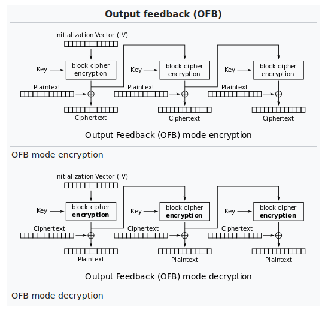
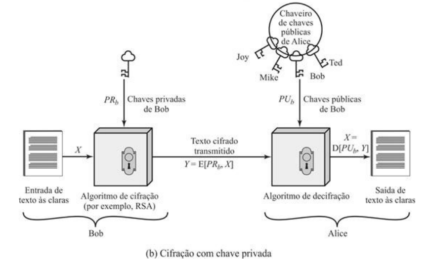

# Módulo: Fundamentos de Criptografia

------

## Pré-Requisitos

São requisitos para essa aula o conhecimento de:

- Redes de Computadores (conceitos gerais)
- Módulo 1: princípios básicos
- Módulo 2: ameaças
- Módulo 3: requisitos
- Módulo 4: malware e vírus
- Módulo 5: worms
- Módulo 6: engenharia social e carga útil
- Módulo 7: contramedidas
- Módulo 8: negação de serviço

------

## Tópicos

- Fundamentos de Criptografia
- xxxxx

# Fundamentos de Criptografia

-------

## AGENDA
- Fundamentos de Criptografia 
- Criptografia Simétrica

-------

## Breve história

- Ocultação de informações para fins de segurança e inteligência é uma tarefa de milhares de anos
- Fatos marcantes: cifras de Júlio César e força-tarefa do U-boat alemão
- Avanços na cifração simétrica e introdução de cifra de chave pública na década de 1970
- Desafio constante para manter ou aumentar resistência com os avanços dos sistemas computacionais

# Confidencialidade com Criptografia Simétrica

## Criptografia Simétrica

- Também conhecido como criptografia convencional, de
chave secreta ou de chave única
   * Única alternativa antes da criptografia de chave pública (anos 70)
   * Alternativa ainda mais amplamente utilizada
- Componentes:  texto simples, algoritmo de cifração, chave secreta,
texto cifrado e algoritmo de decifração

### Texto Simples ou Texto às claras
É a mensagem ou dados originais alimentados ao algoritmo
como entrada.

### Algoritmo de cifração
O algoritmo de cifração executa várias substituições
e transformações no texto às claras.

------

## Criptografia Simétrica: Componentes

### Chave secreta
A chave secreta é também fornecida como entrada para o
algoritmo de cifração. As substituições e transformações exatas realizadas
pelo algoritmo dependem da chave.

### Texto cifrado
É a mensagem embaralhada produzida como saída. Ele
depende do texto às claras e da chave secreta. Para dada mensagem, duas
chaves diferentes produzirão dois textos cifrados diferentes.

### Algoritmo de decifração
É, essencialmente, o algoritmo de cifração
executado ao contrário. Toma o texto cifrado e a chave secreta como entradas
e produz o texto às claras original.

------

## Ilustração do Processo de Criptografia Simétrica

------

## Classificações/Dimensões 

### Tipo de operações usadas para transformar texto às claras em texto cifrado
Dois princípios
gerais: substituição, na qual cada elemento no texto às claras (bit, letra, grupo
de bits ou letras) é mapeado para um outro elemento, e transposição, na qual
elementos no texto às claras são rearranjados. O requisito fundamental é que
nenhuma informação seja perdida (operações reversíveis). Tipicamente, múltiplos estágios.

### Número de chaves
Remetente e o destinatário com mesma
chave: simétrico, de chave única, de chave secreta
ou de cifração convencional. Caso contrário: assimétrico, de duas chaves ou
cifração de chave pública.

### Modo como o texto às claras é processado
Uma cifra de bloco processa um
único bloco de elementos da entrada por vez, produzindo um bloco de saída
para cada bloco de entrada. Uma cifra de fluxo processa elementos de entrada
continuamente, produzindo um elemento de saída por vez.

------

## Requisitos da Criptografia Simétrica

### Cifração Forte

No mínimo, gostaríamos que o
algoritmo fosse tal que um oponente que conheça o algoritmo e tenha acesso
a um ou mais textos cifrados não seria capaz de decifrar o texto cifrado ou
adivinhar a chave. Esse requisito é usualmente enunciado de uma forma mais
forte: o oponente deve ser incapaz de decifrar o texto cifrado ou descobrir a
chave mesmo que esteja de posse de vários textos cifrados juntamente com o
texto às claras que produziu cada texto cifrado.

### Cópias da Chave Secreta
Remetente e destinatário devem obter cópias da chave secreta de maneira
segura e mantê-las em segurança. Se alguém conseguir descobrir a chave e
conhecer o algoritmo, toda comunicação que usar essa chave pode ser lida.

### Métodos de Ataque
Existem dois métodos de ataque: **criptoanálise** ou **força-bruta**

------

## Criptoanálise

- Ataques criptoanalíticos recorrem à natureza do algoritmo
- possivelmente algum conhecimento das características gerais do texto às claras 
- possivelmente algumas amostras de pares de texto às claras e texto cifrado correspondente
- explora as características do algoritmo para tentar deduzir
um texto às claras específico ou deduzir a chave que está sendo usada
- **Resultado:** efeito é catastrófico
   * todas as mensagens **futuras** e **passadas** cifradas com aquela chave são comprometidas

## Ataques Criptoanalíticos (Parte 1/2)

- Apenas algoritmos fracos falham em ataque **somente texto cifrado**
    * geralmente projetados para resistir a **texto às claras conhecido**

### somente texto cifrado
Menos informação, mais difícil de ocorrer.

Conhece Algoritmo de Cifração (assumimos isso em todos os casos) e também conhece o texto cifrado a ser decodificado

### texto às claras conhecido
Adiciona alguns pares às claras/cifrados

### texto às claras escolhido
O criptoanalista consegue escolher pares às claras/cifrados

----

## Ataques Criptoanalíticos (Parte 2/2)

### texto cifrado escolhido
O criptoanalista consegue escolher texto cifrado-alvo.

### texto escolhido
Mais informação, mais fácil (embora mais raro de ocorrer).

O criptoanalista consegue escolher todo o esquema, exceto chave privada.

-------

## Ataque de Força Bruta

- O segundo método, conhecido como ataque de força bruta, é tentar todas as
chaves possíveis em uma amostra de texto cifrado até obter tradução que leve a
um texto às claras inteligível
- Deve ser tentado um valor proporcional ao quantitativo de todas as chaves possíveis para conseguir sucesso (tipicamente metade, em média)
- nesse nível de desempenho, uma chave de 56 bits não pode mais ser considerada segura em termos computacionais

## ALGORITMOS COMPUTACIONALMENTE SEGUROS

- A criptografia é computacionalmente segura se:
   * Custo de quebrar cifra excede o valor da informação
   * Tempo necessário para quebrar a cifra excede a vida útil da informação
- Geralmente muito difícil estimar a quantidade de esforço necessária para quebrar
- Pode-se estimar tempo/custo de um ataque de força bruta

## Algoritmos simétricos de cifração de bloco
- Os algoritmos de cifração simétricos mais comumente usados são cifras de
bloco
- Uma cifra de bloco processa o texto às claras fornecido como entrada em
blocos de tamanho fixo e produz um bloco de texto cifrado de tamanho igual
para cada bloco de texto às claras
- O algoritmo processa cadeias mais longas de
texto às claras como uma série de blocos de tamanho fixo
- Os algoritmos
simétricos mais importantes, todos eles cifra de blocos, são o Data Encryption
Standard (DES), o Triple DES (DES triplo) e o Advanced Encryption Standard
(AES).

## Cifra de Feistel

- A Cifra de Feistel ou Rede de Feistel (também chamada de "Luby--Rackoff block cipher" que a criptoanalisaram) é utilizada em projetos bem-sucedidos de criptografia simétrica, como o DES 
- Criada por Horst Feistel da IBM em 1973
- Entrada de cifração é um bloco de texto às claras de $2w$ bits de comprimento e uma chave
$K$
- Bloco de texto às claras é dividido em duas metades, L0 e R0
- Duas metades passam por $n$ rodadas de processamento
- Cada rodada $i$ utiliza dados $L_{i-1}$ e $R_{i-1}$
- Chaves $K_i$ são derivadas da chave $K$, para cada rodada
- A cada rodada, dados dos lados esquerdo e direito (L e R) se invertem
- Decifração usa mesmo algoritmo, porém chaves $K_i$ em ordem inversa
- Função F não precisa ser inversível, mas a rede sempre será
- Veja mais: https://en.wikipedia.org/wiki/Feistel_cipher

## Ilustração da Cifra de Feistel

{height=90%}

## Parâmetros da Cifra de Feistel (Parte 1/2)

### Tamanho do bloco 
Blocos de tamanhos maiores significam maior
segurança (se todos os outros parâmetros/aspectos forem iguais), mas
velocidade de cifração/decifração reduzida. Um tamanho de bloco de 128
bits é um compromisso razoável quase universal em projetos recentes de
cifra de bloco.

### Tamanho da chave
Chaves de tamanhos maiores significam maior
segurança, mas podem reduzir a velocidade de cifração/decifração. O
comprimento de chave mais comum em algoritmos modernos é 128 bits.

### Número de rodadas
A essência de uma cifra de bloco simétrica é que uma
única rodada oferece segurança inadequada, mas várias rodadas oferecem
segurança crescente. Um número típico é 16 rodadas.

## Parâmetros da Cifra de Feistel (Parte 2/2)

### Algoritmo de geração de subchaves
Maior complexidade nesse algoritmo
deve resultar em maior dificuldade de criptoanálise.

### Função de rodada
Novamente, maior complexidade geralmente significa
maior resistência à criptoanálise.

## Considerações de Projeto de uma Cifra de Feistel

### Software de cifração/decifração rápida
Em muitos casos, mecanismos de
cifração são embutidos em aplicações ou funções utilitárias de modo tal que
não é possível a implementação em hardware. Dessa maneira, a velocidade
de execução do algoritmo torna-se uma preocupação.

### Facilidade de análise
Embora queiramos que o nosso algoritmo seja o mais
difícil possível de criptoanalisar, há grande benefício se o algoritmo for fácil
de analisar. Isto é, se o algoritmo puder ser explicado com concisão e clareza,
é mais fácil analisá-lo em relação a vulnerabilidades criptoanalíticas e, por
conseguinte, desenvolver um nível mais alto de garantias em relação a sua
força. O DES, por exemplo, não tem funcionalidade fácil de analisar.

## Data encryption standard (DES) - História

- O esquema de cifração mais amplamente usado é baseado no Data Encryption
Standard (DES), adotado em 1977 pelo National Bureau of Standards (Escritório
Nacional de Padrões), agora National Institute of Standards and Technology
(NIST — Instituto Nacional de Padrões e Tecnologia)
- Publicado no Federal Information Processing Standard 46 (FIPS PUB 46)
- O algoritmo em si é conhecido como Data Encryption Algorithm (DEA -- algoritmo de cifração de dados)
- O DES toma como entrada um bloco de texto às claras de 64 bits e uma chave de 56 bits, para produzir um bloco de texto cifrado de 64 bits.
- NIST retira em 2005 o FIPS 46-3: https://pt.wikipedia.org/wiki/Data_Encryption_Standard
- Em 2007, máquina paralela de FPGA da Universidade de Bochum e Kiel, Alemanha, viola o DES em aproximadamente seis dias e meio por um custo de $10,000 em hardware

## Funcionamento do DES

- O DES funciona como uma Cifra de Feistel
- São utilizados n=16 rodadas (próximo slide)
- O bloco tem 64 bits (então meio bloco tem 32 bits)
- A chave K tem 64 bits, onde apenas 56 bits são efetivamente utilizados
- O mesmo algoritmo cifra e decifra, apenas bastando inverter a ordem das subchaves
- A função F tem quatro fases (próximos slides): Expansion (E-Expansion) (32 bits viram 48 bits), Key mixing, Substitution (S-Boxes), Permutation (P-Box) (de volta para 32 bits)
- Conceito de "confusion and diffusion" de Claude Shannon em 1940, na E-expansion e S-Boxes/P-Box dão garantia de segurança
- Key Schedule (próximos slides) divide os 56 bits da chave em duas partes de 28 bits (fase PC-1), depois rotacionados individualmente, e agregados novamente (fase PC-2) para gerar subchave de 48 bits
- Veja: https://en.wikipedia.org/wiki/Data_Encryption_Standard

## Ilustração da Estrutura Feistel do DES

{height=90%}

## Ilustração da Função F do DES

{height=80%}

## Ilustração do Key Schedule do DES

{height=80%}

## DES - Preocupações (História)

- Preocupações com a resistência do DES caem em duas categorias:
preocupações com o algoritmo em si e preocupações com a utilização de uma
chave de 56 bits
- A primeira preocupação refere-se à possibilidade de uma
criptoanálise pela exploração das características do algoritmo DES
   * Ao longo dos anos houve numerosas tentativas de encontrar e explorar fraquezas no
algoritmo, o que transformou o DES no mais estudado algoritmo de cifração
existente. 
   * Apesar das numerosas abordagens, até agora ninguém relatou fraqueza
fatal no DES.
- Uma preocupação mais séria é o comprimento da chave
    * Com comprimento de chave de 56 bits, há $2^{56}$ chaves possíveis, o que equivale a aproximadamente
$7,2 \times 10^{16}$ chaves. 
    * Assim, à primeira vista, um ataque de força bruta parece não
ser prático
    * O DES provou-se definitivamente inseguro em julho de
1998, quando a Electronic Frontier Foundation (EFF) anunciou que tinha
decifrado uma cifração DES usando uma máquina especializada denominada
"decifradora DES" (DES cracker) construída por menos de USD 250k

## DES - Estratégias de Ataque e Contra-Ataque

- Há mais por trás de um ataque de busca de chave
do que simplesmente executar todas as chaves possíveis
- A menos que um texto às claras seja fornecido, o analista deve reconhecer o texto às
claras como sendo de fato um texto às claras
-  Se a mensagem for composta apenas por texto às claras em português, o resultado surgirá facilmente, se bem que a tarefa de reconhecer a língua portuguesa terá de ser automatizada
-  Se a mensagem de texto foi comprimida antes da cifração, o reconhecimento será
mais difícil
- Mensagem como dado mais geral (arquivo numérico), e se esse arquivo foi comprimido: ainda
mais difícil de automatizar
- Assim, para suplementar a abordagem de força bruta,
é preciso algum grau de conhecimento sobre o texto às claras esperado e alguns
meios de distinguir automaticamente o texto às claras de um texto qualquer
- **Solução:** se a única forma de ataque que poderia ser feita a um
algoritmo de cifração for a força bruta, o modo de contra-atacá-lo é óbvio: usar
chaves mais longas. 

## Aumento exponencial do tempo

## Triplo DES - 3DES

- A vida do DES foi estendida pela utilização do triplo DES (DES triplo ou
3DES)
   * repetir o algoritmo DES básico três vezes, usando duas ou
três chaves únicas, para obter um tamanho de chave de 112 ou 168 bits
- O triplo DES (3DES) foi padronizado pela primeira vez para uso em aplicações
financeiras no padrão ANSI X9.17 em 1985
- O 3DES foi incorporado como parte do Data Encryption Standard em 1999, com a publicação do FIPS PUB 46-
3

## 3DES - Vantagens e Desvantagens

- O 3DES tem dois atrativos que garantem sua utilização ampla nos próximos
anos
- A primeira é que, com o seu comprimento de chave de 168 bits, ele supera
a vulnerabilidade do DES ao ataque de força bruta
- A segunda é que o algoritmo
de cifração subjacente ao 3DES é o mesmo que no DES
   * Algoritmo submetido a mais escrutínio do que qualquer outro algoritmo de cifração por um
período de tempo mais longo e nenhum ataque criptoanalítico efetivo baseado no
algoritmo, a não ser o de força bruta, foi encontrado
- Alto nível de confiança que 3DES é muito resistente à criptoanálise
- Usa três chaves e três execuções DES: $C = E(K_3, D(K_2, E(K_1, P)))$
- Uso de decifração no segundo estágio dá compatibilidade com usuários originais de DES
- A principal desvantagem do 3DES é que o algoritmo é relativamente lento em
software e tem blocos muito pequenos
- Blocos de apenas 64 bits, onde 56 bits são usados (8 para paridade)

## Advanced encryption standard (AES) - História

- 3DES não é um candidato razoável para
utilização a longo prazo
- Como substituto, o NIST publicou em 1997 uma
chamada de propostas para um novo Advanced Encryption Standard (AES)
- Cifra de bloco simétrica com comprimento de bloco
de 128 bits e suporte para comprimentos de chaves de 128, 192 e 256 bits
- Critérios de avaliação incluíam: segurança, eficiência computacional, requisitos
de memória, adequabilidade de hardware e software e flexibilidade 
- Primeira rodada de avaliação, 15 algoritmos propostos foram aceitos
- Segunda rodada reduziu esse número a cinco algoritmos
- O NIST concluiu
seu processo de avaliação e publicou um padrão final (FIPS PUB 197) em
novembro de 2001 e selecionou o algoritmo de Rijndael como o algoritmo AES
proposto: autores belgas Vincent Rijmen e Joan Daemen
-  Agora esse algoritmo está amplamente disponível em produtos
comerciais

## Ideia Geral do AES

- No AES, não é utilizada uma Rede de Feistel
- Implementação complexa com uso de permutações e substituições
- Entrada para algoritmos de cifração e decifração é um bloco de 128 bits
- No FIPS PUB 197, bloco representado por matriz quadrada de bytes
   * O bloco é copiado para o vetor **Estado**, que é modificado a cada estágio de cifração ou decifração 
   * Após o estágio final, **Estado** é copiado para uma matriz de saída
- Chave de 128 bits representada como matriz quadrada de bytes
   * chave é expandida para um vetor de palavras de escalonamento de chave
   * cada palavra tem 4 bytes
   * escalonamento total de chaves tem 44 palavras para a chave de 128 bits
- A ordenação dos bytes dentro de uma matriz é feita por colunas
- Primeiros 4 bytes de uma entrada de texto às claras de 128 bits passada para a cifra criptográfica
ocupam a primeira coluna da matriz **entrada**
   * segundos 4 bytes ocupam a segunda coluna, e assim por diante
- Primeiros 4 bytes da chave expandida, que formam uma palavra, ocupam a primeira coluna da
matriz **w**

## Estrutura Geral do AES (não usa Feistel)

## Estrutura Geral da Rodada do AES

{height=90%}

# Modos de Operação e Cifras de Bloco vs Fluxo

## Questões práticas de segurança

- Normalmente, a cifração simétrica é aplicada a uma unidade de dados maior do
que um bloco único de 64 bits ou 128 bits
- Mensagens de e-mail, pacotes de
rede, registros de bancos de dados e outras fontes de texto às claras devem ser
partidos em uma série de blocos de comprimento fixo para a cifração por uma
cifra de bloco simétrica
-  A abordagem mais simples para a cifração de múltiplos
blocos é conhecida como modo de livro código eletrônico (**electronic codebook
-- ECB**)
   * texto às claras é processado b bits por vez e cada bloco de
texto às claras é cifrado usando a mesma chave (normalmente b=64 ou b=128)
- Para mensagens longas, o modo ECB pode não ser seguro
   * Um criptoanalista pode conseguir explorar regularidades no texto às claras para facilitar a tarefa de decifração.
   * Por exemplo, se é sabido que a mensagem sempre começa com
certos campos predefinidos, então o criptoanalista pode ter vários pares de texto
às claras-texto cifrado conhecidos com os quais trabalhar.
- Utilização de **modos de operação** e também de **cifras de fluxo**

## Ilustração da Cifração de Bloco

## Ilustração da Cifração de Fluxo

## CIFRAS DE FLUXO

- Processa os elementos de entrada continuamente
- Chave é entrada para um gerador de bits pseudoaleatório
   * Produz fluxo de números pseudoaleatórios (sequência de
cifração)
   * Imprevisível sem conhecer a chave de entrada
   * XOR com bytes de texto às claras
- São mais rápidos e usam muito menos código
- Considerações de projeto:
   * Sequência de cifração deve ter um grande período
   * Deve ter propriedades próximas a de números aleatórios
   * Usar uma chave suficientemente longa
- Uma cifra de fluxo muito utilizada é o RC4 (Rivest Cipher 4) de 1987, *vazado* em 1994: https://en.wikipedia.org/wiki/RC4 
- Bastante simples, mas considerada insegura (usada em protocolos inseguros como WEP)

## RC4 vs cifras de bloco

## MODOS DE OPERAÇÃO
- Em inglês, Block Cipher Mode Operation:
   * https://en.wikipedia.org/wiki/Block_cipher_mode_of_operation
- Cifras de bloco processam dados em blocos
   * Por exemplo, 64 bits (DES, 3DES) ou 128 bits (AES)
- Para mensagens mais longas deve quebrar em blocos
   * E, possivelmente, o completar final do bloco para
múltiplo (*padding*)
- Modos mais antigos: ECB, CBC, OFB, and CFB (FIPS 81 de 1981)
- 5 cinco modos de operação: NIST SP 800-38A de 2001
   * Livro-código eletrônico (ECB)
   * Encadeamento de blocos de cifra (CBC)
   * Realimentação de cifra (CFB)
   * Realimentação de saída (OFB)
   * *Contador (CTR)* - de 2001
- Modo XTS-AES adicionado na SP800-38E de 2010
- Modo PCBC também frequentemente usado (sem norma)
- Os modos pretendem cobrir praticamente todas as possíveis aplicações de
cifração para as quais uma cifra de bloco poderia ser usada

## Vetor de Inicialização

- Alguns modos exigem uma sequência binária única chamada de Vetor de Inicialização, ou *Initialization Vector* (IV)
   * Não deve se repetir, e para alguns modos, deve ser aleatório
- Utilizado para garantir que *plaintexts* repetidos gerem *ciphertexts* distintos, mesmo que a mesma chave seja utilizada
- Também chamado de *Starting Variable* (SV)
- O IV não precisa ser secreto, como uma chave privada
- Observar regras nas normas como SP800-38A
    * Modo CBC e CFB: reutilizar IV vaza informações no primeiro bloco de plaintext
    * Modo OFB e CTR: reutilizar IV quebra a segurança
    * Em CBC, o IV deve ser imprevisível

## Modos: visão geral (seis modos incluindo PCBC)

## Modo: ELECTRONIC CODEBOOK (ECB)
- Modo mais simples
- Dividir texto às claras em blocos de $b$ bits cada
- Cifrar cada bloco usando a **mesma chave**
- "Codebook" (livro-código) porque tem valor de
texto cifrado exclusivo para cada bloco de texto
sem formatação
- Não é seguro para mensagens longas: 
   * texto às claras **repetido** é visto no texto cifrado **também repetido**
   * um criptoanalista possivelmente conseguirá explorar essas regularidades
   * Por exemplo, sabendo que a mensagem sempre começa com certos campos predefinidos, o criptoanalista pode ter vários pares de textos às claras/textos cifrados conhecidos com os quais trabalhar
- Para superar as deficiências de
segurança do ECB, seria bom se tivéssemos uma técnica na qual um mesmo
bloco de texto às claras, caso repetido, produzisse blocos de texto cifrado
diferentes
- Fraquezas conhecidas: veja no próximo slide a encriptação de bits de uma imagem

## Ilustração Fraqueza ECB

## Modo: CIPHER BLOCK CHAINING (CBC)

- a entrada para o algoritmo de cifração é o resultado da
operação de XOR entre o bloco de texto às claras e o bloco de texto cifrado
precedente
- a mesma chave é usada para cada bloco
- encadeamos o processamento da sequência de blocos de texto às claras
- a entrada passada para a função de cifração para cada bloco de texto às claras não
guarda qualquer relação fixa com o bloco de texto às claras
- padrões repetitivos de b bits não são expostos
- para fazer a decifração, cada bloco cifrado é passado pelo algoritmo de
decifração
- O resultado passa por uma operação de XOR com o bloco de texto
cifrado precedente para produzir o bloco de texto às claras

## Ilustração CBC

## Modo: PCBC

- Alteração do IV no CBC somente corrompe o primeiro bloco, dado que ele permite decifração em paralelo (mas não a cifração em paralelo)
- Possibilidade no CBC de ataques tipo *padding oracle attacks*, como POODLE (no SSL 3.0)
    * https://en.wikipedia.org/wiki/POODLE
    * Solução: desabilitar SSL 3.0 (descoberto em 2014)
- Uso de PCBC mitiga esse tipo de ataque, propagando indefinidamente mudanças no plaintext
    * Efeito colateral: inviabiliza decifração paralela

## Ilustração PCBC

## Modo: Realimentação de Cifra (CFB)

- É possível converter qualquer cifra de bloco (estilo CBC) em uma cifra de fluxo usando o
modo de realimentação de cifra
- Uma cifra de fluxo elimina a necessidade de
preenchimento de uma mensagem para que ela tenha um número inteiro de
blocos
- Cifras de fluxo também podem operar em tempo real
- Assim, se um fluxo de caracteres está sendo transmitido, cada caractere pode ser cifrado e
transmitido imediatamente usando uma cifra de fluxo orientada a caracteres
- Uma propriedade desejável de uma cifra de fluxo é que o texto cifrado seja do
mesmo comprimento que o texto às claras
- Assim, se caracteres de 8 bits estão
sendo transmitidos, cada caractere deve ser cifrado usando 8 bits
   * Se forem usados mais de 8 bits, desperdiça-se capacidade de transmissão.
- A entrada para a função de cifração é
um registrador de deslocamento de b bits que inicialmente é ajustado para algum
vetor de inicialização (IV)

## Ilustração CFB

## Modo: Output Feedback (OFB)

- Funciona de forma idêntica na encriptação e decriptação
- Torna *síncrono* o processo de fluxo (inviabiliza paralelização)
- Permite que códigos de correção de erro funcionem normalmente, com o atraso da introdução do plaintext na execução do modo
- Possível encriptar antecipadamente e somente então aplicar XOR no dado plaintext, permitindo algum nível de paralelização

## Ilustração OFB

## Modo: Contador/*Counter* (CTR)

- Introduzido em 1979 por Whitfield Diffie e Martin Hellman
- Um contador igual ao tamanho do bloco de texto às claras é usado 
- O único requisito declarado em SP 800-38A é que o valor do contador deve ser diferente para cada bloco de texto às claras que é cifrado
- Tipicamente, o contador é inicializado com algum valor e então
incrementado de 1 para cada bloco subsequente (módulo $2^b$, onde b é o tamanho
do bloco)
- Para a cifração, o contador é cifrado e então passa por uma operação
de XOR com o bloco de texto às claras para produzir o bloco de texto cifrado;
não há encadeamento
- Para a decifração, a mesma sequência de valores de
contador é usada, sendo que cada contador cifrado passa por uma operação de
XOR com um bloco de texto cifrado para recuperar o bloco de texto às claras
correspondente.

## Ilustração CTR

## Outros Modos

- Novos modos adicionados após publicação do livro
   * Busque em sites com atualização mais frequente!
- Leia mais em: https://en.wikipedia.org/wiki/Block_cipher_mode_of_operation

# Autenticação de Mensagens e Funções de Hash

## Autenticação de Mensagens

- A cifração fornece proteção contra ataques passivos (escutas)
- Um requisito diferente é proteger contra ataques ativos (falsificação de dados e transações)
- A proteção contra tais ataques é conhecida como **autenticação** de mensagens ou de
dados
- Diz-se que uma mensagem, arquivo, documento ou outra coleção de dados é
autêntica quando é genuína e veio de sua fonte alegada
- Autenticação de mensagens ou dados é um procedimento que permite que as partes comunicantes
verifiquem se as mensagens recebidas ou armazenadas são autênticas
- Os dois aspectos importantes são verificar se o conteúdo da mensagem não foi alterado e
se a fonte é autêntica
- Também podemos desejar verificar se uma mensagem foi
transmitida no momento correto (se ela não foi artificialmente atrasada ou
repetida) e a sequência em relação a outras mensagens que fluem entre duas
partes

## Autenticação usando cifração simétrica

- Parece possível somente utilizar cifração simétrica para autenticação perfeita
   * Afinal, como ambos lados possuem a mesma chave, somente assim seria possível cifrar ou decifrar uma mensagem válida
- Reordenação de blocos em Modo ECB pode alterar o significado das mensagens!
- Introdução de código de sequência ainda garante mais a ordenação das mensagens (como no IP), contra qualquer adulteração
   * Porém, tipicamente não é colocado em cada bloco, pois pode introduzir novas fragilidades
- Então, precisamos de mecanismos melhores para autenticação

## Autenticação de mensagem sem cifração de mensagem

- Estudamos possibilidades de autenticação sem cifração
    * Introdução de um tag/etiqueta de autenticação nas mensagens
- A mensagem em si não é cifrada e pode ser lida por qualquer um
- É possível combinar essas técnicas com as de cifração, para oferecer confidencialidade e autenticação
    * Tipicamente, são oferecidas **separadamente**
- Três situações em que autenticação sem confidencialidade é preferível
    * Mesma mensagem transmitida a diversos destinos: mais barato e confiável somente um destino verificar a autenticidade
    * Carga computacional muito alta no destino, inviabilização decifração de tempo real
    * Programas de computador podem ser executados como texto às claras mais uma etiqueta de autenticação, sem exigir decifração em tempo real

## Message authentication code (MAC)

- Técnica que usa chave secreta para geração de pequeno código de autenticação
- Ambos lados A e B compartilham chave secreta comum $K_{AB}$
- Aplicam função : $MAC_M = F(K_{AB}, M)$
- Transmite mensagem mais o código
- Destinatário efetua mesmo cálculo da origem e verifica autenticação
- Introduzindo número de sequência nas mensagens (como no IP), é fácil garantir que a ordem esteja correta
- NIST FIPS PUB 113 recomenda a utilização do DES para geração de tal código (cifra o texto e usa últimos 16 ou 32 bits como código)
- Algoritmo não precisa ser reversível, como na cifração

## Ilustração MAC

{width=90%}

## Função de hash de uma via

- Alternativa é utilizar funções de hash de uma única via, ou **não inversíveis**
- Assim como o MAC, é uma função H(M) que aceita M de tamanho variável e gera um código
- Existe *padding* em M, até que atinja um comprimento fixo
- Existe comprimento da mensagem, para evitar ataques de mensagem alternativa com mesmo hash
- Não toma chave secreta como entrada!
- Para prover autenticação, existem três formas:
   * usando cifração simétrica, como visto anteriormente
   * usando chave pública (a ver)
   * usando um código secreto K adicionado no início e fim da mensagem, e uma função de hash de uma via (não exige cifração, mas ambos lados precisam conhecer K)
- Veja ilustração do hash de uma via no próximo slide

## Ilustração: hash de uma via

{width=60%}

## Funções de hash seguras

- Existem seis requisitos básicos para produzir uma "impressão digital" de um arquivo ou mensagem (1-5 é hash fraco; com 6, é hash forte):

1. H pode ser aplicada a um bloco de dados de qualquer tamanho.
2. H produz uma saída de comprimento fixo.
3. H(x) é relativamente fácil de computar para qualquer x dado, tornando práticas
implementações em hardware e em software.
4. Para qualquer código dado h, é inviável em termos computacionais achar x tal
que H(x) = h. Uma função de hash com essa propriedade é denominada **via** ou
**resistente à pré-imagem**.
5. Para qualquer bloco dado x, é inviável em termos computacionais achar $y \not= x$
tal que H(y) = H(x). Uma função de hash com essa propriedade é denominada
**resistente à segunda pré-imagem**, às vezes denominada **resistente a colisão fraca**.
6. É inviável, em termos computacionais, achar qualquer par (x, y) tal que H(x) =
H(y). Uma função de hash com essa propriedade é denominada **resistente a colisão**, às vezes, **resistente a colisão forte**.

## Segurança de funções de hash

- Assim como na cifração simétrica, existem dois tipos de ataque: **criptoanálise** e **força bruta**
- A força de uma função de hash contra ataques de força bruta depende exclusivamente do comprimento do código de hash produzido pelo algoritmo
- Como regra geral, para um tamanho $n$, temos:
   * Resistência à pré-imagem: $2^n$
   * Resistência à segunda pré-imagem: $2^n$
   * Resistência à colisão: $2^{n/2}$ (*birthday attack*)
- Em 1994, Van Oorschot e Wiener apresentaram uma máquina de 10 M USD para colisões de MD5 com 128 bits
   * colisão encontrada em 24 dias
   * tamanho de 128 bits visto hoje como inadequado!
   * será que tentamos 128+32=160 bits? ainda suspeito...

## FUNÇÕES SIMPLES DE HASH
- Uma função de hash unidirecional ou segura
usada na autenticação de mensagens,
assinaturas digitais
- Todas as funções hash processam a entrada de
um bloco de cada vez de uma forma iterativa
- Uma das funções hash mais simples é o XOR
bit-by-bit de cada bloco: $C_i = b_{i1} \oplus b_{i2} \oplus ... \oplus b_{im}$
   * Verificação efetiva da integridade dos dados em
dados aleatórios
   * Menos eficaz em dados mais previsíveis
   * Praticamente inútil para segurança
 de dados

## Algoritmos de função de hash seguros

- O Secure Hash Algorithm (SHA — algoritmo de hash seguro)  foi desenvolvido pelo
National Institute of Standards and Technology (NIST) e publicado como Padrão
Federal de Processamento de Informações (FIPS 180) em 1993 (conhecida como SHA-0)
- versão revisada foi publicada como FIPS 180-1 em 1995 (SHA-1)
- O SHA-1 produz um valor de hash de 160 bits
- Em 2002, o NIST produziu uma versão revisada do padrão, o FIPS 180-2, que definiu três novas versões do SHA
   * comprimentos de valor de hash de 256, 384 e 512 bits, conhecidas como SHA-256, SHA-384 e SHA-512
   * mesma estrutura subjacente e usam os mesmos tipos de operações de aritmética modular e binárias lógicas que o SHA-1
-  pesquisadores têm demonstrado que o SHA-1 é muito mais fraco do que o seu comprimento de hash de 160 bits sugere
   * é necessário passar para as versões mais novas do SHA.
- Em 2012, padronização do Keccak como SHA-3
- Veja: https://en.wikipedia.org/wiki/Secure_Hash_Algorithms

## Outras aplicações de funções de hash

### Senhas
esquema no qual um hash de senha é
armazenado por um sistema operacional em vez da senha em si. Assim, a
senha verdadeira não pode ser recuperada por um hacker que obtenha acesso
ao arquivo de senhas. Essa aplicação requer resistência à pré-imagem e talvez
resistência à segunda pré-imagem.

### Detecção de intrusão

Armazenar H(F) para cada arquivo em um sistema e
proteger os valores de hash (por exemplo, em um CD gravável mantido em
segurança). Poderemos determinar mais tarde se um arquivo foi modificando
calculando novamente H(F). Um intruso precisaria mudar F sem mudar H(F). Essa aplicação requer resistência fraca à segunda pré-imagem.

## Estrutura geral do SHA-2

- IV criado com base 8 partes: 32 bits de dígitos fracionários dos primeiros 8 números primos (2..19)
- 64 rodadas de execução: cada rodada tem um valor de 32 bits retirado da raiz cúbica dos primeiros 64 primos (2..311)
   * para SHA-512 são 80 rodadas
- blocos de tamanho 512
   * para SHA-512 é 1024
- operações de shift, rotate, soma, etc
- bastante complexo! veja próximos slides...
- detalhes somente aqui: https://en.wikipedia.org/wiki/SHA-2

## Estrutura do SHA-512

## Rodada SHA-512

{width=70%}

## HMAC para autenticação

- O hash SHA-1 não é adequado para MAC, dado que não possui chave de entrada K
- Diversas adaptações de algoritmos de hash com chave foram feitas, sendo a mais popular é o HMAC
- O HMAC (Hash-based Message Authentication Code) ou código de autenticação de mensagem baseado em hash, publicado na RFC 2104
- Funciona com função de hash subjacente e é comprovadamente seguro!
   * Dado que a função de hash também seja segura
- O HMAC trata a função de hash como uma "caixa-preta", o que tem dois benefícios
   * a implementação existente de uma função de hash pode ser usada como um módulo na implementação do HMAC
   * caso seja necessário substituir uma função de hash dada em uma implementação de HMAC, basta remover o módulo de função de hash existente e instalar o novo módulo
- Escolhido HMAC para implementação no IP Security (IPSec)
- Algoritmo em poucas etapas (veja próximos slides)

## HMAC - terminologia

- H = função de hash subjacente (p. ex., SHA)
- n = comprimento do código de hash produzido pela função de hash H
- M = mensagem passada como entrada para o HMAC (incluindo o preenchimento especificado na função de hash subjacente)
- L = número de blocos em M
- $Y_i$ = i-ésimo bloco de M, $0 \leq i \leq (L - 1)$
- b = número de bits em um bloco
- K = chave secreta; se o comprimento da chave for maior que b, a chave é
passada como entrada para a função de hash para produzir uma chave de $n$
bits; o comprimento recomendado é $\geq n$
- $K^+$ = K preenchida com zeros à esquerda de modo que o resultado tenha b bits de comprimento
- ipad = 00110110 (36 em hexadecimal) repetido b/8 vezes
- opad = 01011100 (5C em hexadecimal) repetido b/8 vezes

## Ilustração do HMAC

{height=90%}

## OUTRAS FUNÇÕES DE HASH SEGURAS

- Mais baseado no projeto de funções de hash iteradas
    * Se a função de compressão for resistente à colisão...
    * ...então é função de hash iterada resultante também é
- MD5 (RFC1321)
    * Foi um hash amplamente utilizado desenvolvido por Ron Rivest
    * Produz hash de 128 bits, agora muito pequeno
    * Também tem preocupações criptoanalíticas
- Whirlpool (hash endossado pela NESSIE)
    * Desenvolvido por Vincent Rijmen e Paulo Barreto
    * Função de compressão é derivada do AES
    * Produz hash de 512 bits

# Criptografia de Chave Pública

## Estrutura de criptografia de chave pública

- Criptografia de chave pública: primeiro avanço verdadeiramente revolucionário na criptografia em milhares de anos literalmente
- Criptografia de chave pública proposta publicamente pela primeira vez por Diffie e Hellman em 1976 
    * Nota 1: agora sabe-se que Williamson (CESG/UK) propôs secretamente o conceito em 1969
    * Nota 2: patente US 4,200,77 expirada credita Hellman, Diffie e Ralph Merkle como inventores
    * Nota 3: em 2006, Hellman sugeriu que o nome fosse modificado para "Diffie-Hellman-Merkle key exchange" em homenagem às contribuições de Ralph Merkle ao projeto
- a criptografia de chave pública é **assimétrica**
    * utilização de duas chaves separadas
    * em contraste com a criptografia simétrica, que usa somente uma chave
- Método prático para trocar uma chave secreta
- Usado em vários produtos comerciais
- Segurança depende da dificuldade de calcular logaritmos discretos

## Componentes Criptografia de Chave Pública (Parte 1/2)

### Texto às claras
É a mensagem ou dados legíveis passados para o algoritmo
como entrada.

### Algoritmo de cifração
O algoritmo criptográfico executa várias
transformações no texto às claras.

### Chave pública e privada
É um par de chaves que foi selecionado de modo
que, se uma é usada para cifrar, a outra é usada para decifrar. As
transformações exatas executadas pelo algoritmo criptográfico dependem da
chave pública ou privada que é passada como entrada.

## Componentes Criptografia de Chave Pública (Parte 2/2)

### Texto cifrado
É a mensagem embaralhada e ininteligível produzida como
saída. Ela depende do texto às claras e da chave. Para dada mensagem, duas
chaves diferentes produzirão dois textos cifrados diferentes.

### Algoritmo de decifração
Esse algoritmo aceita o texto cifrado e a chave
correspondente, e produz o texto às claras original.

## Ilustração Criptografia Chave Pública: Confidencialidade

## Ilustração Criptografia Chave Pública: Autenticação

## Aplicações para Chaves Públicas

- Sistemas de chave pública são caracterizados pela utilização de um tipo de algoritmo criptográfico
com duas chaves
   * uma mantida em privado
   * uma disponível publicamente
- Podem ser utilizadas em três categorias
   * assinatura digital
   * distribuição de chave simétrica
   * cifração de chaves secretas
- Algoritmos populares são: Diffie-Helman; RSA; DSS; Curvas Elípticas

## RSA

- Um dos primeiros esquemas de chave pública proposto em 1977
    * Desenvolvido por Ron Rivest, Adi Shamir e Len Adleman no MIT
    * Publicado pela primeira vez em 1978 
- Cifra de bloco na qual o texto às claras e o texto cifrado são inteiros entre 0 e n - 1 para algum n
- Em 1977, os três inventores do RSA desafiaram os leitores da revista Scientific American a decodificar um texto cifrado na coluna "Mathematical Games" de Martin Gardner
   * Recompensa de 100 dólares
   * Em abril de 1994, um grupo trabalhando via Internet e usando mais de 1.600 computadores reclamou o prêmio
   *  desafio usou um tamanho de chave pública (comprimento de n) de 129 dígitos decimais, ou cerca de 428 bits
   * Atualmente, um tamanho de chave de 1024 bits (cerca de 300 dígitos decimais) é considerado forte o suficiente para aplicações comuns
- esquema RSA tem reinado soberano como a mais amplamente aceita e implementada abordagem da criptografia de chave pública

## Acordo de chaves de Diffie-Hellman

- Artigo seminal de Diffie e Hellman, que definiu a criptografia de chave pública em 1976
- finalidade do algoritmo é permitir que dois usuários cheguem a um acordo
seguro sobre um segredo compartilhado 
- segredo pode ser usado como chave secreta para subsequente aplicação de criptografia simétrica sobre mensagens
- O algoritmo em si é limitado à troca das chaves

## Digital signature standard

- NIST publicou FIPS PUB 186, conhecido como Digital Signature Standard (DSS -- padrão de assinatura digital)
- O DSS faz uso do SHA-1 e apresenta uma nova técnica de assinatura digital, o Digital Signature
Algorithm (DSA -- algoritmo de assinatura digital)
- DSS foi proposto originalmente em 1991 e revisado em 1993 em resposta a comentários públicos
referentes à segurança do esquema
- Houve ainda mais uma pequena revisão em 1996
- DSS usa um algoritmo projetado para prover somente a função assinatura digital
- Diferentemente do RSA, ele não pode ser usado para cifração ou troca de chaves

## Criptografia de curvas elípticas
- vasta maioria dos produtos e padrões que usam criptografia de chave pública
para cifração e assinaturas digitais usa RSA
- O comprimento em bits para uso seguro do RSA vem aumentando nos últimos anos, e isso colocou uma carga de processamento mais pesada sobre aplicações que usam RSA
- Esse problema tem ramificações, especialmente para sites de comércio eletrônico que executam
grande número de transações seguras
- Recentemente, um sistema concorrente começou a desafiar o RSA: a criptografia de curvas elípticas (Elliptic Curve Cryptography -- ECC)
- A ECC já está aparecendo em esforços de padronização, incluindo o Standard for Public-Key Cryptography (padrão para criptografia de chave pública) P1363 do IEEE
- ela parece oferecer segurança igual para um tamanho de bits muito menor, o que reduz os
custos de processamento
   *  nível de confiança na ECC ainda não é tão alto quanto no RSA

# Assinaturas Digitais e Gerenciamento de Chaves

## Aspectos Diversos das Chaves Públicas

- Três grandes aspectos de chaves públicas:
   1. A distribuição segura de chaves públicas
   2. Uso de chave pública para distribuir chaves secretas
   3. A utilização de criptografia de chave pública para criar chaves temporárias para a cifração de mensagens
- Assinatura Digital: Bob quer enviar uma mensagem não-secreta a Alice e garantir autenticidade
   * Bob usa uma função de hash segura, como a SHA-512, para gerar um valor de hash para a mensagem
   * Bob cifra o código de hash com sua chave privada, criando uma **assinatura digital**
   * Alice recebe a mensagem mais a assinatura e decifra com a chave pública de Bob
   * assinatura digital não provê confidencialidade
- Certificados de chave pública: qualquer um pode forjar um anúncio público de chaves
   * A solução para esse problema é o **certificado de chave pública**
   * chave pública mais um ID de usuário do proprietário da chave, e o bloco inteiro assinado por uma terceira entidade confiável (CA)

## Certificado de Chave Pública: Padrão X.509

## Cifração de Enlace

- Possível cifrar enlaces de comunicação
- Requer bastante poder computacional nos enlaces, mas é bastante seguro
- Cada nó do enlace precisa decifrar as mensagens e cifrar novamente, de forma a rotear corretamente o conteúdo
   * Difícil de verificar pelo usuário final
- Veja ilustração no próximo slide

## Ilustração da Cifração de Enlace

# Aleatoriedade
   
## Números aleatórios e pseudoaleatórios

- Números aleatórios desempenham importante papel na utilização de criptografia
para várias aplicações de segurança de rede
- Geração de chaves para o algoritmo criptográfico
- Geração de um fluxo de chaves para uma cifra de fluxo simétrica
- Geração de uma chave simétrica para uso como chave de sessão temporária
ou na criação de um envelope digital (a ver)
- Essas aplicações dão origem a dois requisitos distintos e não necessariamente
compatíveis para uma sequência de números aleatórios: **aleatoriedade** e
**imprevisibilidade**

## Aleatoriedade
- Tradicionalmente, a preocupação na geração de uma sequência de números
alegadamente aleatórios é que a sequência de números seja aleatória em algum
sentido estatístico bem definido. 
- Dois critérios são usados para
validar que uma sequência de números é aleatória: **distribuição uniforme** e **independência**
- No contexto da nossa discussão, a utilização de uma sequência de números
que *parecem estatisticamente aleatórios* ocorre frequentemente no projeto de
algoritmos relacionados à criptografia

### Distribuição uniforme
A distribuição de números na sequência deve ser
uniforme, isto é, a frequência de ocorrência de cada um dos números deve
ser aproximadamente a mesma.

### Independência
Nenhum valor na sequência pode ser inferido dos outros.

## Desafios Práticos de Aleatoriedade

- Existem testes bem definidos para determinar se uma sequência de
números corresponde a uma distribuição particular, como a distribuição
uniforme, mas não há teste para "provar" independência 
   * Em vez disso, diversos testes podem ser aplicados para demonstrar se a sequência
**não** exibe independência
   * A estratégia geral é aplicar vários desses testes até que
a confiança na existência da independência seja suficientemente forte
-  Por exemplo, um requisito fundamental
do esquema criptográfico de chave pública RSA é a capacidade de gerar
números primos
   * Em geral, é difícil determinar se um número grande N dado é
primo. Uma abordagem de força bruta seria dividir N por todo ímpar inteiro
menor do que $\sqrt{N}$
   * Se N for da ordem de, digamos, $N^{150}$, ocorrência que não é
incomum em criptografia de chave pública, tal abordagem de força bruta está
além do alcance de analistas humanos e de seus computadores.
   * Se a sequência for longa o suficiente (mas muito, muito
menor que $\sqrt{N^{150}}$) a primalidade de um número pode ser determinada com
*quase total certeza*

## Aleatório versus pseudoaleatório

- Em aplicações como autenticação mútua e geração de chaves de sessão, o
requisito não é tanto que a sequência de números seja estatisticamente aleatória,
mas que os membros sucessivos da sequência sejam **imprevisíveis**
- Com sequências "verdadeiramente" aleatórias, cada número é estatisticamente
independente de outros números na sequência e, por conseguinte, imprevisível
- números aleatórios verdadeiros nem
sempre são usados; em vez disso, sequências de números que parecem ser
aleatórias são geradas por algum algoritmo
   * Neste último caso, deve-se tomar
cuidado para que um oponente não consiga prever elementos futuros da
sequência com base em elementos anteriores
- algoritmos determinísticos produzem sequências de números que não são estatisticamente aleatórios
   * Todavia, se o algoritmo for bom, as sequências resultantes passarão em muitos
testes razoáveis de aleatoriedade
- Tais números são denominados números **pseudoaleatórios**

## Filosofando sobre números pseudoaleatórios

De acordo com HAMM91:

> Para finalidades práticas somos forçados a aceitar o conceito esquisito de
   “relativamente aleatórios” significando que, com relação ao uso proposto,
   não podemos ver qualquer razão por que eles não funcionariam como se
   fossem aleatórios (como a teoria usualmente requer). Isso é altamente
   subjetivo e não muito palatável para os puristas, mas é um argumento ao
   qual os estatísticos regularmente apelam quando tomam "uma amostra
   aleatória" — eles esperam que quaisquer resultados que usarem terão
   aproximadamente as mesmas propriedades de uma contagem completa do
   espaço total da amostra que ocorre em sua teoria.

## Números verdadeiramente aleatórios

- Um gerador de números verdadeiramente aleatórios (*True Random Number Generator — TRNG*) usa uma fonte não determinística para produzir aleatoriedade
- A maioria opera medindo processos naturais imprevisíveis, como
detectores de pulso de eventos de radiação ionizantes, tubos de descarga de gás e
capacitores com fuga de fluxo
- A Intel desenvolveu um chip disponível
comercialmente que toma amostras de ruído térmico amplificando a voltagem
medida entre resistores não acionados
-  Um grupo do Bell Labs
desenvolveu uma técnica que usa as variações no tempo de resposta de
solicitações de leitura de um setor de disco de um disco rígido
-  LavaRnd é um projeto de código-fonte aberto para criar números
verdadeiramente aleatórios usando câmeras baratas, código-fonte aberto e
hardware barato. O sistema usa um dispositivo de carga acoplada saturado
(CDD) dentro de uma lata hermeticamente fechada (à prova de luz) como fonte
caótica para produzir aleatoriedade

# Discussão (TODO)

## Breve discussão

### Cenário atual

- Já teve alguma experiência de lentidão de serviços ou ataque? Qual a mensagem/objetivo do ataque? Qual plataforma afetada?
- Quais plataformas sofrem lentidão frequentemente, mesmo que não sejam ataques intencionais?

------

## Leia mais

Livro: 

- "Segurança de Computadores - Princípios e Práticas - 2012" - Stallings, William; Brown, Lawrie & Lawrie Brown & Mick Bauer & Michael Howard
    * Em Português do Brasil, CAMPUS - GRUPO ELSEVIER, 2ª Ed. 2014

Veja Capítulo 7, todas seções e finaliza o capítulo 7.

# Agradecimentos

-----

## Pessoas

Em especial, agradeço aos colegas que elaboraram bons materiais, como o prof. Raphael Machado, Kowada e Viterbo cujos conceitos formam o cerne desses slides.

Estendo os agradecimentos aos demais colegas que colaboraram com a elaboração do material do curso de [Pesquisa Operacional](https://github.com/igormcoelho/curso-pesquisa-operacional-i), que abriu caminho para verificação prática dessa tecnologia de slides.

-----

## Software

Esse material de curso só é possível graças aos inúmeros projetos de código-aberto que são necessários a ele, incluindo:

- pandoc
- LaTeX
- GNU/Linux
- git
- markdown-preview-enhanced (github)
- visual studio code
- atom
- revealjs
- groomit-mpx (screen drawing tool)
- xournal (screen drawing tool)
- ...

-----

## Empresas

Agradecimento especial a empresas que suportam projetos livres envolvidos nesse curso:

- github
- gitlab
- microsoft
- google
- ...

-----

## Reprodução do material

Esses slides foram escritos utilizando pandoc, segundo o tutorial ilectures:

- https://igormcoelho.github.io/ilectures-pandoc/

Exceto expressamente mencionado (com as devidas ressalvas ao material cedido por colegas), a licença será Creative Commons.

**Licença:** CC-BY 4.0 2020

Igor Machado Coelho

-------

## This Slide Is Intentionally Blank (for goomit-mpx)
